# Étude 25 — Harness AI-native & model-agnostic (le repo comme plateforme d'agents)

> **Statut** : validée (2026-07-19, Q-1…Q-6 arbitrées — toutes sur les recommandations)
> **Priorité** : 25 · **Valeur** : 🔌 le harness d'ingénierie (docs canoniques, 45 skills, gates,
> workflows agents, mémoire) cesse d'être exploitable par un seul outil (Claude Code) et devient
> une **plateforme neutre** sur laquelle n'importe quelle tête d'exécution — Claude, Codex,
> Gemini CLI, Cursor, Copilot, Windsurf, Aider, ou un dév humain — travaille avec les mêmes
> connaissances, les mêmes règles et les mêmes gates, sans duplication ni dérive ·
> **Complexité** : moyenne+
> **Architecte** : Fable / 2026-07-19 · **Exécuteur cible** : Sonnet (ou équiv.) — lots courts,
> quasi tout est documentaire/outillage, aucun impact runtime produit
> **Dépend de** : — (Q-1…Q-6 arbitrées le 2026-07-19, plus rien ne bloque) ; s'articule avec
> l'étude 24 (scission corpus privé — **en exécution depuis le 2026-07-19**, lots 1-2 livrés,
> repo privé `yahia-quest-content` créé — voir §4 D-8) · **Bloque** : rien (exécutable en
> parallèle du produit)
> **Docs normatifs liés** : CLAUDE.md, ARCHITECTURE.md, STATUS.md,
> `docs/ci-cd-and-branch-protection.md`, `docs/passation.md`, `FableEtudes/README.md`,
> `FableEtudes/METHODE-GENERATION-CONTENU.md`, `.github/copilot-instructions.md`

## 1. Contexte & objectif produit

### 1.1 Le problème

Le projet est **opéré par des agents IA** : la quasi-totalité des ~510 PRs mergées ont été
produites par des sessions Claude Code, encadrées par un harness construit sur mesure —
CLAUDE.md canonique (515 lignes), 45 skills (6,1 Mo, dont l'usine de contenu `content-*`/`prof-*`),
hooks et permissions, 4 workflows GitHub agents, gouvernance FableEtudes
(architecte → exécuteur → humain), gates déterministes et chaîne push→PR→checks→automerge
« zéro geste humain ». Ce harness est **l'actif d'ingénierie n° 1 du projet** — c'est lui qui
transforme des modèles génériques en équipe qui livre avec un DoD constant.

Or ce harness est aujourd'hui **étiqueté mono-fournisseur** :

- La connaissance canonique s'appelle `CLAUDE.md` — un nom que seuls Claude Code (et notre
  pointeur Copilot) consomment ;
- les 45 skills vivent sous `.claude/skills/`, découvrables **uniquement** par Claude Code ;
- les permissions/hooks vivent dans `.claude/settings.json`, en syntaxe Claude Code, avec un
  hook agent dont le modèle est codé en dur ;
- les 4 gardes CI (`regression-guard`, `content-audit`, `upgrade-guard`, `report-triage`)
  reposent sur `anthropics/claude-code-action@v1`, un secret `CLAUDE_CODE_OAUTH_TOKEN` et un
  modèle codé en dur (`--model claude-sonnet-4-6`) ;
- la mémoire de travail longue durée de l'assistant (leçons de process, pièges du poste) vit
  **hors repo**, dans le dossier utilisateur de Claude Code, invisible pour tout autre outil,
  tout autre poste et tout autre collaborateur.

Les risques concrets de cet état — au-delà de la question de principe :

- **RISQUE FOURNISSEUR** : hausse de prix, dégradation de service, changement de conditions ou
  simple retard d'un fournisseur = tout le débit d'ingénierie du projet est affecté d'un coup.
  Aucun plan B branché.
- **RISQUE DE PÉRENNITÉ** : des identifiants de modèles morts sont codés en dur à 5 endroits
  (les modèles se déprécient en ~12-18 mois) ; l'action CI est épinglée à un fournisseur.
- **COÛT D'OPPORTUNITÉ** : impossible de router un lot vers l'outil le mieux placé (un garde de
  revue croisée par un modèle d'une autre famille, un exécuteur moins cher un jour disponible
  via un autre CLI, le 2ᵉ collaborateur humain qui préfère Cursor ou Copilot) sans réécrire de
  la mécanique.
- **DUPLICATION LATENTE** : le jour où un 2ᵉ outil arrive, la tentation naturelle est de copier
  les règles dans son dialecte (`.cursor/rules`, `GEMINI.md`…) — et la dérive commence. Le
  gotcha « le guide Copilot référence encore `@/shared/ui` » (CLAUDE.md, § pièges) est la
  preuve à petite échelle que **toute copie diverge**.

### 1.2 Ce que cette étude N'EST PAS

- **Pas un désengagement de Claude.** Claude Code reste la tête d'exécution principale (c'est
  l'abonnement qui alimente les gardes CI, et l'outillage le plus riche aujourd'hui). L'objectif
  est l'**optionalité** : pouvoir brancher/débrancher des têtes sans refonte, pas en changer.
- **Pas un nivellement par le bas.** On ne renonce à aucune capacité avancée de Claude Code
  (hooks agent, subagents, plugins) au motif que d'autres outils ne l'ont pas : le socle est
  neutre, les enrichissements restent par outil (« progressive enhancement », voir P-3).
- **Pas une réécriture du process.** FableEtudes, le DoD, la chaîne automerge, les gates : le
  fond ne change pas — il est déjà agnostique (§2.2). On change l'**emballage et la découverte**.
- **Pas d'infrastructure runtime.** Rien ici ne touche l'app livrée aux élèves.

### 1.3 Objectif & indicateurs de succès

**Objectif** : faire du repo lui-même le harness — toute connaissance, capacité, politique et
mémoire de process vit dans le repo en **formats neutres ou standardisés**, et chaque outil IA
n'est qu'une tête d'exécution branchée dessus via une **couche d'adaptation mince et générée**.

KPI mesurables (drill de portabilité, §7) :

- **KPI-1 — temps d'onboarding d'une tête neuve** : un agent jamais vu (ex. Codex CLI, Gemini
  CLI) reçoit le repo et produit un lot conforme au DoD **sans qu'aucun fichier de connaissance
  ne soit écrit à la main pour lui** (uniquement la couche générée). Cible : < 30 min de setup.
- **KPI-2 — zéro duplication** : toute règle projet existe en **exactement un** fichier source ;
  les vues par outil sont générées et un gate CI (`harness:check`) échoue si elles dérivent.
- **KPI-3 — zéro identifiant de modèle en dur** dans le repo (workflows, hooks) : les modèles
  sont des **rôles** résolus par configuration (`architecte`, `exécuteur`, `garde`), changeables
  en un point.
- **KPI-4 — le débit ne baisse pas** : la chaîne actuelle (Claude Code + automerge) fonctionne à
  l'identique à chaque lot (aucune régression de DoD, gates inchangés).

## 2. État des lieux (audit du 2026-07-19) — le harness actuel

### 2.1 Cartographie en couches

Le harness existant, tel qu'audité sur le code (chiffres mesurés ce jour) :

```mermaid
flowchart TB
    subgraph K["Couche CONNAISSANCE (markdown, repo)"]
        CM["CLAUDE.md — canonique, 515 l."]
        AR["ARCHITECTURE.md — 386 l."]
        ST["STATUS.md — topo central, journal daté, 202 l."]
        DOCS["docs/*.md — 17 specs normatives + guides"]
        FE["FableEtudes/ — 24 études + README (rôles) + CONTRIBUER + METHODE"]
        CR["content/README.md — spec pipeline contenu"]
    end
    subgraph C["Couche CAPACITÉS"]
        SK[".claude/skills/ — 45 skills, 157 fichiers, 6,1 Mo\nSKILL.md + references/ (112 fichiers)"]
    end
    subgraph P["Couche POLITIQUE"]
        SET[".claude/settings.json — ~45 allow + 4 deny"]
        HK[".claude/hooks/ — 2 hooks déterministes + 1 hook agent (pre-commit)"]
        HUSKY[".husky/ — pre-commit lint-staged, pre-push verify"]
    end
    subgraph O["Couche OUTILLAGE (déterministe)"]
        NPM["npm scripts — verify, ci:verify, content:check/qa/audit,\nbuild:check, smoke:shell…"]
        SCR["scripts/ — content, db, e2e, perf, reports, smoke"]
    end
    subgraph W["Couche ORCHESTRATION"]
        GH[".github/workflows — 18 workflows\ndont 4 agents (claude-code-action)"]
        RS[".github/rulesets — main-protection (4 checks requis)"]
        AM["chaîne auto-pr → automerge → db-migrate-prod"]
    end
    subgraph M["Couche MÉMOIRE"]
        STM["STATUS.md §2 — décisions datées append-only"]
        JN["Journaux d'exécution des études"]
        UM["Mémoire auto Claude Code — HORS REPO (dossier user)"]
    end
    K --> C --> P --> O --> W --> M
```



Lecture par couche, avec le **degré de couplage fournisseur** :

| Couche        | Contenu (audité)                                                                                                                                                                                                                                                                                      | Couplage Claude                         | Nature du couplage                                                                                                                                                 |
| ------------- | ----------------------------------------------------------------------------------------------------------------------------------------------------------------------------------------------------------------------------------------------------------------------------------------------------- | --------------------------------------- | ------------------------------------------------------------------------------------------------------------------------------------------------------------------ |
| Connaissance  | CLAUDE.md (515 l.), ARCHITECTURE.md, STATUS.md, 17 `docs/*.md`, FableEtudes (24 études, README, CONTRIBUER, METHODE), content/README                                                                                                                                                                  | **Faible**                              | uniquement le **nom** `CLAUDE.md` et quelques mentions de modèles (« Architecte : Fable/Opus ») ; le contenu est du markdown pur, lisible par tout agent           |
| Capacités     | 45 skills : 1 process (`verify`, `code-review`), 3 gardes (`regression-guard`, `upgrade-guard`, `report-triage`), 41 contenu (`content-*`, `prof-*`, `curriculum-architect`) ; pattern SKILL.md + `references/`                                                                                       | **Moyen**                               | l'**emplacement** (`.claude/skills/`) et la **découverte** (seul Claude Code injecte les descriptions) ; le format SKILL.md lui-même est un standard ouvert (§3.2) |
| Politique     | `.claude/settings.json` (allow/deny, deny explicite sur `supabase db push`), hooks `guard-generated.mjs` (bloque l'édition des fichiers générés), `format-changed.mjs` (prettier post-edit), hook **agent** pre-commit (prompt inline FR, `model: claude-sonnet-4-6`, mécanisme `permissionDecision`) | **Fort**                                | syntaxe de permissions propre à Claude Code ; hook agent = API + modèle propriétaires ; la **politique** elle-même (que garder/bloquer) est pourtant agnostique    |
| Outillage     | npm scripts + `scripts/` : gates 100 % déterministes (lint, tsc, vitest, content:check/qa, bundle budget, smoke:shell, pgTAP, migration order)                                                                                                                                                        | **Nul**                                 | tout est exécutable par n'importe qui — humain, CI, agent quelconque                                                                                               |
| Orchestration | 18 workflows ; 4 gardes agents sur `anthropics/claude-code-action@v1` + `CLAUDE_CODE_OAUTH_TOKEN` + `--model claude-sonnet-4-6` en dur ; chaîne auto-pr/automerge/migration gates/CodeQL déterministe                                                                                                 | **Fort sur les 4 gardes, nul ailleurs** | l'action, le secret et le modèle ; le _pattern_ (workflow → invoque un skill du repo → PR/issue en sortie) est agnostique                                          |
| Mémoire       | STATUS.md §2 (journal décisionnel append-only daté), journaux d'exécution des études, cartes de suivi (`programmes-officiels/suivi/`) — **et** la mémoire auto de Claude Code côté user (leçons de process : pièges MSYS, règles CI/CD, budgets de session…)                                          | **Fort sur la seule partie hors-repo**  | tout ce qui est dans le repo est neutre ; la mémoire user-side est propriétaire, mono-poste, mono-outil, non versionnée                                            |

### 2.2 Ce qui est déjà AI-native et agnostique (les fondations sont bonnes)

L'audit donne un résultat contre-intuitif : **le plus dur est déjà fait**. Les éléments
structurants du harness sont agnostiques par construction — c'est l'emballage qui ne l'est pas.

1. **L'autorité est déterministe, pas modèle.** Le DoD ne dit jamais « fais confiance à
   l'agent » : il dit gate verte (`verify`, `ci:verify`), checks requis (`verify`,
   `Migration presence/order`, `CodeQL`), pgTAP, budgets bundle, `content:qa:strict`. Un agent
   quelconque qui pousse une branche est jugé par la même machine. Le principe « le
   déterministe décide, le LLM rédige » est même déjà écrit (étude 11).
2. **Le trust boundary est la PR, pas la session.** La chaîne push→PR ready→checks→automerge
   (décision 2026-07-12) fait de GitHub le point de contrôle unique : peu importe _qui_ a
   poussé (Claude, un autre agent, le 2ᵉ collaborateur humain), rien n'atteint `main` sans les
   4 checks verts sur une tête à jour.
3. **La mémoire de projet est versionnée et datée.** STATUS.md (phase, décisions append-only,
   état réel des features « vérifié code + migrations »), les études avec journaux, la carte
   documentaire (§7 de STATUS) : n'importe quel agent qui lit le repo reconstruit le contexte
   sans accès à une mémoire privée. C'est exactement le pattern « memory bank » de l'état de
   l'art (§3.5) — en mieux tenu.
4. **La gouvernance des agents est écrite pour des exécuteurs interchangeables.** FableEtudes
   définit des **rôles** (architecte / exécuteur / humain), pas des produits : « Sonnet (ou
   équiv.) **ou dév humain** ». Les règles d'exécution (cadre fermé, STOP & escalade, un lot =
   une PR) sont testées dans les deux sens : CONTRIBUER.md onboarde un humain avec les mêmes
   règles que le modèle — la preuve la plus forte qu'elles sont agnostiques.
5. **La méthode contenu est explicitement « ton agent IA ».** METHODE-GENERATION-CONTENU.md se
   présente comme générique (« zéro connaissance du projet requise »), budgétée en tokens
   (charte T-1…T-10), avec ScribeKit « LLM-agnostique » (étude 13) comme couche déterministe.
6. **Le pointeur Copilot applique déjà la bonne doctrine.** `.github/copilot-instructions.md`
   (33 l.) dit : « CLAUDE.md et ARCHITECTURE.md sont la source de vérité ; ne pas répéter leurs
   règles ici (elles dérivent) ». La philosophie SSOT-plus-pointeurs est actée — il ne manque
   que sa généralisation et son gate anti-dérive (le fichier a déjà dérivé une fois : gotcha
   `@/shared/ui`).
7. **Les capacités sont du markdown à divulgation progressive.** Les skills suivent déjà le
   pattern « description courte toujours en contexte → corps à la demande → `references/`
   chargées au besoin » : c'est le design retenu par le standard ouvert Agent Skills (§3.2),
   donc la bibliothèque est **structurellement** prête à être portée.

### 2.3 Matrice de couplage — les 9 points d'adhérence, du plus superficiel au plus profond

| #   | Point d'adhérence                                                    | Fichiers (audités)                                                                                                                                                                 | Profondeur                                                                 | Effort de découplage                                                                                                      |
| --- | -------------------------------------------------------------------- | ---------------------------------------------------------------------------------------------------------------------------------------------------------------------------------- | -------------------------------------------------------------------------- | ------------------------------------------------------------------------------------------------------------------------- |
| A-1 | Nom du fichier canonique `CLAUDE.md`                                 | racine + wrapper parent                                                                                                                                                            | superficielle (un nom)                                                     | trivial (L1)                                                                                                              |
| A-2 | Mentions de modèles dans les docs (« Fable/Opus », « Sonnet »)       | FableEtudes/README, _TEMPLATE, en-têtes d'études                                                                                                                                   | superficielle (des étiquettes de rôle)                                     | trivial (L1, prospectif — pas de réécriture d'historique)                                                                 |
| A-3 | Emplacement/découverte des skills                                    | `.claude/skills/**` (45)                                                                                                                                                           | moyenne (structure OK, chemin propriétaire)                                | faible→moyen (L3)                                                                                                         |
| A-4 | Slash-commands (`/verify`, `/code-review`…) référencés dans les docs | CLAUDE.md, docs                                                                                                                                                                    | superficielle                                                              | trivial (formulation « invoque le skill X » + équivalents par outil)                                                      |
| A-5 | Permissions                                                          | `.claude/settings.json`                                                                                                                                                            | moyenne (la politique est simple : allow-list de commandes + deny db push) | moyen (L4 : politique déclarative → vues par outil)                                                                       |
| A-6 | Hooks déterministes                                                  | `.claude/hooks/*.mjs` + wiring settings.json                                                                                                                                       | faible (les scripts sont du Node pur ; seul le _wiring_ est propriétaire)  | faible (L4 : re-wiring par outil ; le pre-push husky couvre déjà le filet universel)                                      |
| A-7 | Hook **agent** pre-commit                                            | settings.json (prompt inline, `model: claude-sonnet-4-6`)                                                                                                                          | forte (API propriétaire + modèle en dur)                                   | moyen (L4 : externaliser le prompt en fichier neutre ; wiring par outil ; fallback = rien, le pre-push et la CI couvrent) |
| A-8 | Les 4 gardes CI agents                                               | `regression-guard.yml`, `content-audit.yml`, `upgrade-guard.yml`, `report-triage.yml` : `anthropics/claude-code-action@v1`, `CLAUDE_CODE_OAUTH_TOKEN`, `--model claude-sonnet-4-6` | forte (action + auth + modèle)                                             | moyen (L5 : indirection provider + rôles de modèles ; le prompt de chaque garde est déjà « Run the /X skill » — portable) |
| A-9 | Mémoire auto hors repo                                               | dossier user Claude Code (index + fiches)                                                                                                                                          | forte (invisible du repo)                                                  | faible (L6 : rapatrier la substance projet dans le repo ; la mémoire user reste un cache personnel)                       |

Aucun point n'est du béton : **il n'existe aucun couplage runtime** (l'app ne dépend en rien du
harness), et les couplages les plus profonds (A-7, A-8) ont tous un fallback déterministe déjà
en place (pre-push husky, gates CI). Le découplage est un travail de surface à faible risque —
d'où la roadmap courte (§6).

### 2.4 Douleurs déjà observées (motivation par les faits, pas par la mode)

- **La dérive des copies est documentée** : le guide Copilot a référencé `@/shared/ui` (un
  déménagement jamais advenu) — noté comme gotcha dans CLAUDE.md. Une seule copie, une seule
  dérive, déjà au tableau. Généraliser les copies sans générateur+gate multiplierait ce bug.
- **La mémoire de process s'évapore** : les leçons durement acquises (pièges MSYS/Windows,
  règles de campagne contenu, budgets de session, `jq` absent du poste) vivent dans la mémoire
  user-side d'un seul outil sur un seul poste. Le 2ᵉ collaborateur (onboardé 2026-07) n'en
  hérite pas ; un changement de poste ou d'outil les perd.
- **Des identifiants de modèles morts-vivants** : `claude-sonnet-4-6` est codé en dur à 5
  endroits (4 workflows + 1 hook). Les dépréciations de modèles sont régulières ; chaque
  bump = 5 éditions manuelles à ne pas oublier (le même anti-pattern que les versions de deps
  avant `upgrade-guard`).
- **Le 2ᵉ collaborateur humain est outillé à l'aveugle** : CONTRIBUER.md lui transmet le
  process, mais s'il travaille avec un agent non-Claude, cet agent ne voit ni les skills, ni
  les permissions, ni les gotchas — il ne voit que ce que son outil lit (aujourd'hui : rien,
  faute d'AGENTS.md).
- **Le nom même du harness ment** : des règles 100 % générales (« migrations additives d'abord »,
  « features never import features ») sont rangées sous une bannière `CLAUDE.md`/`.claude/` qui
  dit implicitement « ceci concerne Claude » — alors qu'elles concernent _tout contributeur,
  humain ou machine_.

## 3. Benchmark — standards & état de l'art open source (recherche du 2026-07-19)

Quatre recherches indépendantes menées ce jour sur sources primaires (sites de spec, docs
officielles, dépôts GitHub, API GitHub pour les chiffres) ; URLs en annexe A. L'écosystème a
massivement convergé en 2025-2026 — le moment est favorable : les standards existent, sont
gouvernés par des fondations neutres, et sont adoptés par tous les acteurs.

### 3.1 Fichiers d'instructions : AGENTS.md a gagné (et Claude Code est le grand absent)

- **AGENTS.md** ([agents.md](https://agents.md/)) est le standard neutre d'instructions projet :
  précurseur `AGENT.md` chez Amp (mai 2025), lancé au pluriel par OpenAI avec Codex (août 2025)
  en collaboration avec Amp/Jules/Cursor/Factory, revendiqué dans 60 000+ repos, et — fait
  décisif — **donné en déc. 2025 à l'Agentic AI Foundation (AAIF)**, fonds de la **Linux
  Foundation** co-fondé par Anthropic, Block et OpenAI, aux côtés de MCP et goose. Ce n'est plus
  le fichier d'un fournisseur : c'est l'infrastructure commune, au même titre que MCP.
- Sémantique : markdown **libre** à la racine (pas de schéma), fichiers **imbriqués** possibles
  (« closest wins »). Deux limites objectives du standard : **pas de mécanisme de scoping**
  (pas de globs — chaque outil boulonne le sien par-dessus) et des **sémantiques de fusion
  divergentes** entre outils (concaténation racine→bas avec override chez Codex, plus-proche-
  uniquement chez Copilot, combinaison chez Cursor, premier-fichier-trouvé parmi 9 noms chez
  Zed, troncature à 32 Kio par défaut chez Codex). Règles pratiques qui en découlent : le
  fichier racine doit être **court et autosuffisant**, et ne jamais dépendre d'un comportement
  de fusion particulier.
- **Adoption vérifiée (juillet 2026) : 14 outils majeurs sur 20 le lisent nativement par
  défaut** — OpenAI Codex (c'est SON fichier natif), GitHub Copilot (VS Code ≥ v1.104, coding
  agent, CLI, code review), Cursor (≥ ~v1.6), Windsurf/Devin, Cline (≥ v3.37.1), Roo, Google
  Jules, Amp, opencode, Crush, Devin, Factory, OpenHands, JetBrains Junie (c'est même devenu son
  fichier **par défaut**), Qodo. Partiels : **Gemini CLI** (GEMINI.md reste le défaut, mais
  `context.fileName: ["AGENTS.md", "GEMINI.md"]` se committe dans `.gemini/settings.json`) et
  Zed (fallback en dernier rang). Les deux **hold-outs** : **Aider** (dormant — dernière release
  2025-08) et… **Claude Code**.
- **Claude Code ne lit PAS AGENTS.md — fait vérifié à la source, juillet 2026.** Les docs
  officielles disent noir sur blanc : « Claude Code reads `CLAUDE.md`, not `AGENTS.md` » ;
  l'issue anthropics/claude-code#6235 (5 200+ réactions — parmi les plus votées de GitHub) reste
  ouverte sans signal de roadmap. **Le pont officiel d'Anthropic** : un `CLAUDE.md` contenant
  l'import **`@AGENTS.md`** (résolu déterministe au lancement de session) plus, au besoin, un
  appendice spécifique Claude. Anthropic déconseille explicitement le symlink **sur Windows**
  (privilèges requis) — et le danger est réel : sans `core.symlinks=true` + mode développeur,
  un checkout Git-for-Windows matérialise le symlink en **fichier texte de 9 octets** contenant
  « AGENTS.md » — échec silencieux. Notre poste principal est Windows : symlink proscrit (D-1).
- **Preuves en production** : vercel/next.js, colinhacks/zod, apache/airflow committent
  `CLAUDE.md` en symlink → AGENTS.md (équipes Unix) ; **cloudflare/workers-sdk** applique le
  pattern Windows-safe — un CLAUDE.md de 5 lignes « See `@AGENTS.md` » — c'est notre modèle ;
  microsoft/vscode fait le pointeur inverse (copilot-instructions canonique, AGENTS.md stub).
  Détail qui compte : **Copilot coding agent et CLI lisent aussi `CLAUDE.md` et `GEMINI.md`
  directement** — un CLAUDE.md « plein » à côté d'un AGENTS.md ferait donc doublon/conflit chez
  Copilot : argument décisif de plus pour le CLAUDE.md-mince.
- Les dialectes par outil subsistent comme **couche d'adaptation scopée**, pas comme source :
  `.github/copilot-instructions.md` + `.github/instructions/*.instructions.md` (globs
  `applyTo`), `.cursor/rules/*.mdc` (frontmatter `alwaysApply`/globs), `.windsurf/rules`
  (legacy — devenu `.devin/rules` après le rachat), `.clinerules/`, `CONVENTIONS.md` d'Aider
  (chargé via `--read`), et côté Claude `.claude/rules/*.md` avec frontmatter `paths:`
  (chargement scopé par glob, livré 2026 — l'équivalent Claude du `applyTo` Copilot). Le
  pattern de référence (harness-skills, mastra, cloudflare) : **AGENTS.md canonique + fichiers
  par outil volontairement minces qui y renvoient** — la généralisation de ce que notre
  `.github/copilot-instructions.md` fait déjà avec CLAUDE.md.
- Outils de synchronisation multi-dialectes : **ruler** (2,8 k ⭐, 30+ cibles, propage aussi les
  configs MCP) et **rulesync** (v14, 31 cibles + AGENTS.md + Agent Skills ; sait aussi convertir
  et synchroniser commands/subagents/skills/hooks/permissions). Actifs et crédibles — mais
  aucun repo public > 10 k ⭐ observé ne committe leur config : l'usage réel des grands repos
  est le pont léger (symlink/import), le générateur restant un choix d'équipes multi-outils
  intensives (notre arbitrage : Q-4).
- Hygiène de migration validée par le terrain : **supprimer les fichiers legacy** en migrant
  (un `.cursorrules` résiduel shadowerait AGENTS.md chez Zed — zod a exactement ce bug) ; nous
  n'en avons aucun, autant ne jamais en créer.
- Incident de sécurité à connaître : « **Rules File Backdoor** » (Pillar Security, mars 2025) —
  instructions en **Unicode invisible** (zero-width, bidi) injectées dans des fichiers de règles
  (`.cursor/rules/`, `copilot-instructions.md`), invisibles en revue GitHub. Conséquence pour
  nous : les fichiers d'instructions sont une **surface d'attaque** à scanner (gate, §5.5).

### 3.2 Capacités : Agent Skills (SKILL.md) est devenu un standard ouvert

- Le format créé par Anthropic (oct. 2025) a été **publié comme standard ouvert en déc. 2025**
  sur [agentskills.io](https://agentskills.io) (repo `agentskills/agentskills`, ~23 k ⭐ ; spec
  Apache-2.0/CC-BY) avec une bibliothèque de validation officielle : `skills-ref validate`.
- Spec (l'essentiel) : un skill = un dossier `SKILL.md` (+ `references/`, `scripts/`, `assets/`)
  ; frontmatter requis `name` (= nom du dossier, kebab-case ≤ 64 car.) et `description`
  (**≤ 1 024 car.**, « quoi + quand », avec les mots déclencheurs) ; optionnels `license`,
  `compatibility` (exigences d'environnement), `metadata` (map libre), `allowed-tools`
  (expérimental). Recommandations : corps < 5 000 tokens / < 500 lignes, `references/` à un seul
  niveau. Le design est la **divulgation progressive** en 3 étages (métadonnées ~100 tokens
  toujours en contexte → corps à l'activation → ressources au besoin) — **très exactement le
  pattern `SKILL.md + references/` que nos 45 skills appliquent déjà**.
- **Adoption vérifiée (mi-2026), c'est le raz-de-marée** : Claude Code (créateur), **OpenAI
  Codex** (`.agents/skills`, invocation `$skillname`), **Gemini CLI** (`.gemini/skills` ou
  `.agents/skills`, outil `activate_skill` avec confirmation), **Cursor** (`.cursor/skills` +
  `.agents/skills`, commande `/migrate-to-skills`), **GitHub Copilot** (`.github/skills`,
  **`.claude/skills` lu tel quel**, `.agents/skills`), Windsurf, Cline, Amp (lit aussi
  `.claude/skills`), opencode, goose, Factory, Crush, Kiro, JetBrains Junie, VS Code natif…
  Le chemin de convergence inter-outils est **`.agents/skills/`**.
- Les formats propriétaires antérieurs migrent vers les skills : Codex a **déprécié** ses
  custom prompts, Cursor fournit un convertisseur rules→skills, Claude Code a fusionné
  commands et skills. Les survivances (prompt files Copilot `.github/prompts/*.prompt.md`,
  commands TOML Gemini, workflows Windsurf) sont la couche « invocation manuelle ».
- Bibliothèques exemplaires étudiées : `anthropics/skills` (~162 k ⭐, skills lourds
  « scripts-first »), `obra/superpowers` (~257 k ⭐ — une **méthodologie complète** en 14 skills
  composables, avec `evals/` : les skills se testent comme du logiciel),
  **`harness/harness-skills`** (≈54 skills vendor : AGENTS.md canonique cross-skills, playbooks
  partagés `references/` au niveau repo, descriptions avec **anti-déclencheurs** explicites —
  « Do NOT use for X (use skill Y) » — et install par outil documentée), `cloudflare/skills`
  (1 skill-routeur + N références par produit), `expo/skills`, `getsentry/skills`,
  `supabase/agent-skills`. Marketplaces : `/plugin marketplace` (Claude), `npx skills add`
  (skills.sh, Vercel), VoltAgent/awesome-agent-skills (~1 500 skills curés).
- Signal de churn à respecter : `openai/skills` **déprécié en quelques mois** (→ plugins), Roo
  Code **fermé le 2026-05-15**, chat modes VS Code renommés. Règle qui s'en déduit : ne coder de
  dépendance dure qu'aux chemins `.claude/` et `.agents/` et aux standards de fondation.

**Verdict pour nos 45 skills** : nous sommes déjà sur le format gagnant ; le portage est une
mise en conformité (descriptions ≤ 1 024 car. — plusieurs `prof-*`/`content-*` dépassent —,
`name` = nom du dossier, gate `skills-ref validate`) plus un **miroir `.agents/skills/`**, pas
une refonte. Les extensions Claude Code que nous utiliserions (hooks, `context: fork`,
injection dynamique) restent légitimes en surcouche, à isoler du noyau portable (P-3).

### 3.3 Outils & protocoles : MCP consolidé, pas de manifeste portable, ACP à surveiller

- **MCP** : donné à l'AAIF (Linux Foundation) le 2025-12-09 ; version stable en vigueur
  `2025-11-25`, Release Candidate `2026-07-28` (cœur **stateless**, extensions first-class,
  politique de dépréciation à 12 mois) en finalisation ; registre officiel encore en preview.
  Adopté par tous les acteurs (OpenAI depuis mars 2025, Google, Microsoft/VS Code, Cursor,
  Windsurf, Zed, JetBrains).
- **Il n'existe PAS de manifeste MCP portable par repo** : chaque client a son fichier ET sa clé
  racine (`.mcp.json`/`mcpServers` chez Claude Code, `.cursor/mcp.json`/`mcpServers`,
  `.vscode/mcp.json`/`servers` + `inputs`, `.codex/config.toml`/`[mcp_servers]` (TOML,
  trust-gated), `.gemini/settings.json`/`mcpServers`, Zed `context_servers`) et sa syntaxe de
  secrets (`${VAR}` vs `${env:VAR}` vs `${input:id}` vs `bearer_token_env_var`). Bonne pratique
  de l'état de l'art : **un fichier pivot `.mcp.json` (convention de facto) + génération des
  vues par client** — jamais de secret en clair, interpolation d'env partout.
- Notre cas : le repo n'utilise **aucun serveur MCP aujourd'hui** — c'est une chance : on pose
  la doctrine (pivot + génération) avant le premier besoin, coût quasi nul (D-3).
- **ACP** (Agent Client Protocol, Zed, août 2025) : protocole **éditeur ↔ agent** (JSON-RPC sur
  stdio) — Zed, JetBrains (registry ACP co-lancé 2026-01), Neovim, Emacs côté clients ; Gemini
  CLI, Codex CLI, Copilot CLI, Claude Code (via un **adaptateur maintenu par Zed**, pas par
  Anthropic), goose, opencode côté agents. Pertinent pour « n'importe quel agent dans n'importe
  quel éditeur » ; **aucune action repo requise** — c'est l'affaire des outils (D-9).
- **A2A** (agent2agent, Google → Linux Foundation, v1.0 début 2026) : orchestration inter-agents
  inter-organisations — **hors sujet pour un mono-repo** ; écarté explicitement (D-9).

### 3.4 Orchestration & spec-driven : notre process EST l'état de l'art (le garder, l'ancrer)

Comparaison des cadres dominants (étoiles vérifiées API GitHub, 2026-07-19) :

| Cadre                       | ⭐           | Artefacts                                                                                                | Ce qu'on en apprend                                                                                                                               |
| --------------------------- | ------------ | -------------------------------------------------------------------------------------------------------- | ------------------------------------------------------------------------------------------------------------------------------------------------- |
| `github/spec-kit`           | 122 k        | `.specify/`, `memory/constitution.md`, `specs/<feature>/` ; phases `/specify → plan → tasks → implement` | la « constitution » (principes non négociables chargés à chaque phase) = notre CLAUDE.md ; ~30 intégrations d'outils                              |
| `Fission-AI/OpenSpec`       | 61 k         | `openspec/specs/` (vérités vivantes) + `changes/<change>/{proposal,design,tasks}` + **archive datée**    | **l'analogue public le plus proche de FableEtudes** : proposition → tâches → exécution → archivage ; pensé brownfield                             |
| `bmad-code-org/BMAD-METHOD` | 50 k         | PRD, architecture, stories ; 12+ personas                                                                | explicitement model-agnostic (Claude/Gemini/GPT) ; le plus lourd à opérer                                                                         |
| `obra/superpowers`          | 257 k        | méthodologie en skills composables                                                                       | process **empaqueté en fichiers machine-chargeables** plutôt qu'en prose ; revue en 2 étapes (conformité au plan, puis qualité) ; évals de skills |
| Amazon Kiro                 | propriétaire | `.kiro/specs/` (requirements EARS, design, tasks) + `.kiro/steering/`                                    | steering scopé par dossier = nos docs normatifs par sujet                                                                                         |
| GSD, Tessl, agent-os        | —            | —                                                                                                        | **le cimetière** : GSD archivé après 64 k ⭐ en 7 mois, Tessl a pivoté, agent-os au point mort — la couche « framework » churne violemment        |

Enseignements fermes :

1. **Le split architecte/exécuteur est la forme convergée de l'industrie** : Aider architect
   mode, Claude Code `opusplan` (Opus planifie, Sonnet exécute), BMAD, Superpowers
   (plan → sous-agents), le système orchestrateur-workers d'Anthropic. FableEtudes n'a rien à
   copier sur le fond — il est déjà là, avec en plus la validation humaine formalisée et le
   « STOP & escalade » que peu de cadres écrivent.
2. **Parier sur les fichiers et les gates, pas sur les frameworks.** Les markdown + AGENTS.md +
   CI survivent à tous les cadres listés ; on n'adopte **aucun** framework SDD externe — on
   aligne quelques conventions (archivage daté façon OpenSpec, déjà partiellement en place via
   les statuts d'études).
3. **« One task = one session = one PR »** avec contexte frais par lot et artefact compacté
   entre phases (l'étude joue ce rôle) : validé partout (Backlog.md, humanlayer « Frequent
   Intentional Compaction », bande d'utilisation de contexte publiée 40-60 %).
4. Worktrees git = primitive standard d'isolation multi-agents ; partition par propriété de
   fichiers ; conventions de nommage de branches — tout est déjà chez nous (worktrees,
   `needs-rebase`, un lot = une PR).

### 3.5 Mémoire & contexte : notre pattern est validé, deux disciplines à ancrer

- Le pattern dominant (Cline Memory Bank, hiérarchies CLAUDE.md, handoffs datés) converge vers :
  **index court + fichiers thématiques à la demande**, chargement **scopé par chemin** (`paths:`
  frontmatter des `.claude/rules/*.md`, AGENTS.md imbriqués « closest wins »), et **mise à jour
  dans le même commit** que le travail. Seuils publiés et appliqués par l'industrie :
  ~**200 lignes par fichier d'instructions** pour l'adhérence (« longer files reduce
  adherence »), 200 lignes/25 Ko pour un index mémoire.
- **STATUS.md est une instance nommée du pattern « handoff central »** — avec ses deux
  disciplines déjà pratiquées ici : un seul topo actif, journal décisionnel **daté append-only**
  (l'équivalent des ADR, dont l'état de l'art 2026 dit « les agents refactorisent le
  raisonnement qu'ils ne voient pas » — d'où motifs datés + mentions de supersession, que
  STATUS §2 fait déjà).
- **llms.txt : verdict empirique négatif** (~0 fetch par les crawlers sur 500 M de visites
  mesurées) **sauf** pour un usage réel : index de docs développeur navigué par les agents au
  moment de l'inférence. Pertinent un jour pour une doc publique de l'app, pas pour le harness.
- Notre écart n° 1 : la **mémoire auto de Claude Code** (leçons de process : pièges Windows/MSYS,
  règles de campagne, budgets de session) vit hors repo, mono-outil, mono-poste — c'est de la
  connaissance projet qui doit être **rapatriée dans le repo** (L6) ; la mémoire user-side
  redevient ce qu'elle doit être : un cache personnel non normatif.
- Signal quantitatif : CLAUDE.md fait 515 lignes — 2,5× le seuil d'adhérence publié. La refonte
  AGENTS.md (L1) est l'occasion de re-scinder (fichier racine court + renvois vers les docs par
  sujet, qui existent déjà).

### 3.6 Validation, gouvernance & sécurité multi-agents

- **« Le gate qui juge le travail doit être séparé du modèle qui l'a fait »** — la position
  mainstream 2026 (Willison : les agents _récompensent_ la rigueur classique — tests, CI,
  planification). Notre DoD est exactement ça. À volume de PR croissant, l'étage suivant est la
  **merge queue** (checks `merge_group` séparés qui attrapent les conflits sémantiques entre PRs
  simultanément vertes) — pas nécessaire aujourd'hui, à connaître.
- **Étiquette des PRs d'agents** (guidance GitHub, mai 2026 — plus d'1 revue sur 5 implique un
  agent) : red flag n° 1 = **CI gaming** (seuils affaiblis, tests supprimés, gates
  conditionnels) — notre DoD §2 l'interdit déjà en prose ; l'état de l'art ajoute la version
  **machine** : protéger les fichiers de gates eux-mêmes (workflows, seuils de couverture,
  configs lint) par CODEOWNERS/rulesets pour que « ne pas affaiblir le gate » soit inviolable.
- **Revue croisée multi-modèles** : réelle et massive (Copilot code review, CodeRabbit, Gemini
  Code Assist, claude-code-action) — mais la règle de gouvernance convergée est : un avis
  d'agent est un **commentaire, jamais une approbation requise** ; on ne promeut un check
  d'agent en « required » qu'après stabilisation de son taux de faux positifs.
- **Incidents 2025-2026 à intégrer au modèle de menace** (tous documentés, annexe A) :
  « Rules File Backdoor » (Unicode invisible dans les fichiers de règles — §3.1) ; « toxic agent
  flow » GitHub MCP (une issue publique piégée exfiltre des repos privés via un token trop
  large) ; wiper Amazon Q (supply chain d'une extension : prompt destructeur injecté par PR) ;
  RCE Zed (config projet exécutée à l'ouverture). Mitigations convergées : la PR + checks requis
  comme **frontière de confiance unique** (déjà notre modèle) ; tokens **least-privilege, un
  repo par session** ; **actions épinglées au SHA** (nous sommes à `@v1`/`@v4` mouvants —
  écart réel) ; contenu du repo/issues/PR = **données non fiables**, jamais des ordres ;
  exécution autonome en environnement isolé avec egress default-deny ; secrets CI ≠ credentials
  prod (déjà le cas : les gardes agents n'ont que `CLAUDE_CODE_OAUTH_TOKEN` + `GITHUB_TOKEN`,
  jamais `PROD_SUPABASE_DB_URL`, réservé au workflow déterministe de migration).
- **Politique d'exécution** : aucune portabilité entre outils (syntaxes toutes différentes :
  `permissions.allow/deny` Claude, `approval_policy`+`sandbox_mode` TOML Codex, Run Modes
  Cursor, `coreTools`/Trusted Folders Gemini, firewall Copilot) — mais **convergence
  conceptuelle** : approbation ↔ isolation séparées, trust par dossier, réseau default-deny.
  D'où D-4 : une politique **déclarative source** (la nôtre est simple : ~45 allow + 4 deny
  absolus) et des vues générées par outil.

### 3.7 Ce qu'on adopte / ce qu'on écarte (synthèse du benchmark)

| On adopte                                                                               | Pourquoi                                                                       |
| --------------------------------------------------------------------------------------- | ------------------------------------------------------------------------------ |
| AGENTS.md canonique (+ pointeurs par outil)                                             | standard de fondation, ~28 outils, coût quasi nul, tue la duplication          |
| Conformité spec Agent Skills + miroir `.agents/skills/` + `skills-ref validate` en gate | nos 45 skills deviennent lisibles par Codex/Gemini/Cursor/Copilot sans refonte |
| Doctrine `.mcp.json` pivot (dormante — zéro MCP aujourd'hui)                            | poser la règle avant le premier besoin                                         |
| Rôles de modèles configurés (fin des ids en dur)                                        | pérennité (dépréciations), routage par tâche                                   |
| Politique d'exécution déclarative → vues générées                                       | une seule vérité, N dialectes                                                  |
| Gate `harness:check` (pointeurs, dérive, Unicode invisible, validation skills)          | la leçon Rules File Backdoor + notre propre historique de dérive Copilot       |
| CODEOWNERS sur les fichiers de gates + actions épinglées SHA                            | rendre « ne pas affaiblir le gate » machine-enforced                           |
| Rapatriement de la mémoire process dans le repo                                         | la connaissance projet appartient au repo, pas à un cache d'outil              |
| Revue croisée cross-modèle **optionnelle, jamais required**                             | défense en profondeur au bon niveau de confiance                               |

| On écarte                                                    | Pourquoi                                                                                                                                         |
| ------------------------------------------------------------ | ------------------------------------------------------------------------------------------------------------------------------------------------ |
| Adopter un framework SDD externe (spec-kit, BMAD, OpenSpec…) | FableEtudes couvre déjà le besoin ; la couche framework churne (GSD†, Tessl†, agent-os†) ; on s'inspire (archive datée), on n'installe pas       |
| Symlinks git pour les pointeurs                              | poste principal Windows (`core.symlinks` par défaut = fichiers texte) ; un import/pointeur explicite est plus robuste                            |
| A2A, ACP côté repo                                           | hors périmètre mono-repo (A2A) / affaire des éditeurs (ACP) — veille seulement                                                                   |
| llms.txt pour le harness                                     | usage réel quasi nul hors index de docs publiques                                                                                                |
| Outil de sync tiers (ruler/rulesync) comme dépendance        | la surface à synchroniser est petite ; un script maison de ~100 lignes + gate est plus pérenne que dépendre d'un projet jeune (réévaluable, Q-4) |

La matrice d'adoption détaillée (20 outils × fichiers natifs × support AGENTS.md × scoping ×
mémoire) est en **annexe C**.

## 4. Principes & décisions d'architecture (fermées)

### 4.1 Les sept principes de la cible

- **P-1 — Le repo EST le harness.** Toute connaissance, capacité, politique et mémoire de
  process vit dans le repo, en formats neutres (markdown, JSON, scripts Node), versionnée et
  revue par PR. Aucun savoir normatif ne réside dans un cache d'outil, une UI SaaS ou la
  configuration locale d'un poste. Corollaire : une tête d'exécution quelconque qui clone le
  repo dispose de 100 % du nécessaire.
- **P-2 — Une seule source par savoir ; les vues sont générées et gatées.** Chaque règle existe
  en exactement un fichier source ; ce que les outils exigent dans leur dialecte est **généré**
  (`npm run harness:sync`) et **vérifié en CI** (`harness:check` échoue sur toute dérive).
  C'est la généralisation machine-enforced de la doctrine « CLAUDE.md gagne, corrige l'autre
  doc » — qui devient « AGENTS.md gagne, et le gate le prouve ».
- **P-3 — Socle neutre, enrichissement par outil (jamais l'inverse).** Le socle (AGENTS.md,
  skills conformes à la spec, npm scripts, hooks git husky, CI) suffit à produire un lot conforme
  au DoD avec n'importe quelle tête. Les surcouches propriétaires (hooks agent Claude,
  subagents, plugins, `context: fork`…) accélèrent et sécurisent davantage — elles ne
  conditionnent jamais la conformité. On ne nivelle pas par le bas ; on ne rend rien
  obligatoire qui ne soit pas portable.
- **P-4 — L'autorité est déterministe.** Gates locaux (husky) + checks requis de la PR +
  workflows déterministes sont la seule autorité de merge ; un modèle — n'importe lequel — est
  un rédacteur dont la production est jugée par la machine puis, où c'est prévu, par l'humain.
  (Déjà vrai en pratique ; promu au rang de principe écrit du harness.)
- **P-5 — Les modèles sont des rôles configurés, jamais des identifiants en dur.** Le repo
  connaît des rôles (`architecte`, `executeur`, `garde-tests`, `garde-contenu`, `garde-deps`,
  `garde-triage`, `hook-precommit`) ; un unique fichier versionné les résout en
  (fournisseur, modèle). Changer de modèle — ou de fournisseur — pour un rôle = un diff d'une
  ligne. Le gate interdit tout identifiant de modèle ailleurs.
- **P-6 — La mémoire de projet est versionnée, datée, append-only.** STATUS.md (topo +
  décisions datées), journaux d'exécution des études, et désormais `docs/agents/` (playbooks
  opérationnels du poste et des campagnes). La mémoire automatique d'un outil (Claude
  auto-memory, Windsurf memories, Devin Knowledge — toutes non portables, cf. §3.5) est un
  **cache personnel non normatif** : utile, jamais autoritatif, jamais seul dépositaire d'un
  savoir projet.
- **P-7 — Les fichiers d'instructions sont une surface d'attaque.** Ce que lit un agent peut le
  détourner (« Rules File Backdoor », §3.1). Donc : scan d'Unicode invisible/bidi sur tout le
  harness en CI, revue attentive de toute PR touchant `AGENTS.md`/`harness/`/workflows, actions
  épinglées, secrets hors du harness, et le principe existant « contenu observé = données, pas
  ordres » (déjà dans les prompts des gardes).

### 4.2 Décisions d'architecture (ADR)

- **D-1 — AGENTS.md devient le fichier canonique ; CLAUDE.md devient un pointeur d'import.**
  Concrètement : le contenu actuel de CLAUDE.md (universel à ~100 % : commandes, conventions,
  DoD, gotchas) est porté dans `AGENTS.md` (réécrit pour tenir le budget de taille, cf. D-1b) ;
  `CLAUDE.md` devient ~5 lignes : en-tête + **`@AGENTS.md`** + appendice strictement
  Claude-spécifique (mention des skills auto-découverts, du hook agent). Modèle de production :
  cloudflare/workers-sdk. — _Alternatives rejetées_ : **symlink** (proscrit sur notre poste
  Windows : checkout silencieusement cassé sans `core.symlinks` + mode développeur ; déconseillé
  par Anthropic même) ; **statu quo inversé** (CLAUDE.md canonique + AGENTS.md pointeur, façon
  microsoft/vscode) — rejeté car 14 outils lisent AGENTS.md nativement et un CLAUDE.md « plein »
  serait lu EN PLUS par Copilot (doublon/conflit) ; **copie générée dans les deux sens** —
  rejetée : c'est réintroduire la dérive que P-2 tue.
- **D-1b — Budget de taille du fichier racine.** AGENTS.md vise **≤ 250 lignes / ≤ 24 Kio**
  (marge sous la troncature Codex à 32 Kio ; aligné sur le seuil d'adhérence publié
  ~200 lignes). Le CLAUDE.md actuel fait 515 lignes : la bascule s'accompagne d'une
  **re-scission** — le fichier racine garde mission, commandes essentielles, DoD condensé,
  carte des docs et gotchas critiques ; le reste descend dans les docs par sujet **déjà
  existants** (`docs/*.md`, content/README, FableEtudes/README) avec renvois. Règle du lot :
  _rien ne se perd — toute ligne retirée du fichier racine a une destination pointée._
- **D-2 — Skills : source `.claude/skills/` conservée ; miroir `.agents/skills/` généré,
  committé et gaté ; conformité spec.** La bibliothèque reste où Claude Code, Copilot et Amp la
  lisent déjà ; `harness:sync` produit le miroir au chemin de convergence inter-outils
  (`.agents/skills/`) pour Codex/Gemini/Cursor/etc. ; `harness:check` + `skills-ref validate`
  gardent les deux côtés conformes et identiques. Mise en conformité au passage : `description`
  ≤ 1 024 caractères (les dépassements actuels migrent vers le corps), `name` = nom du dossier,
  `compatibility:` renseigné sur les skills liés au harness (verify, gardes), champs
  propriétaires rangés sous `metadata`/appendice. Exclusions du miroir configurables dans le
  manifest (articulation é24, cf. D-8). — _Alternatives rejetées_ : déplacer la source vers
  `.agents/skills/` (Claude Code ne le lit pas ; migration de 45 skills sans gain) ;
  junction/symlink Windows (non versionnable proprement) ; pas de miroir (Codex/Gemini/Cursor
  resteraient aveugles).
- **D-3 — MCP : doctrine « pivot » posée, dormante.** Le repo n'utilise aucun serveur MCP
  aujourd'hui — la décision est donc préventive : le jour où un serveur MCP entre (ex. Supabase
  MCP), il naît dans **`.mcp.json`** (convention de facto, format Claude Code) et
  `harness:sync` génère les vues clients nécessaires (`.cursor/mcp.json`, `.vscode/mcp.json`,
  `.gemini/settings.json`…) avec secrets exclusivement par interpolation d'environnement.
  Aucun travail avant le premier besoin.
- **D-4 — Politique d'exécution déclarative.** `harness/policy.json` déclare la politique
  (aujourd'hui : ~45 commandes toujours autorisées, 4 interdits absolus — `supabase db push`
  etc. — chacun avec sa raison) ; `harness:sync` génère `.claude/settings.json` (permissions)
  et, quand un outil le permet en repo, sa vue (ex. `.gemini/settings.json`) ; AGENTS.md porte
  la section « Politique d'exécution » lisible par les têtes sans fichier de permissions repo
  (Codex, Cursor…) — pour elles c'est une consigne, pas une contrainte : le filet dur reste
  P-4 (deny local Claude, hooks git, CI, et l'absence de secrets prod en local). Les hooks
  déterministes (`guard-generated.mjs`, `format-changed.mjs`) sont déjà du Node neutre : seul
  le wiring reste par outil. Le hook **agent** pre-commit : prompt extrait vers
  `harness/prompts/pre-commit-guard.md` (neutre, versionné, revu), modèle résolu par rôle
  (D-5) ; il reste une surcouche Claude (P-3) — les autres têtes s'appuient sur husky + CI.
- **D-5 — Rôles de modèles : `harness/models.json`.** Structure :
  `{ "roles": { "executeur": { "provider": "anthropic", "model": "claude-sonnet-4-6" }, … } }`.
  Consommé par : les 4 workflows gardes (étape de résolution qui lit le JSON et exporte
  `MODEL`), le hook agent, et tout futur consommateur. Le gate interdit `claude-…`/`gpt-…`/
  `gemini-…` en dur hors de ce fichier (et des docs historiques : études/STATUS, exclus du
  scan). Un bump de modèle = une PR d'une ligne, comme un bump de dépendance.
- **D-6 — Gardes CI : un contrat neutre, une implémentation par défaut.** Le contrat (nouveau
  `docs/agents/gardes.md`) : _un garde = un job planifié qui (1) vérifie ses prérequis et skippe
  gracieusement sans secret, (2) prépare un contexte borné, (3) invoque UN skill du repo,
  (4) livre exclusivement PR/issue/commentaire — jamais de push sur `main`, (5) est jugé par
  les mêmes checks que tout le monde._ Les 4 gardes actuels respectent déjà (1)-(5) ;
  l'implémentation `anthropics/claude-code-action` reste le défaut (l'abonnement Max est le
  moteur économique). Le lot L5 rend le fournisseur **interchangeable par garde** : modèle via
  D-5, action derrière une variable, de sorte qu'un `openai/codex-action` ou `jules-action`
  puisse tenir le même contrat en changeant 2 lignes + 1 secret. Un garde « second avis »
  cross-famille sur PR sensibles est spécifié mais **dormant** (activé par la simple présence
  de son secret ; jamais required — règle de gouvernance §3.6).
- **D-7 — Mémoire : rapatriement de la substance dans `docs/agents/`.** Nouveau répertoire de
  playbooks opérationnels versionnés : `poste-windows.md` (pièges MSYS/pathconv, `jq` absent,
  junctions node_modules), `campagnes-contenu.md` (budgets de session, lotissement, règles
  déjà dans METHODE — renvois, pas de doublon), `gardes.md` (contrat D-6), `collaboration.md`
  (conventions multi-têtes, D-8/§5.4). La mémoire auto de Claude Code continue d'exister comme
  cache personnel ; règle écrite dans AGENTS.md : _un savoir projet découvert en session doit
  finir dans le repo (docs/agents, STATUS, étude), pas seulement en mémoire d'outil._
- **D-8 — Articulation avec l'étude 24 (scission corpus privé — EN EXÉCUTION).** É24 a été
  arbitrée et lancée le 2026-07-19 (PolyForm-NC, purge d'historique décidée, FableEtudes +
  METHODE au privé ; lots 1-2 livrés : repo privé **`yahia-quest-content`** créé, corpus
  importé, CI contenu verte). Conséquences actées pour é25 : (1) le repo privé **naît avec la
  même structure harness** (AGENTS.md canonique, `.agents/skills/`, `harness/`) — les lots é25
  s'y appliquent à l'identique ; (2) le miroir `.agents/skills/` public ne reflète que **ce qui
  reste physiquement dans le repo moteur** après la scission (le tri est fait en amont par é24,
  pas par le manifest — celui-ci ne garde que des exclusions ponctuelles) ; (3) le présent
  dossier FableEtudes migrera au privé avec le corpus d'études — les lots d'é25 qui touchent le
  repo moteur public restent des PRs publiques, le journal d'exécution suit l'étude. Toujours
  vrai : aucun lot d'é25 ne bloque é24 ni réciproquement.
- **D-9 — Protocoles : veille, pas d'action.** ACP est l'affaire des éditeurs (rien à committer
  côté repo) ; A2A est hors périmètre mono-repo ; le registre MCP est en preview. Une ligne
  « veille harness » s'ajoute à la routine trimestrielle de `docs/dependency-maintenance.md` :
  re-vérifier l'adoption AGENTS.md/Skills/MCP et les chemins propriétaires (leçon du churn :
  Windsurf→Devin, Roo†, openai/skills†).

## 5. Architecture cible détaillée

### 5.1 Arborescence de référence (état final visé)

```text
yahia-quest-arena/
├─ AGENTS.md                     ← LE canonique (≤250 l.) : mission, commandes, DoD condensé,
│                                   politique d'exécution, carte des docs, gotchas critiques
├─ CLAUDE.md                     ← pointeur : en-tête + @AGENTS.md + appendice Claude (~5 l.)
├─ ARCHITECTURE.md / STATUS.md   ← inchangés (compagnon architecture / topo daté)
├─ .github/
│  ├─ copilot-instructions.md    ← pointeur mince (Copilot lit aussi AGENTS.md nativement)
│  └─ workflows/…                ← gardes : modèle résolu depuis harness/models.json, action
│                                   épinglée SHA, contrat docs/agents/gardes.md
├─ .gemini/settings.json         ← contextFileName: ["AGENTS.md"] (+ vue policy si utile)
├─ .claude/
│  ├─ settings.json              ← GÉNÉRÉ depuis harness/policy.json (en-tête DO NOT EDIT)
│  ├─ hooks/*.mjs                ← scripts Node neutres (inchangés)
│  └─ skills/                    ← SOURCE des 45+ skills (inchangée, spec-conforme)
├─ .agents/skills/               ← MIROIR GÉNÉRÉ de .claude/skills (marqué linguist-generated)
├─ .mcp.json                     ← (futur) pivot MCP — n'existe qu'au premier besoin
├─ harness/
│  ├─ models.json                ← rôles → (provider, modèle) — SEUL lieu des ids de modèles
│  ├─ policy.json                ← politique d'exécution déclarative (allow/deny + raisons)
│  ├─ manifest.json              ← quoi générer où, exclusions du miroir skills
│  └─ prompts/pre-commit-guard.md← prompt du hook agent, neutre et versionné
├─ scripts/harness/
│  ├─ sync.mjs                   ← npm run harness:sync — (re)génère toutes les vues
│  └─ check.mjs                  ← npm run harness:check — dérive, Unicode invisible, tailles,
│                                   ids de modèles hors models.json, skills-ref validate
├─ docs/agents/
│  ├─ poste-windows.md · campagnes-contenu.md · gardes.md · collaboration.md
└─ FableEtudes/ · docs/ · content/ · src/ · …   ← inchangés
```

### 5.2 Qui lit quoi (la couche d'adaptation en une table)

| Tête d'exécution                                                | Instructions                                        | Capacités (skills)                                  | Politique                                         | Remarque                                                            |
| --------------------------------------------------------------- | --------------------------------------------------- | --------------------------------------------------- | ------------------------------------------------- | ------------------------------------------------------------------- |
| **Claude Code**                                                 | `CLAUDE.md` → `@AGENTS.md`                          | `.claude/skills/` (source)                          | `.claude/settings.json` (généré) + hooks          | expérience actuelle inchangée, y compris hooks agent                |
| **OpenAI Codex** (CLI/cloud/IDE)                                | `AGENTS.md` (natif)                                 | `.agents/skills/` (miroir)                          | section « Politique » d'AGENTS.md + sandbox Codex | tronque à 32 Kio → D-1b                                             |
| **GitHub Copilot** (VS Code/coding agent/CLI)                   | `AGENTS.md` (natif) + pointeur copilot-instructions | `.claude/skills/` lu tel quel (ou `.github/skills`) | section « Politique » + firewall Copilot          | ne pas laisser un CLAUDE.md « plein » (doublon)                     |
| **Cursor**                                                      | `AGENTS.md` (natif)                                 | `.cursor/skills` ou `.agents/skills/`               | Run Modes + section « Politique »                 | `.cursor/rules` non nécessaires (pas de scoping requis aujourd'hui) |
| **Gemini CLI**                                                  | `AGENTS.md` via `.gemini/settings.json`             | `.agents/skills/` (ou `.gemini/skills`)             | `.gemini/settings.json` (généré)                  | l'outil `activate_skill` demande confirmation                       |
| **Windsurf/Devin, Cline, opencode, Amp, Factory, Junie, Kiro…** | `AGENTS.md` (natif)                                 | `.agents/skills/` (Amp lit aussi `.claude/skills`)  | section « Politique »                             | zéro fichier dédié à créer                                          |
| **Aider** (dormant)                                             | `--read AGENTS.md`                                  | —                                                   | —                                                 | supporté « en manuel », non prioritaire                             |
| **Dév humain**                                                  | AGENTS.md + CONTRIBUER.md                           | lit les skills comme des runbooks                   | hooks git husky                                   | déjà le cas (CONTRIBUER.md)                                         |

Lecture : **une seule écriture (AGENTS.md, skills), N lectures natives** — la couche
d'adaptation se réduit à 3 pointeurs (CLAUDE.md, copilot-instructions, `.gemini/settings.json`)
et 1 miroir généré. C'est le minimum incompressible de l'écosystème actuel.

### 5.3 Le flux harness : source → sync → gate

```mermaid
flowchart LR
    subgraph SRC["SOURCES (éditées à la main, revues)"]
        A["AGENTS.md"]
        SK[".claude/skills/**"]
        PO["harness/policy.json"]
        MO["harness/models.json"]
        PR2["harness/prompts/*.md"]
    end
    subgraph GEN["VUES GÉNÉRÉES (harness:sync — DO NOT EDIT)"]
        CL["CLAUDE.md (pointeur)"]
        CP[".github/copilot-instructions.md (pointeur)"]
        GM[".gemini/settings.json"]
        AG[".agents/skills/** (miroir)"]
        ST[".claude/settings.json"]
    end
    subgraph GATE["GATE CI (harness:check, dans ci.yml)"]
        C1["dérive vues vs sources"]
        C2["Unicode invisible / bidi"]
        C3["tailles (AGENTS.md ≤ 24 Kio, descriptions ≤ 1 024)"]
        C4["ids de modèles hors models.json"]
        C5["skills-ref validate (spec)"]
    end
    SRC -->|npm run harness:sync| GEN
    SRC --> GATE
    GEN --> GATE
```



Le hook `guard-generated.mjs` (déjà en place pour routeTree/types/migrations contenu) s'étend
aux vues générées du harness : une tête Claude qui tenterait d'éditer `.agents/skills/**` ou
`.claude/settings.json` à la main est bloquée à la source ; les autres têtes sont rattrapées
par `harness:check` en CI. Même philosophie que le pipeline contenu : **fichiers sources →
build déterministe → vues, jamais l'inverse.**

### 5.4 Multi-assistants simultanés : conventions anti-collision

Le socle existe (worktrees, un lot = une PR, auto-PR/automerge, `needs-rebase`, réservation
d'études CONTRIBUER §4). On le complète, dans `docs/agents/collaboration.md` :

- **Préfixe de branche par tête** : `claude/…` (existant), `codex/…`, `gemini/…`, `cursor/…`,
  `humain/<pseudo>/…` — diagnostic immédiat de qui a poussé quoi ; la chaîne auto-PR est
  agnostique au préfixe (vérification au lot L6).
- **Réservation d'étude/lot étendue aux têtes** : la cellule statut de l'index FableEtudes porte
  déjà `en exécution (<pseudo>)` — le pseudo devient `(<tête>:<pseudo>)` si plusieurs outils
  tournent en parallèle.
- **Partition par propriété de fichiers** (état de l'art §3.4) : deux lots actifs ne touchent
  pas les mêmes fichiers ; c'est déjà la conséquence du découpage en lots des études — on
  l'écrit noir sur blanc.
- **La PR reste l'unique point de rencontre** : aucune coordination inter-têtes hors GitHub
  (pas de mémoire partagée d'outil, pas de canal privé) — ce qui doit être su des autres est
  dans la PR, l'étude ou STATUS.md (P-6).

### 5.5 Sécurité du harness (synthèse des contrôles)

| Menace (documentée §3.6)                                                   | Contrôle cible                                                                                                                                                           | Lot    |
| -------------------------------------------------------------------------- | ------------------------------------------------------------------------------------------------------------------------------------------------------------------------ | ------ |
| Instructions Unicode invisibles dans le harness (« Rules File Backdoor »)  | scan zero-width/bidi de `AGENTS.md`, `harness/`, skills, prompts dans `harness:check`                                                                                    | L2     |
| Affaiblissement du gate par un agent (« CI gaming », red flag n° 1 GitHub) | protection des chemins sensibles (`.github/workflows/**`, `harness/**`, seuils vitest, eslint) — modalité à arbitrer Q-6 (CODEOWNERS vs ruleset vs revue humaine ciblée) | L5/Q-6 |
| Supply chain des actions CI                                                | épinglage **SHA** des `uses:` (aujourd'hui `@v1`/`@v4` mouvants) + note de bump dans upgrade-guard                                                                       | L5     |
| Exfiltration via token trop large (« toxic agent flow »)                   | déjà conforme : gardes = `GITHUB_TOKEN` scoped + token d'abonnement, jamais de secret prod ; règle écrite dans gardes.md                                                 | L2     |
| Config d'agent exécutée à l'ouverture (RCE Zed)                            | aucun fichier de config exécutable committé pour des outils tiers sans revue ; `.gemini/settings.json` généré et gaté                                                    | L4     |
| Secrets dans le harness                                                    | interdiction structurelle : policy/models/manifest sont des JSON sans secret ; interpolation env only (doctrine D-3)                                                     | L2     |

## 6. Plan d'exécution en lots

Chaque lot = **une PR mergeable, gate verte, utile seul**. Tout est documentaire/outillage —
aucun lot ne touche le runtime produit, aucune migration DB. Ordre : L1 → L2, puis L3/L4/L5/L6
indépendants (L5 consomme `models.json` créé en L2) ; L7 en clôture avec l'humain.

| lot | contenu (résumé)                                           | fichiers/objets créés ou modifiés                                                                                                                                                                                                                  | tests exigés                                                                                                | dépend de            |
| --- | ---------------------------------------------------------- | -------------------------------------------------------------------------------------------------------------------------------------------------------------------------------------------------------------------------------------------------- | ----------------------------------------------------------------------------------------------------------- | -------------------- |
| L1  | Bascule AGENTS.md canonique + pointeurs                    | `AGENTS.md` (nouveau, ≤ 250 l.), `CLAUDE.md` (pointeur), `.github/copilot-instructions.md` (réduit), `.gemini/settings.json`, recâblage des références dans STATUS.md §7, FableEtudes/README + _TEMPLATE + CONTRIBUER, docs/* qui citent CLAUDE.md | revue humaine du mapping ligne-à-ligne (annexé à la PR) ; session Claude Code de contrôle (l'import charge) | —                    |
| L2  | Outillage & gate `harness:check` v1 + rôles de modèles     | `harness/models.json`, `scripts/harness/check.mjs` (+ tests), scripts npm `harness:check`, extension `guard-generated.mjs`, wiring `ci.yml`                                                                                                        | Vitest sur le scanner (Unicode, tailles, ids de modèles) ; CI verte avec le nouveau check                   | L1                   |
| L3  | Skills : conformité spec + miroir `.agents/skills/`        | corrections frontmatter des 45 skills (descriptions ≤ 1 024, `name`), `scripts/harness/sync.mjs` (+ tests), `harness/manifest.json`, `.agents/skills/**` (généré), `.gitattributes` (linguist-generated), validation spec dans `check.mjs`         | Vitest sync (idempotence, exclusions) ; `harness:check` prouve source ≡ miroir                              | L2                   |
| L4  | Politique d'exécution déclarative + hook agent externalisé | `harness/policy.json`, génération `.claude/settings.json` + enrichissement `.gemini/settings.json`, `harness/prompts/pre-commit-guard.md`, section « Politique d'exécution » d'AGENTS.md vérifiée cohérente                                        | Vitest génération (policy → settings) ; hook pre-commit fonctionnel en session réelle                       | L2                   |
| L5  | Gardes CI portables + durcissement supply chain            | 4 workflows gardes (résolution modèle depuis `models.json`), épinglage SHA de toutes les actions, `docs/agents/gardes.md` (contrat D-6), `second-opinion.yml` (dormant, gated par secret), application Q-6                                         | run manuel (`workflow_dispatch`) d'un garde vert ; `harness:check` : zéro id de modèle en dur               | L2 (+ arbitrage Q-6) |
| L6  | Mémoire & collaboration multi-têtes                        | `docs/agents/poste-windows.md`, `campagnes-contenu.md`, `collaboration.md`, rapatriement des leçons de la mémoire d'outil, mise à jour CONTRIBUER.md (choix d'outil libre), vérif chaîne auto-PR sur préfixes non-`claude/`                        | revue humaine ; test réel : une branche `test/…` non-claude ouvre bien sa PR armée                          | L1                   |
| L7  | Drill de portabilité (KPI-1/KPI-2)                         | protocole dans `docs/agents/collaboration.md` §drill ; exécution avec une 2ᵉ tête réelle (Gemini CLI free tier ou Codex) sur un lot calibré ; rapport d'écarts → issues                                                                            | le lot livré par la 2ᵉ tête passe le DoD sans intervention sur le harness                                   | L1-L6 + humain       |

Détail des points durs par lot :

- **L1 — le seul lot « risqué » (contenu, pas code).** Règle d'or D-1b : _rien ne se perd_ — la
  PR embarque un tableau de correspondance (chaque section de l'ancien CLAUDE.md → sa
  destination : AGENTS.md, doc par sujet, ou suppression justifiée). Les gotchas critiques
  (migrations ordonnées, `content:build --subject`, grants explicites…) restent dans le fichier
  racine. L'appendice Claude de CLAUDE.md tient en ~10 lignes (skills auto-découverts, hook
  agent, note worktrees). ⚠️ Le wrapper parent `../CLAUDE.md` (hors repo git) est à mettre à
  jour manuellement dans la foulée — hors PR, notée dans le journal.
  **Stop-point** : ne PAS toucher aux workflows ni aux skills dans ce lot.
- **L2 — le gate avant tout le reste.** `check.mjs` v1 vérifie : présence/forme des pointeurs ;
  budget de taille d'AGENTS.md (≤ 24 Kio) ; scan zero-width/bidi (plages U+200B–U+200F,
  U+202A–U+202E, U+2060–U+2064, U+FEFF, tags U+E0000–U+E007F — notés ici en clair,
  évidemment jamais en littéral) sur AGENTS.md, CLAUDE.md, harness/, prompts et
  frontmatters de skills — en tenant compte du contenu **arabe légitime** du repo (le scan cible
  les caractères invisibles, pas l'arabe : les fichiers de contenu RTL ne sont pas dans le
  périmètre harness) ; identifiants de modèles (`claude-*`, `gpt-*`, `gemini-*`, `o[0-9]-*`)
  hors `harness/models.json` (exclusions : FableEtudes/, docs d'archive, STATUS — l'historique
  n'est pas réécrit) ; JSON valides. `models.json` naît avec les rôles actuels à iso-valeurs
  (aucun changement de comportement).
- **L3 — mécanique, volumineux, sans risque.** L'audit de conformité passera sur les 45
  frontmatters (dépassements de `description` attendus sur `content-*`/`prof-*`). Le miroir est
  une copie fidèle (mêmes fichiers) modulo exclusions du manifest ; `sync.mjs` est idempotent
  (relance = zéro diff), même philosophie que `content:build`. Si le validateur officiel
  `skills-ref` est consommable en npm, l'utiliser ; sinon implémenter les règles de la spec dans
  `check.mjs` (elles tiennent en ~40 lignes) — décision à l'exécution, notée au journal.
- **L4 — la politique ne change pas, elle se déclare.** `policy.json` reprend à l'identique les
  ~45 allow + 4 deny actuels (+ champ `reason` par deny) ; la génération produit un
  `.claude/settings.json` **byte-stable** (tri déterministe) ; le hook agent garde son
  comportement, seul son prompt (externalisé) et son modèle (rôle `hook-precommit`) bougent.
- **L5 — 2 lignes par workflow + SHA.** Étape de résolution :
  `MODEL=$(node -p "require('./harness/models.json').roles['garde-tests'].model")` (ou action
  composite locale) injectée dans `claude_args`. Épinglage SHA : toutes les `uses:` du repo
  (actions/checkout, setup-node, claude-code-action…), avec le commentaire `# vX.Y.Z` à côté du
  SHA — et une note dans `docs/dependency-maintenance.md` (upgrade-guard surveille déjà les
  deps npm ; les SHA d'actions rejoignent sa checklist trimestrielle).
- **L6 — écrire ce qui n'existe que dans les têtes.** Le contenu de `poste-windows.md` et
  `campagnes-contenu.md` reprend les leçons opérationnelles accumulées (pièges MSYS/pathconv,
  `jq` absent, junction node_modules, budgets de session de campagne, lotissement des PRs...) —
  aujourd'hui éparpillées entre mémoire d'outil et têtes humaines. Critère : un nouvel
  arrivant (humain ou agent) n'apprend plus ces pièges par accident.
- **L7 — la preuve.** Le drill est un protocole écrit et rejouable ; son rapport (écarts,
  frictions, temps) est le juge de paix des KPI. Il nécessite l'humain (installation d'une 2ᵉ
  tête, compte éventuel) — c'est assumé : la portabilité se **mesure**, elle ne se décrète pas.

- [x] Lot 1 — Bascule AGENTS.md canonique + pointeurs (2026-07-19)
- [x] Lot 2 — Outillage & gate `harness:check` + `models.json` (2026-07-19)
- [ ] Lot 3 — Skills : conformité spec + miroir `.agents/skills/`
- [x] Lot 4 — Politique d'exécution déclarative + hook externalisé (2026-07-20)
- [ ] Lot 5 — Gardes CI portables + épinglage SHA
- [ ] Lot 6 — Mémoire & collaboration multi-têtes
- [ ] Lot 7 — Drill de portabilité (avec l'humain)

## 7. Stratégie de test

- **Unit (Vitest)** : `scripts/harness/__tests__/` — scanner Unicode (cas : zero-width dans une
  description, RLO dans un prompt, faux positif arabe legitime hors périmètre), budget de
  taille, détection d'ids de modèles, idempotence de `sync.mjs`, stabilité byte-à-byte de la
  génération de `settings.json`, exclusions du manifest. (Hors seuils de couverture produit —
  même statut que `scripts/content/`.)
- **Gate CI** : `harness:check` entre dans `ci.yml` (et `npm run ci:verify`) au lot L2 ; il est
  lui-même le test de non-dérive permanent de tous les lots suivants.
- **Non-régression du harness vivant** : après L1 puis L4, une session Claude Code réelle
  vérifie : contexte chargé (import), skills découverts, hooks actifs, `npm run verify` vert.
  Après L5, un `workflow_dispatch` de chaque garde prouve le chemin modèle-par-rôle.
- **Test système** : le drill L7 (2ᵉ tête réelle, lot calibré, DoD complet) — c'est le seul
  test qui valide la promesse de l'étude, le reste ne teste que la plomberie.
- **Réversibilité** : chaque lot est un revert propre (docs + outillage, zéro migration, zéro
  runtime) ; L1 se revert en une PR (repointage des fichiers).

## 8. Risques & mitigations

- **RISK-1 — Churn de l'écosystème** (un outil renomme son chemin, un standard évolue).
  _Prob. moyenne / impact faible._ Mitigation : ne dépendre durement que des standards de
  fondation (AGENTS.md, Agent Skills, MCP) et des chemins `.claude/`+`.agents/` ; veille
  trimestrielle D-9 ; tout est réversible par conception.
- **RISK-2 — Perte d'adhérence après la réécriture du fichier racine** (une règle moins suivie
  car descendue dans un doc pointé). _Prob. moyenne / impact moyen._ Mitigation : mapping
  ligne-à-ligne en revue L1 ; les gotchas à conséquence prod restent racine ; période
  d'observation d'une semaine avant L3+ ; au moindre signe (une session ignore une règle
  descendue), la règle remonte dans AGENTS.md.
- **RISK-3 — Dérive des vues générées** (édition manuelle d'un fichier généré). _Prob. faible /
  impact faible._ Mitigation : `harness:check` en CI + hook `guard-generated` étendu + en-têtes
  DO NOT EDIT.
- **RISK-4 — Double lecture chez Copilot** (AGENTS.md + CLAUDE.md). _Prob. certaine / impact
  faible._ Mitigation : CLAUDE.md-mince (D-1) — le doublon se réduit à 5 lignes inoffensives.
- **RISK-5 — Bruit de diffs du miroir skills** (45 skills dupliqués dans les PRs de contenu).
  _Prob. certaine / impact faible._ Mitigation : `.gitattributes` `linguist-generated` (diffs
  repliés sur GitHub) ; le miroir ne change que quand la source change.
- **RISK-6 — Fausse équivalence des têtes** (croire qu'une tête non-Claude a les mêmes filets :
  pas de hooks agent, pas de deny local). _Prob. moyenne / impact moyen._ Mitigation : P-3
  explicite ; les filets **universels** (husky pre-push, CI, checks requis, absence de secrets
  prod en local) suffisent au DoD ; `collaboration.md` documente ce que chaque tête a ou n'a
  pas ; la politique AGENTS.md § exécution avertit les têtes « consigne seulement ».
- **RISK-7 — Le harness devient un produit** (sur-ingénierie du sync/manifest). _Prob. faible /
  impact moyen._ Mitigation : budget de code explicite (~150 lignes sync + ~150 lignes check) ;
  si le manifest réclame > 3 dialectes générés ou du MCP multi-clients, basculer sur `rulesync`
  plutôt que grossir le script maison (Q-4 réévaluée, seuil écrit).
- **RISK-8 — La bascule Q-6 (protection des gates) casse le « zéro geste humain »**. _Prob.
  faible / impact faible._ Mitigation : périmètre CODEOWNERS limité à `.github/workflows/**` +
  `harness/**` (~2 PRs/mois touchent ces chemins) ; le flux automerge reste intact pour tout le
  reste ; l'arbitrage est explicitement humain (Q-6).

## 9. Questions ouvertes (pour l'humain) — **toutes arbitrées le 2026-07-19**

- **Q-1 — GO/NO-GO sur la bascule AGENTS.md canonique** (D-1 : renommage du contenu, CLAUDE.md
  pointeur). C'est LA décision de l'étude ; tout le reste en découle.
  → **Arbitrée : GO, exécution immédiate du lot 1.** Standard de fondation, 14 outils natifs,
  coût d'un lot, réversible en une PR.
- **Q-2 — Périmètre du miroir `.agents/skills/`** : maintenant que la scission é24 est actée
  (les `prof-*`/`content-*` sortiront physiquement du repo public avec ses lots 3-6), le miroir
  doit-il refléter **tout skill présent dans le repo au moment du sync** (zéro liste à
  maintenir — le tri est fait en amont par é24) ou une sélection éditoriale plus fine ?
  → **Arbitrée : refléter tout ce qui est présent.** Le manifest (D-2) ne sert qu'aux
  exclusions ponctuelles.
- **Q-3 — Activer une seconde famille de modèles en CI** (garde « second avis » cross-famille,
  ou bascule d'un garde existant) — implique un compte/abonnement OpenAI ou Google et un secret
  de plus.
  → **Arbitrée : différer.** La mécanique (D-6, workflow dormant) sera prête au lot 5 ; la
  dépense n'est activée que par un besoin réel.
- **Q-4 — Générateur maison vs `rulesync`** pour la couche de sync.
  → **Arbitrée : script maison.** Surface minuscule, zéro dépendance à un projet jeune ; seuil
  de bascule écrit (RISK-7) si le besoin grossit.
- **Q-5 — Statut de la mémoire automatique personnelle** (Claude auto-memory) : la conserver
  comme cache non normatif (avec la règle « tout savoir projet finit dans le repo ») ou la
  débrancher au profit du seul repo ?
  → **Arbitrée : conservée comme cache personnel.** Utile aux sessions locales ; la règle de
  rapatriement (D-7) protège contre toute dérive normative.
- **Q-6 — Protéger les chemins de gate par revue humaine ?** CODEOWNERS sur
  `.github/workflows/**` + `harness/**` = toute PR qui touche la machinerie de merge exige
  l'approbation explicite de Mohamed — une dérogation assumée au « zéro geste » (décision
  2026-07-12), sur un périmètre rare (~2 PRs/mois).
  → **Arbitrée : oui, CODEOWNERS sur ces deux chemins uniquement.** Réponse standard au red
  flag n° 1 (« CI gaming ») ; seul moyen qu'un agent ne puisse pas éditer le juge qui le juge.
  Mis en œuvre au lot 5 (CODEOWNERS n'a de sens qu'une fois `harness/` créé au lot 2+).

## 10. Journal d'exécution

- **2026-07-19 — Validation.** Les six questions ouvertes ont été arbitrées par Mohamed
  (une par une, via question structurée) — toutes dans le sens de la recommandation de
  l'architecte. Statut passé à `validée`. Aucun ADR (§4.2) n'a nécessité de révision : les
  décisions D-1…D-9 encodaient déjà le chemin recommandé. Lot 1 démarré dans la foulée (même
  session).
- **2026-07-19 — Lot 1 livré (D-1/D-1b).** `AGENTS.md` créé à la racine (168 lignes, 11,0 Kio —
  sous le budget ≤250 l. / ≤24 Kio de D-1b) en condensant les ~515 lignes de l'ancien
  `CLAUDE.md` ; `CLAUDE.md` réduit à l'import `@AGENTS.md` + appendice Claude-only (~14 l.,
  modèle cloudflare/workers-sdk). Correspondance section-à-section (rien ne se perd, D-1b) :
  - « What this is », « Essential commands », « Conventions », « Definition of Done »,
    « Known gotchas » → portés dans AGENTS.md, condensés sans perte de substance.
  - « Data model (Supabase) » (73 l.) → condensé à ~10 l. dans AGENTS.md ; le détail complet
    vit déjà dans `ARCHITECTURE.md` §8/§8a (vérifié avant condensation, aucun contenu unique
    perdu) — AGENTS.md pointe désormais vers ARCHITECTURE.md.
  - « Content pipeline » (79 l.) → condensé à ~15 l. ; le détail vit déjà dans
    `content/README.md` et `content-engine/references/generation-pipeline.md`.
  - « Subsystems & further docs » (97 l., incl. le paragraphe « Merge automation » qui
    dupliquait `docs/ci-cd-and-branch-protection.md`) → remplacé par la section « Documentation
    map » (tableau, ~10 l.) qui pointe vers les mêmes docs sans répéter leur contenu.
  - Nouvelles sections (n'existaient pas dans CLAUDE.md, ajoutées par l'architecture cible) :
    « Execution policy » (pointeur `harness/policy.json`, encore à créer — lot 4) et
    « Multi-agent collaboration » (préfixes de branche, un lot = une PR, mémoire → repo).
  - Dérive documentaire corrigée en passant : le gotcha « The Copilot guide still references
    `@/shared/ui/`… » était **obsolète** (vérifié : `.github/copilot-instructions.md` dit déjà
    correctement qu'il n'y a pas de `@/shared/ui`) — non reporté dans AGENTS.md.
  - `.github/copilot-instructions.md` réduit à un pointeur vers AGENTS.md (Copilot le lit
    nativement depuis VS Code ≥ 1.104 + coding agent + CLI) ; `.gemini/settings.json` créé
    (`context.fileName: ["AGENTS.md"]`).
  - Références canoniques recâblées : `README.md`, `ARCHITECTURE.md`, `STATUS.md` (§7 + intro),
    `FableEtudes/README.md`, `FableEtudes/_TEMPLATE.md`, `FableEtudes/CONTRIBUER.md` (9
    occurrences), `FableEtudes/METHODE-GENERATION-CONTENU.md`, `content/README.md`,
    `docs/passation.md`, `docs/ci-cd-and-branch-protection.md`, `docs/interactive-question-types.md`,
    `docs/content-voice-and-composition.md`, `docs/guide-duels-et-ligues.md`,
    `docs/guide-rappel-actif.md`, `docs/lycee-architecture.md`, `docs/content-generation-pipeline.md`,
    `.github/pull_request_template.md`. **Volontairement non touchés** (historique, ne se
    réécrit pas) : les 24 `FableEtudes/NN-*/ETUDE.md` individuels (leur mention de CLAUDE.md
    comme doc normatif reste vraie — CLAUDE.md existe toujours), `docs/audits/codebase-audit.md`
    (audit daté 2026-06-30, commit-pinné), l'entrée de journal STATUS.md du 2026-07-12
    (référence datée). **Hors périmètre de ce lot** (prévu aux lots 3/5) : `.claude/skills/**`,
    `.github/workflows/**`.
  - **Vérification empirique de l'import** (au lieu d'une simple lecture de la doc Anthropic) :
    sous-agent frais lancé dans ce repo, sans autorisation d'utiliser Read sur CLAUDE.md ou
    AGENTS.md — il a correctement restitué la mission du produit, les 3 premières commandes et
    la règle DoD n°7 depuis son contexte système auto-injecté, et confirmé que son bloc
    `CLAUDE.md` ne contenait que l'import. Verdict : **IMPORT FONCTIONNEL**.
  - Gate : `npm run verify` vert avant push (voir PR). Aucun écart accepté.
- **2026-07-19 — Lot 2 livré (D-5).** `harness/models.json` créé avec les 8 rôles (architecte,
  exécuteur, hook-precommit, 4 gardes, second-avis) à **iso-valeurs** — toutes les occurrences
  réelles de `claude-sonnet-4-6` extraites des 4 workflows + du hook agent
  (`.claude/settings.json`) recopiées telles quelles, `second-avis` marqué `dormant` (Q-3).
  Aucun changement de comportement (les workflows ne consomment pas encore ce fichier — c'est
  L5). `scripts/harness/check.mjs` (v1) + 26 tests Vitest (`scripts/harness/__tests__/check.test.mjs`,
  style aligné sur `scripts/db/check-migration-order.mjs` : fonctions pures exportées + `main()`
  gardé) implémentent les 5 invariants du gate : pointeur CLAUDE.md↔AGENTS.md, budget de taille
  AGENTS.md, Unicode invisible/bidi (AGENTS.md, CLAUDE.md, `harness/**`, frontmatters des 45
  skills), ids de modèles hors `harness/models.json`, validité JSON de `harness/*.json`.
  **Écart documenté (implémentation, pas redesign)** : le scan « ids de modèles » est scopé à
  `AGENTS.md`/`CLAUDE.md`/`harness/**` à ce lot — PAS encore `.claude/settings.json` (contient
  toujours `"model": "claude-sonnet-4-6"` en dur dans le hook) ni `.github/workflows/**` (4
  occurrences en dur) : les inclure maintenant ferait échouer le gate avant que L4/L5 ne les
  rewire pour consommer `models.json`. La table des lots elle-même le confirme (le critère de
  succès « harness:check : zéro id de modèle en dur » est explicitement attaché à L5, pas L2).
  Le scan s'élargira mécaniquement à ces deux surfaces quand L4 et L5 atterriront. `guard-generated.mjs`
  étendu pour bloquer par avance l'édition manuelle du futur miroir `.agents/skills/**` (L3).
  `npm run harness:check` ajouté, câblé dans `ci:verify` et comme étape CI (`ci.yml`, job
  `verify`, après `programme:check`) — **pas** dans le `verify` local rapide (reste
  lint+typecheck+test, tel que documenté dans AGENTS.md). AGENTS.md mis à jour (commande
  `harness:check` + composition `ci:verify`) ; toujours dans le budget (169 lignes, 12,8 Kio).
  Gate : `npm run ci:verify` intégral vert avant push (harness:check inclus).
- **2026-07-20 — Lot 4 livré (D-4). ⚠️ Écart d'ordre assumé : L4 exécuté AVANT L3.**
  _Raison_ : la roadmap (#535) place é25 en file FONDATIONS « lots 3 → 7 dans l'ordre », mais
  **F2 = é24 lots 3b→6 (« dégraissage public » : sortir les skills `prof-*`/`content-*` du repo
  public) est en cours en parallèle**. Créer maintenant le miroir `.agents/skills/` des 45 skills
  reviendrait à **dupliquer dans le repo public l'actif que é24 est en train d'en retirer** —
  une contradiction de doctrine, pas un simple conflit de fichiers. §6 de cette étude déclare
  L3/L4/L5/L6 **indépendants** (l'étude prime sur le raccourci d'écriture de la roadmap), donc
  L4 est pris sans dérogation. **L3 reste à faire APRÈS é24 lot 3b**, sur le périmètre de skills
  qui subsistera — et la ROADMAP est amendée en ce sens dans cette PR.
  _Livré_ : `harness/policy.json` — politique déclarative, **45 règles allow d'origine
  préservées à l'identique** (regroupées par intention : gates / content-pipeline / tooling /
  db-readonly / git-readonly / gh-readonly, pour qu'une revue voie le POURQUOI d'une règle) +
  4 deny **chacun avec sa `reason`** ; seule addition : `Bash(npm run harness:check)` (le gate
  né au lot 2). `harness/prompts/pre-commit-guard.md` — prompt du hook agent externalisé
  (markdown lisible et diffable au lieu d'une string JSON à `\n` échappés ; **fond identique**,
  vérifié par comparaison normalisée). `scripts/harness/sync.mjs` — compile
  policy+models+prompt → `.claude/settings.json`, idempotent, sortie **byte-compatible
  Prettier** (sinon lint-staged reformaterait le généré et créerait une dérive à chaque
  commit — piège vérifié explicitement). `check.mjs` gagne l'**invariant 6** (« toute vue
  générée est exactement ce que `harness:sync` produirait ») : c'est lui qui rend sûre
  l'exemption du scan d'ids de modèles sur les fichiers générés — leur `claude-sonnet-4-6`
  vient légitimement de `models.json`, et un bump fait à la main dans le généré est détecté
  comme dérive (testé en simulant l'édition sauvage : gate rouge, message actionnable).
  `guard-generated.mjs` bloque désormais l'édition manuelle de `.claude/settings.json` en
  pointant la bonne source selon ce qu'on voulait changer. `npm run harness:sync` ajouté.
  _Dérive corrigée au passage_ : la section « Execution policy » d'AGENTS.md (écrite au lot 1,
  par anticipation) annonçait `npm run dev` comme toujours autorisé — **c'était faux**, la
  politique réelle ne l'a jamais contenu — et omettait `harness:check` ; réécrite pour refléter
  `policy.json` exactement. 12 tests Vitest ajoutés (38 au total sur `scripts/harness/`).
  Gate : `npm run ci:verify` intégral vert.
  _Reste_ : L3 (après é24 3b), L5 (gardes CI + SHA + CODEOWNERS de Q-6), L6 (mémoire process),
  L7 (drill, avec Mohamed).

---

## Annexe A — Sources (recherche du 2026-07-19, sources primaires)

**Standards & fondation** : [agents.md](https://agents.md/) · [openai/agents.md](https://github.com/openai/agents.md) ·
[AAIF / Linux Foundation](https://www.linuxfoundation.org/press/linux-foundation-announces-the-formation-of-the-agentic-ai-foundation) ·
[donation MCP](https://www.anthropic.com/news/donating-the-model-context-protocol-and-establishing-of-the-agentic-ai-foundation) ·
[spec Agent Skills](https://agentskills.io/specification) · [agentskills/agentskills](https://github.com/agentskills/agentskills) ·
[MCP changelog/RC 2026-07-28](https://modelcontextprotocol.io/specification/draft/changelog) ·
[MCP Registry (preview)](https://blog.modelcontextprotocol.io/posts/2025-09-08-mcp-registry-preview/) ·
[ACP](https://agentclientprotocol.com/) · [ACP Registry](https://zed.dev/blog/acp-registry).

**Docs officielles par outil (instructions/skills/permissions)** :
[Claude Code memory](https://code.claude.com/docs/en/memory) (« reads CLAUDE.md, not AGENTS.md » + pattern `@AGENTS.md`) ·
[issue #6235](https://github.com/anthropics/claude-code/issues/6235) ·
[Claude Code skills](https://code.claude.com/docs/en/skills) · [permissions](https://code.claude.com/docs/en/permissions) · [sandboxing](https://code.claude.com/docs/en/sandboxing) ·
[Codex AGENTS.md](https://developers.openai.com/codex/guides/agents-md) · [Codex skills](https://developers.openai.com/codex/skills/) · [Codex security](https://developers.openai.com/codex/agent-approvals-security) ·
[Copilot custom instructions](https://docs.github.com/en/copilot/how-tos/configure-custom-instructions/add-repository-instructions) · [Copilot agent skills](https://docs.github.com/en/copilot/concepts/agents/about-agent-skills) · [Copilot firewall](https://docs.github.com/en/copilot/how-tos/use-copilot-agents/coding-agent/customize-the-agent-firewall) ·
[Cursor rules](https://cursor.com/docs/context/rules) · [Cursor skills](https://cursor.com/docs/context/skills) · [Cursor security](https://cursor.com/docs/agent/security) ·
[Gemini CLI GEMINI.md](https://geminicli.com/docs/cli/gemini-md/) · [Gemini CLI skills](https://geminicli.com/docs/cli/skills/) ·
[Windsurf/Devin rules & memories](https://docs.windsurf.com/windsurf/cascade/memories) · [Cline rules](https://docs.cline.bot/features/cline-rules) ·
[Amp manual](https://ampcode.com/manual) · [opencode rules](https://opencode.ai/docs/rules/) · [Junie guidelines](https://junie.jetbrains.com/docs/guidelines-and-memory.html) ·
[Aider conventions](https://aider.chat/docs/usage/conventions.html) · [Devin AGENTS.md](https://docs.devin.ai/onboard-devin/agents-md) · [Factory](https://docs.factory.ai/cli/configuration/agents-md) · [Qodo](https://docs.qodo.ai/qodo-gen/agent/agents.md-support) · [Zed rules](https://zed.dev/docs/ai/rules).

**Skills — bibliothèques & pratiques** : [anthropics/skills](https://github.com/anthropics/skills) ·
[obra/superpowers](https://github.com/obra/superpowers) · [harness/harness-skills](https://github.com/harness/harness-skills) ·
[cloudflare/skills](https://github.com/cloudflare/skills) · [expo/skills](https://github.com/expo/skills) · [getsentry/skills](https://github.com/getsentry/skills) ·
[supabase/agent-skills](https://github.com/supabase/agent-skills) · [VoltAgent/awesome-agent-skills](https://github.com/VoltAgent/awesome-agent-skills) ·
[best practices Anthropic](https://platform.claude.com/docs/en/agents-and-tools/agent-skills/best-practices) · [évaluation de skills](https://agentskills.io/skill-creation/evaluating-skills).

**Orchestration / SDD / mémoire** : [github/spec-kit](https://github.com/github/spec-kit) ·
[Fission-AI/OpenSpec](https://github.com/Fission-AI/OpenSpec) · [BMAD-METHOD](https://github.com/bmad-code-org/BMAD-METHOD) ·
[buildermethods/agent-os](https://github.com/buildermethods/agent-os) · [Kiro specs](https://kiro.dev/docs/specs/) ·
[analyse SDD Fowler-site](https://martinfowler.com/articles/exploring-gen-ai/sdd-3-tools.html) ·
[Cline Memory Bank](https://docs.cline.bot/best-practices/memory-bank) · [llms.txt](https://llmstxt.org/) (+ mesure d'usage [aeo.press](https://www.aeo.press/ai/the-state-of-llms-txt-in-2026)) ·
[humanlayer ACE-FCA](https://github.com/humanlayer/advanced-context-engineering-for-coding-agents) ·
[Anthropic multi-agent research](https://www.anthropic.com/engineering/multi-agent-research-system) · [sub-agents](https://code.claude.com/docs/en/sub-agents) ·
[MrLesk/Backlog.md](https://github.com/MrLesk/Backlog.md) · [mastra-ai/mastra](https://github.com/mastra-ai/mastra) · [openai/codex AGENTS.md](https://github.com/openai/codex/blob/main/AGENTS.md).

**Validation & sécurité** : [revue des PRs d'agents (GitHub blog)](https://github.blog/ai-and-ml/generative-ai/agent-pull-requests-are-everywhere-heres-how-to-review-them/) ·
[vibe engineering (Willison)](https://simonwillison.net/2026/May/6/vibe-coding-and-agentic-engineering/) ·
[OWASP LLM Top-10 2025](https://owasp.org/www-project-top-10-for-large-language-model-applications/assets/PDF/OWASP-Top-10-for-LLMs-v2025.pdf) ·
[Rules File Backdoor (Pillar)](https://www.pillar.security/blog/new-vulnerability-in-github-copilot-and-cursor-how-hackers-can-weaponize-code-agents) ·
[toxic agent flow GitHub MCP (Invariant)](https://invariantlabs.ai/blog/mcp-github-vulnerability) ·
[incident Amazon Q](https://www.scworld.com/news/amazon-q-extension-for-vs-code-reportedly-injected-with-wiper-prompt) ·
[RCE Zed](https://github.com/zed-industries/zed/security/advisories/GHSA-cv6g-cmxc-vw8j) ·
[claude-code-action](https://github.com/anthropics/claude-code-action) · [codex-action](https://github.com/openai/codex-action) · [jules-action](https://github.com/google-labs-code/jules-action) ·
[ruler](https://github.com/intellectronica/ruler) · [rulesync](https://github.com/dyoshikawa/rulesync).

## Annexe B — Squelettes des fichiers cibles

**`AGENTS.md` (squelette — le lot L1 le remplit depuis le CLAUDE.md actuel)**

```markdown
# AGENTS.md — yahia-quest-arena (Na9ra Nal3ab)

> Fichier canonique pour TOUT contributeur, humain ou agent (standard agents.md).
> Quand un autre doc diverge : ce fichier gagne — corrige l'autre doc.
> État du projet (phase, décisions datées) : STATUS.md. Architecture : ARCHITECTURE.md.

## Ce qu'est ce projet ← 10 l. (académie gamifiée, hiérarchie catalogue, phase gratuite)

## Commandes essentielles ← 25 l. (dev/build/verify/ci:verify/content:* — inchangées)

## Definition of Done ← 30 l. (gate verte, pas d'affaiblissement, tests, migrations §7, PR à mener au merge §8)

## Frontières & conventions ← 25 l. (features/shared, aliases, zod, logger, i18n/RTL)

## Contenu pédagogique ← 15 l. (pipeline content/, skills, JAMAIS de SQL à la main, --subject)

## Politique d'exécution ← 15 l. (toujours OK : verify/lint/…; JAMAIS : db push/reset prod, secrets ; source : harness/policy.json)

## Pièges critiques ← 30 l. (migrations ordonnées, grants, fichiers générés, build:check local…)

## Carte des docs ← 15 l. (STATUS, docs/*.md, FableEtudes, content/README, docs/agents/)

## Multi-agents ← 10 l. (préfixes de branches, réservation d'études, un lot = une PR, mémoire → repo)
```

**`CLAUDE.md` (pointeur final)**

```markdown
# CLAUDE.md

@AGENTS.md

<!-- Spécifique Claude Code : les skills du repo (.claude/skills/) se déclenchent
     automatiquement ; le hook agent pre-commit fait une passe bloquante sur le diff
     indexé ; préférer un worktree par session parallèle. -->
```

**`harness/models.json`**

```json
{
  "$comment": "SEUL endroit du repo où un identifiant de modèle est autorisé (gate harness:check). Un bump = une PR d'une ligne.",
  "roles": {
    "architecte": { "provider": "anthropic", "model": "claude-fable-5" },
    "executeur": { "provider": "anthropic", "model": "claude-sonnet-4-6" },
    "hook-precommit": { "provider": "anthropic", "model": "claude-sonnet-4-6" },
    "garde-tests": { "provider": "anthropic", "model": "claude-sonnet-4-6" },
    "garde-contenu": { "provider": "anthropic", "model": "claude-sonnet-4-6" },
    "garde-deps": { "provider": "anthropic", "model": "claude-sonnet-4-6" },
    "garde-triage": { "provider": "anthropic", "model": "claude-sonnet-4-6" },
    "second-avis": { "provider": "openai", "model": "<à définir si Q-3 activée>" }
  }
}
```

**`harness/policy.json` (extrait)**

```json
{
  "$comment": "Politique d'exécution déclarative. harness:sync génère .claude/settings.json (+ vues). Les deny portent leur raison — elle est reprise dans AGENTS.md §Politique.",
  "allow": ["npm run verify", "npm run test:*", "git status", "git diff:*", "gh pr view:*", "…"],
  "deny": [
    {
      "rule": "supabase db push",
      "reason": "prod migre par db-migrate-prod.yml, jamais à la main (DoD §7)"
    },
    { "rule": "supabase db reset", "reason": "destructif" }
  ]
}
```

**Extrait de garde CI (le pattern L5, appliqué aux 4 workflows)**

```yaml
- name: Resolve model for role
  id: model
  run: echo "model=$(node -p "require('./harness/models.json').roles['garde-tests'].model")" >> "$GITHUB_OUTPUT"
- uses: anthropics/claude-code-action@<SHA-épinglé> # v1.x.y
  with:
    claude_code_oauth_token: ${{ secrets.CLAUDE_CODE_OAUTH_TOKEN }}
    prompt: "Run the /regression-guard skill …" # inchangé : le savoir vit dans le skill
    claude_args: |
      --model ${{ steps.model.outputs.model }}
```

## Annexe C — Matrice d'adoption détaillée (vérifiée sur docs officielles, 2026-07-19)

| Outil                                               | Fichier(s) natif(s)                                                                     | AGENTS.md                                                                   | Scoping                                    | Mémoire propre              |
| --------------------------------------------------- | --------------------------------------------------------------------------------------- | --------------------------------------------------------------------------- | ------------------------------------------ | --------------------------- |
| OpenAI Codex (CLI/cloud/IDE)                        | `AGENTS.md` (c'est le natif) + `~/.codex/AGENTS.md`                                     | **natif** (auteur) — concat racine→bas, cap 32 Kio                          | fichiers imbriqués + overrides             | non                         |
| GitHub Copilot (VS Code ≥ 1.104, coding agent, CLI) | `.github/copilot-instructions.md`, `.github/instructions/*.instructions.md` (`applyTo`) | **natif** (+ lit `CLAUDE.md`/`GEMINI.md`)                                   | globs `applyTo` ; AGENTS.md le plus proche | non                         |
| Cursor (≥ ~1.6)                                     | `.cursor/rules/*.mdc` (`alwaysApply`/globs)                                             | **natif** (imbriqués combinés)                                              | `.mdc` 4 types                             | Memories (statut flou)      |
| Windsurf → Devin Desktop                            | `.windsurf/rules` (legacy) / `.devin/rules` (`trigger`)                                 | **natif**                                                                   | 4 modes d'activation, caps 12 k car.       | oui (memories auto)         |
| Cline (≥ 3.37.1)                                    | `.clinerules/`                                                                          | **natif** (+ `~/.agents/AGENTS.md` global)                                  | dossier + toggles                          | non (pattern communautaire) |
| Google Jules                                        | — (config env UI)                                                                       | **natif** (racine)                                                          | racine seule                               | non vérifié                 |
| Amp (Sourcegraph)                                   | `AGENTS.md` natif (ex-`AGENT.md`)                                                       | **natif** — fallback `CLAUDE.md`                                            | frontmatter `globs`, imports `@`           | non                         |
| opencode                                            | `AGENTS.md` + `opencode.json` `instructions[]`                                          | **natif** — fallback `CLAUDE.md`                                            | globs de config                            | non                         |
| Charm Crush                                         | `CRUSH.md` + `~/.config/AGENTS.md`                                                      | **natif** (généré par défaut à l'init)                                      | listes de chemins                          | non                         |
| Devin                                               | Knowledge (UI, triggers sémantiques) + skills                                           | **natif**                                                                   | triggers sémantiques                       | oui (Knowledge)             |
| Factory.ai                                          | `AGENTS.md` natif                                                                       | **natif** (plus proche gagne)                                               | imbriqués                                  | non documenté               |
| OpenHands                                           | `.openhands/microagents/` (V0) / skills (V1)                                            | **natif** (V1 recommandé)                                                   | triggers mots-clés                         | microagents                 |
| JetBrains Junie                                     | `.junie/AGENTS.md` → racine `AGENTS.md` (défaut !) → legacy guidelines                  | **natif par défaut**                                                        | fichier                                    | non détaillé                |
| Qodo                                                | `best_practices.md` (cap 1 500 l.)                                                      | **natif** (plus proche)                                                     | TOML agents                                | non                         |
| Roo Code († 2026-05)                                | `.roo/rules/`                                                                           | natif (défaut)                                                              | par mode                                   | non                         |
| **Gemini CLI**                                      | `GEMINI.md` hiérarchique + imports `@`                                                  | **partiel** : via `context.fileName` committable                            | JIT par répertoire                         | `/memory` (curée)           |
| **Zed**                                             | `.rules` (+ 8 noms en fallback ordonné)                                                 | **partiel** : dernier rang du fallback                                      | fichier unique                             | non                         |
| **Claude Code**                                     | `CLAUDE.md` hiérarchique + imports `@` + `.claude/rules/*.md` (`paths:`)                | **NON** (« reads CLAUDE.md, not AGENTS.md ») — pont officiel : `@AGENTS.md` | `.claude/rules` globs (2026)               | oui (auto-memory indexée)   |
| **Aider** (dormant 2025-08)                         | `CONVENTIONS.md` via `--read`                                                           | **non** (manuel)                                                            | listes manuelles                           | non                         |
| Continue.dev                                        | `.continue/rules/*.md`                                                                  | non/indéterminé (requête ouverte)                                           | globs + regex                              | non                         |

Synthèse : **14/20 natifs par défaut, 2 partiels configurables, 2 hold-outs réels (Claude Code,
Aider), 2 morts/dormants.** Le pont `@AGENTS.md` couvre Claude Code ; `--read AGENTS.md` couvre
Aider ; les 18 autres lisent la source telle quelle.
