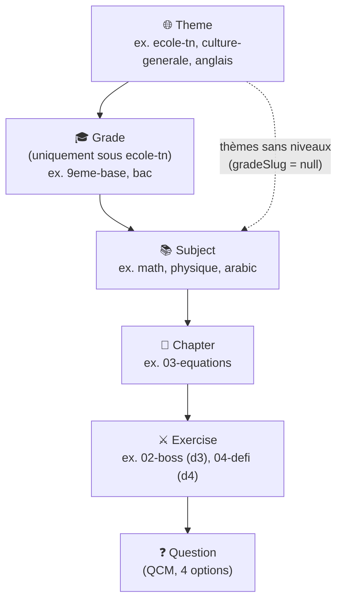
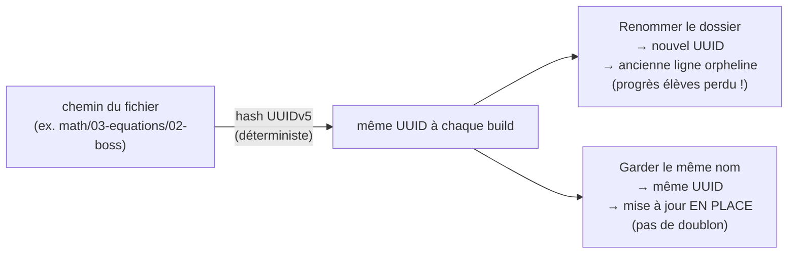
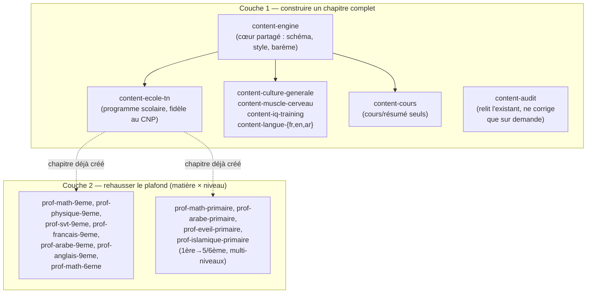
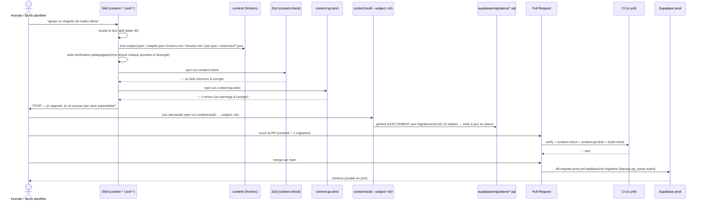
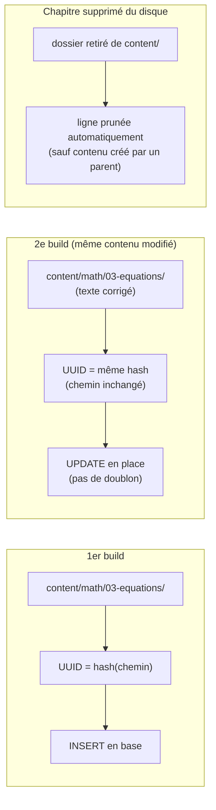
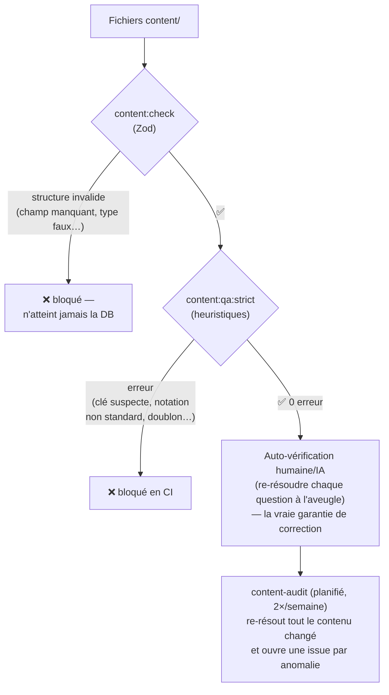
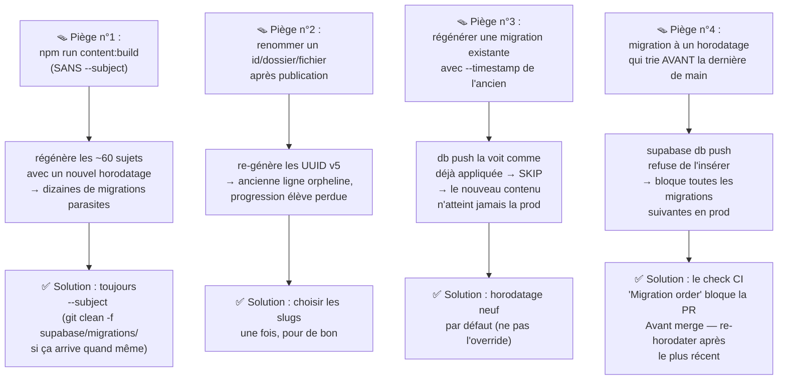
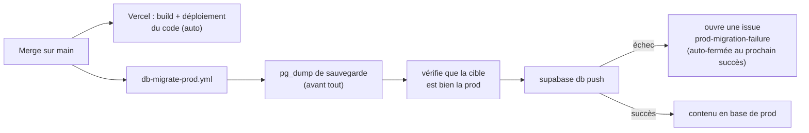

# Pipeline de génération de contenu — guide complet

> **Pour qui ?** Ce document explique, en langage simple et avec des schémas, comment le contenu
> pédagogique (matières, chapitres, cours, quiz, exercices) est **créé, validé, transformé en
> migrations SQL, puis déployé en prod** dans yahia-quest-arena. Il est écrit pour être compris
> aussi bien par un humain (auteur de contenu, développeur, relecteur) que par une IA (Claude)
> qui reprend le travail.
>
> Ce fichier est un **résumé narratif avec schémas** — la source de vérité normative reste
> [`CLAUDE.md`](../CLAUDE.md) (§ "Content pipeline"), [`content/README.md`](../content/README.md)
> et [`.claude/skills/content-engine/references/generation-pipeline.md`](../.claude/skills/content-engine/references/generation-pipeline.md).
> En cas de désaccord, ces trois-là gagnent — corrige ce fichier.

---

## 1. L'idée en une phrase

> Le contenu pédagogique n'est **jamais écrit directement en base de données** : on écrit des
> **fichiers texte versionnés** dans `content/`, un outil les **valide** puis les **compile** en
> **migrations SQL idempotentes**, et c'est **le merge sur `main`** qui les envoie en prod.

Fichiers → validation → SQL → revue humaine (PR) → merge → prod. Jamais l'inverse, jamais de
raccourci.

---

## 2. Vue d'ensemble du pipeline

```mermaid
flowchart LR
    A["👤 Demande de contenu\n(humain ou tâche planifiée)"] --> B["🧠 Skill Claude Code\n(content-* / prof-*)"]
    B --> C["📁 Fichiers dans content/\nsubject.json · chapter.json\ncours.md · resume.md\nquiz.json · exercices/*.json"]
    C --> D{"npm run content:check\n(validation Zod)"}
    D -- "❌ erreur" --> B
    D -- "✅ ok" --> E{"npm run content:qa:strict\n(qualité pédagogique)"}
    E -- "❌ erreur" --> B
    E -- "✅ 0 erreur" --> F["npm run content:build\n-- --subject <id>"]
    F --> G["🗄️ 1 migration SQL\nsupabase/migrations/*.sql\n(idempotente, UUID v5)"]
    G --> H["🔎 Revue humaine\n(relit le SQL généré)"]
    H --> I["📬 Pull Request"]
    I --> J{"CI verte ?\nverify + content:check +\ncontent:qa:strict + build"}
    J -- "✅" --> K["🔀 Merge sur main"]
    K --> L["🚀 Vercel : déploiement du code"]
    K --> M["🛢️ db-migrate-prod.yml\napplique la migration en prod"]
    L --> N["🎮 Le contenu est jouable"]
    M --> N
```



**Ce qu'il faut retenir de ce schéma :**

- Une IA (skill) ou un humain n'écrit **que des fichiers** — jamais de SQL à la main.
- Deux portes de qualité automatiques (`content:check`, `content:qa:strict`) bloquent tout
  fichier invalide **avant** qu'il devienne du SQL.
- Le SQL généré est **relu par un humain** (c'est une PR normale), mais **appliqué
  automatiquement** à la prod au merge — personne ne clique "exécuter" sur la base de prod.

---

## 3. La hiérarchie du catalogue (le modèle mental)

Le contenu s'organise en 6 niveaux, du plus général au plus précis :



- Un **theme** est une grande piste (le programme scolaire tunisien, la culture générale, une
  langue…). Seul `ecole-tn` a des **grades** (la classe : 1ère année de base → Bac).
- Une **subject** (matière) appartient à un theme, et si le thème a des grades, à un grade précis
  (`gradeSlug`).
- Un **chapter** (chapitre) appartient à une matière ; il porte le cours (`cours.md`), le résumé
  (`resume.md`) et le quiz obligatoire (`quiz.json`).
- Un **exercise** (mission) appartient à un chapitre ; sa difficulté (1 à 4) détermine sa
  récompense et si elle est gratuite ou premium.
- Une **question** appartient à un exercice ou au quiz ; c'est un QCM à 4 options.

> 💡 **9ème année n'est qu'un `grade` parmi 13.** C'est le plus riche en contenu aujourd'hui,
> mais l'architecture est générique : n'importe quel thème/niveau suit le même pipeline.

---

## 4. L'arborescence de fichiers (ce qu'on écrit vraiment)

```
content/
└── math/                        ← un dossier = une SUBJECT (contient subject.json)
    ├── subject.json             ← méta : id, nom natif, thème, niveau, langue…
    └── 03-equations/            ← un dossier = un CHAPTER (contient chapter.json)
        ├── chapter.json         ← titre, description, ordre, sources[]
        ├── cours.md             ← le cours complet (markdown, style RPG)
        ├── resume.md            ← résumé du cours (bullet points)
        ├── quiz.json            ← quiz de compréhension OBLIGATOIRE (verrou)
        └── exercices/
            ├── 01-pratique.json ← practice, difficulté 1, 50 XP / 10 coins
            ├── 02-boss.json     ← boss, difficulté 3, 120 XP / 30 coins (premium)
            └── 04-defi.json     ← challenge, difficulté 4, 300 XP / 60 coins (premium)
```

**Règle d'or : le nom du dossier/fichier EST l'identité.** Chaque ID en base est un
**UUID v5 déterministe**, calculé à partir du chemin (`subjectId/chapterSlug/exerciseSlug/qN`).



C'est pourquoi la règle absolue est : **on ne renomme jamais** un `id` de matière, un dossier de
chapitre ou un fichier d'exercice une fois publié. On ajoute toujours du contenu **nouveau** à côté
(le prochain `NN` libre), on ne renumérote/réordonne jamais l'existant.

---

## 5. Qui écrit quoi ? Les deux couches de skills

Le contenu n'est **jamais écrit "à la main" par un développeur** — il est produit par des
**skills Claude Code** spécialisés, organisés en deux couches qui ne se chevauchent pas :



| Couche                       | Ce qu'elle produit                                                     | Ne touche jamais                             |
| ----------------------------- | ----------------------------------------------------------------------- | --------------------------------------------- |
| **Base** (`content-*`)        | cours + résumé + quiz + ladder gratuite (difficulté 1–2, + boss/défi d3-4 standard) | — |
| **Professeur** (`prof-*`)     | exercices **difficiles/élites** (d3–4) **en plus**, sur un chapitre qui existe déjà | le cours, le quiz, ou la conversion d'une mission gratuite en premium |
| **Audit** (`content-audit`)   | un rapport de qualité (re-résout chaque question)                       | ne corrige que si on le demande explicitement |

### Table de sélection rapide (« je veux… → j'utilise… »)

| Je veux…                                                             | Skill à utiliser                                     |
| --------------------------------------------------------------------- | ----------------------------------------------------- |
| Créer un **nouveau chapitre** complet (programme scolaire)             | `content-ecole-tn`                                    |
| Créer un nouveau chapitre pour un thème non scolaire                   | le wrapper `content-*` correspondant (culture/iq/langue/muscle) |
| Réécrire **seulement le cours ou le résumé**                           | `content-cours`                                       |
| Réécrire **seulement le quiz** ou ajouter du **d1–2 gratuit**           | le wrapper du programme (ou `content-engine` de base) |
| Ajouter des exercices **difficiles/élites (d3–4)** pour une matière × niveau scolaire | le `prof-*` correspondant                             |
| **Auditer / vérifier** du contenu existant                             | `content-audit`                                       |
| Comprendre le schéma / le barème qualité / les récompenses / la notation | `content-engine/references/*`                         |

---

## 6. Le cycle de vie détaillé d'une demande de contenu



Points clés de ce cycle :

1. **Le skill s'arrête après avoir écrit les fichiers et validé** — il ne pousse rien sans qu'on
   le lui demande explicitement (« stop and report »).
2. **La construction de la migration est manuelle et ciblée** (`--subject <id>`), jamais un build
   global — voir le piège n°1 ci-dessous.
3. **La revue humaine porte sur le SQL généré**, pas sur un contenu de confiance aveugle : on relit
   avant de merger.
4. **Le déploiement est automatique** une fois le merge fait — pas d'étape manuelle en prod.

---

## 7. Pourquoi c'est idempotent (le modèle UUID v5)



Conséquence pratique : on peut **relancer `content:build` autant de fois qu'on veut** sur le même
sujet sans créer de doublons — c'est ce qui permet d'enrichir le catalogue en continu, chapitre par
chapitre, sans jamais tout regénérer.

---

## 8. Les portes de qualité (gates)



Trois niveaux de filtrage, chacun attrapant un type d'erreur différent :

| Porte                     | Attrape                                                            | Ne détecte PAS                                   |
| -------------------------- | ------------------------------------------------------------------- | -------------------------------------------------- |
| `content:check` (Zod)      | champs manquants, mauvais types, contraintes de forme               | une bonne réponse fausse                           |
| `content:qa:strict`        | déséquilibre des clés, notation non standard, structure suspecte    | une bonne réponse fausse                           |
| Auto-vérification (skill)  | ce que le skill doit faire lui-même avant de rapporter              | erreurs qu'il n'a pas vues                         |
| `content-audit` (planifié) | **ré-résout vraiment** chaque question, vérifie fidélité au programme | rien n'est garanti à 100 %, c'est un filet de sécurité |

> ⚠️ Un mauvais corrigé (bonne réponse fausse) **passe** `content:check` et `content:qa:strict` —
> ces outils vérifient la **structure**, pas la **vérité**. C'est pour ça que `content-audit`
> existe : un balayage planifié qui re-résout chaque question.

---

## 9. Les règles « cumulatif et non redondant »

Le catalogue grandit chapitre par chapitre, palier par palier, **sans jamais tout reconstruire**.
Ces règles rendent ça sûr :

1. **Auditer l'existant d'abord** — lire ce qui existe déjà dans `exercices/*.json` avant d'ajouter.
2. **Remplir vers le haut, jamais sur le côté** — nouveau palier au prochain `NN` libre, jamais un
   quasi-doublon d'un exercice existant.
3. **Ne jamais renommer/renumérer** — ça re-génère les UUID (voir §7) → perte de progression élève.
4. **Ne jamais dupliquer une question** déjà présente ailleurs dans le chapitre.
5. **Le contenu créé par un parent n'est jamais touché** par le générateur (seules les lignes
   admin/`content/` sont mises à jour ou élaguées).
6. **Une matière modifiée = une migration régénérée** — jamais de migration en double pour un sujet
   inchangé.

---

## 10. Les pièges connus (à ne jamais reproduire)



---

## 11. Le déploiement en prod (automatique, jamais manuel)



**On n'applique jamais une migration à la main** (pas de SQL editor, pas de `db push` local contre
la prod). On merge le code + la migration → le workflow s'en charge, avec sauvegarde préalable.

---

## 12. Les surveillances automatiques (planifiées)

En plus du pipeline "à la demande", plusieurs garde-fous tournent tout seuls dans le temps :

```mermaid
gantt
    dateFormat  X
    axisFormat  %a
    section Semaine type
    Nightly (E2E + pgTAP, chaque nuit)        :done, n1, 0, 1d
    Regression-guard (Lun + Jeu 23:00 UTC)    :active, r1, 0, 1d
    Upgrade-guard (Mar + Ven, après nightly vert) :crit, u1, 1, 1d
    Content-audit (Mer + Sam 22:07 UTC)       :milestone, c1, 2, 1d
```

| Automatisation        | Fréquence         | Rôle                                                                              |
| ----------------------- | ------------------- | ------------------------------------------------------------------------------------ |
| `nightly.yml`            | chaque nuit (01:00) | E2E + pgTAP complets, issue de suivi                                                |
| `regression-guard`       | Lun + Jeu 23:00 UTC | réconcilie les tests avec les changements du jour, distingue test obsolète vs vrai bug |
| `upgrade-guard`          | Mar + Ven, après un nightly vert | met à jour la stack (npm, TS, Node, Supabase CLI, Actions), une PR par majeure |
| `content-audit.yml`      | Mer + Sam 22:07 UTC | **re-résout** chaque question changée dans la semaine, ouvre une issue par anomalie **BLOCKER/MAJOR** — c'est le filet que `content:qa:strict` ne peut pas être (voir §8) |

Aucune de ces automatisations ne pousse directement sur `main` (sauf `automerge` qui merge une PR
déjà entièrement verte). `content-audit` en particulier est **review-only** : il ne corrige jamais
le contenu tout seul, il signale.

---

## 13. Checklist de bout en bout (à copier-coller)

- [ ] Bon skill choisi (base vs professeur — tableau §5).
- [ ] Ladder existante auditée ; le nouveau contenu remplit vers le haut, sans renommer/renuméroter,
      sans dupliquer de question.
- [ ] Barème qualité + auto-vérification (re-résoudre à l'aveugle, distracteurs réalistes, notation
      standard, piège nommé sur d3-4).
- [ ] `npm run content:check` ✓ · `npm run content:qa:strict` → 0 erreur.
- [ ] `npm run content:build -- --subject <id>` → **exactement une** nouvelle migration ; aucun
      fichier parasite d'un build complet accidentel.
- [ ] Fichiers `content/` + la migration unique mis en commun dans la même PR ; rapport écrit ;
      push/PR seulement si demandé.

---

## 14. Glossaire express

| Terme               | Définition simple                                                                       |
| -------------------- | ------------------------------------------------------------------------------------------ |
| **Theme**             | Grande piste (ex. programme scolaire, culture générale)                                    |
| **Grade**             | Niveau scolaire (uniquement sous `ecole-tn`), ex. 9ème année                                |
| **Parcours**          | Le "produit" auquel l'élève est inscrit (thème+grade) ; FREE (exploration) ou PREMIUM (concours) |
| **Subject**           | Une matière (maths, arabe, anglais…)                                                        |
| **Chapter**           | Un chapitre d'une matière : cours + résumé + quiz + exercices                              |
| **Exercise**          | Une mission QCM notée (practice/boss/challenge), difficulté 1 à 4                          |
| **Quiz**              | Le QCM de compréhension du cours, obligatoire, verrouille les exercices (programme scolaire seulement) |
| **UUID v5**           | Identifiant déterministe calculé à partir du chemin/slug — stable tant que le nom ne change pas |
| **Idempotent**        | Rejouer le même build ne crée pas de doublon : ça met juste à jour                          |
| **Skill**             | Un mode d'assistance Claude Code spécialisé (ex. `content-ecole-tn`, `prof-math-9eme`)      |
| **Migration**         | Un fichier SQL généré sous `supabase/migrations/`, appliqué automatiquement à la prod au merge |

---

## 15. Pour aller plus loin

- [`CLAUDE.md`](../CLAUDE.md) — vue d'ensemble du projet, section "Content pipeline" et "Definition
  of Done" §7 (coordination DB ↔ code).
- [`content/README.md`](../content/README.md) — format exact des fichiers, commandes.
- [`.claude/skills/content-engine/references/generation-pipeline.md`](../.claude/skills/content-engine/references/generation-pipeline.md) —
  la carte canonique skills + règles cumulatives + procédure build→migration (source de vérité de
  ce document).
- [`.claude/skills/content-engine/references/content-schema.md`](../.claude/skills/content-engine/references/content-schema.md) —
  le schéma exact (champs, contraintes Zod) de chaque fichier.
- [`.claude/skills/content-engine/references/rewards-and-modes.md`](../.claude/skills/content-engine/references/rewards-and-modes.md) —
  modes, difficultés, barème de récompenses, seuils de score.
- [`.claude/skills/content-engine/references/themes-and-trilingual.md`](../.claude/skills/content-engine/references/themes-and-trilingual.md) —
  thèmes/grades seedés, modèle trilingue.
- [`.claude/skills/content-engine/references/quality-bar.md`](../.claude/skills/content-engine/references/quality-bar.md) —
  protocole d'auto-vérification pédagogique.
