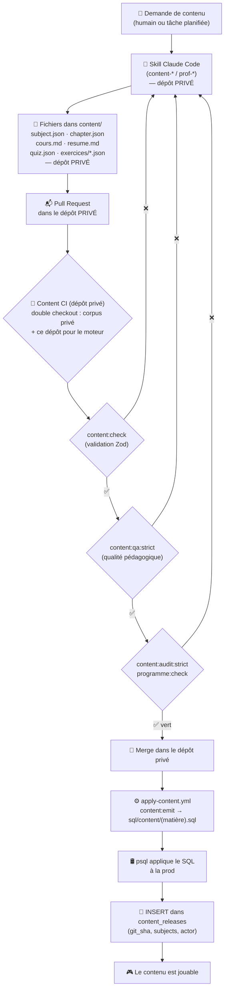
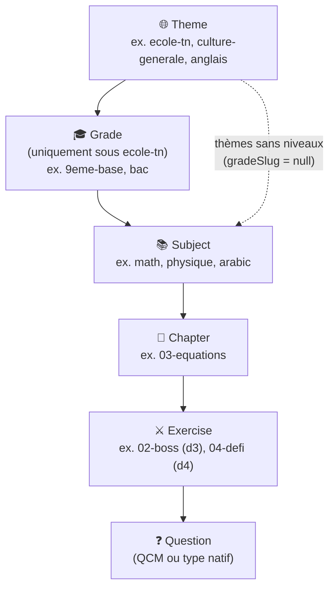
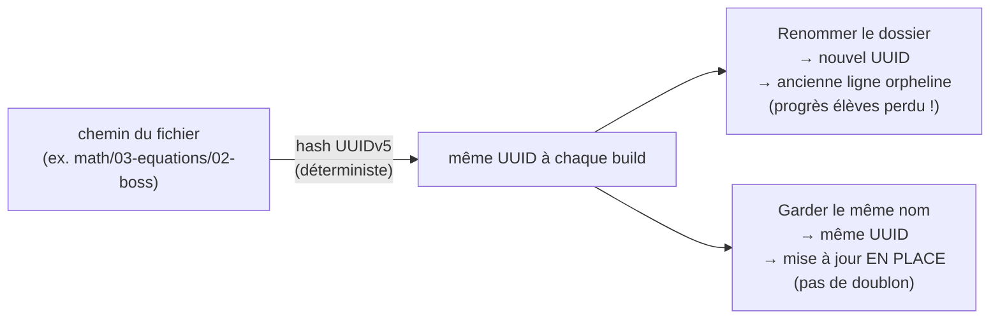
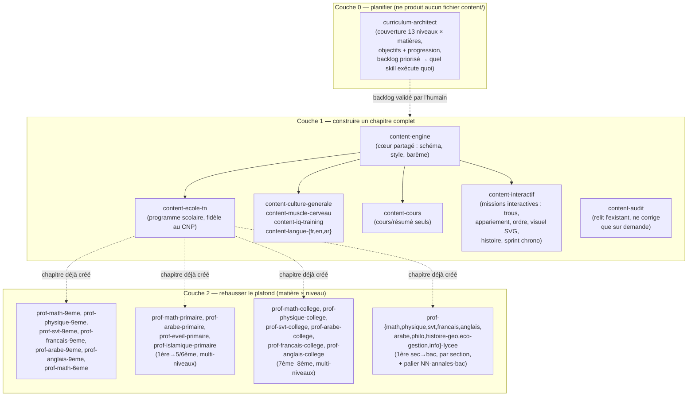
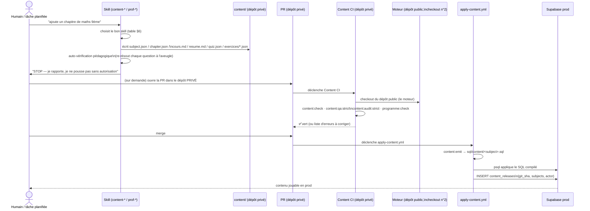
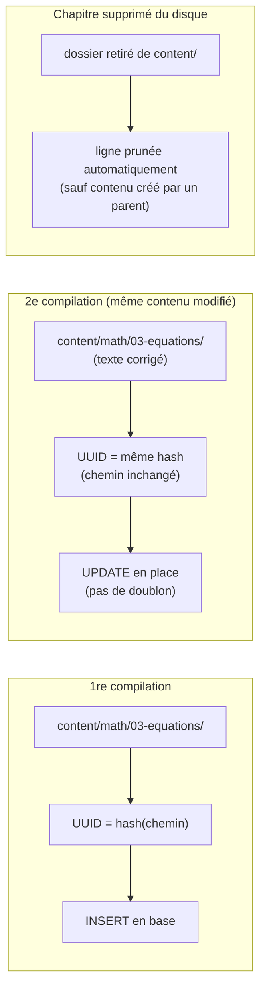
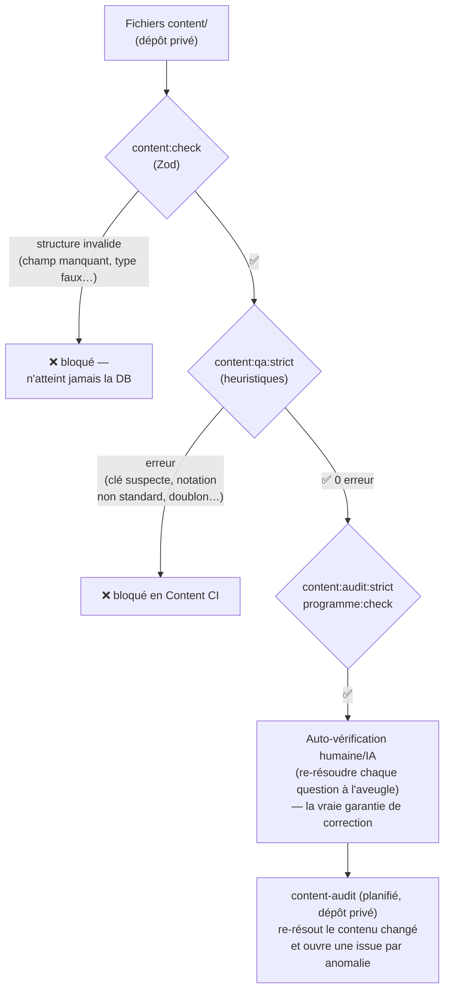
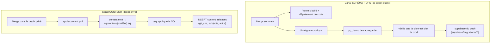
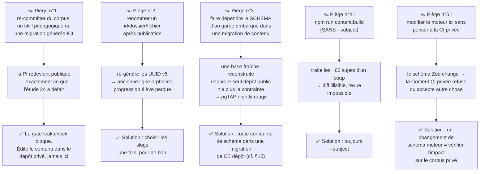

# Pipeline de génération de contenu — guide complet

> **Pour qui ?** Ce document explique, en langage simple et avec des schémas, comment le contenu
> pédagogique (matières, chapitres, cours, quiz, exercices) est **créé, validé, compilé en SQL,
> puis appliqué en prod** — et **où** chaque morceau de la chaîne vit depuis que le corpus a
> quitté ce dépôt. Il est écrit pour être compris aussi bien par un humain (auteur de contenu,
> développeur, relecteur) que par une IA (Claude) qui reprend le travail.
>
> ⚠️ **Depuis l'étude 24 (2026-07-20), le corpus et l'usine de génération ne vivent plus dans
> ce dépôt public.** Ils ont été transférés dans le dépôt **privé** `MBeji/yahia-quest-content`
> (sur invitation). Ce dépôt-ci ne garde que le **moteur** — générique et sans corpus. Si tu
> cherches `content/` ici, c'est normal : il n'existe plus. Lis le §2 avant tout le reste.
>
> Ce fichier est un **résumé narratif avec schémas** — la source de vérité normative reste
> [`AGENTS.md`](../AGENTS.md) (§ "Content pipeline"), et, côté dépôt privé, le README du corpus
> et `.claude/skills/content-engine/references/generation-pipeline.md`. En cas de désaccord,
> ceux-là gagnent — corrige ce fichier.

---

## 1. L'idée en une phrase

> Le contenu pédagogique n'est **jamais écrit directement en base de données** : on écrit des
> **fichiers texte versionnés** dans le **dépôt privé**, un **moteur** hébergé dans ce dépôt
> public les **valide** puis les **compile** en SQL idempotent, et c'est **le merge dans le dépôt
> privé** qui l'applique en prod.

Fichiers → validation → SQL → revue humaine (PR) → merge → prod. Jamais l'inverse, jamais de
raccourci.

Ce qui a changé avec l'étude 24 : le contenu **n'est plus livré sous forme de migrations
Supabase**. Il est compilé en fichiers `sql/content/<subject>.sql` stables et appliqué par un
workflow dédié — parce qu'une base ne peut porter **qu'un seul** historique de migrations, et
que deux dépôts qui poussent dedans se bloquent mutuellement (voir §11).

---

## 2. Où vit quoi — la répartition public / privé

C'est la question n°1 depuis la scission. La ligne de partage est simple :

> **Le moteur est public et générique. Le corpus et l'usine qui le fabriquent sont privés.**

```mermaid
flowchart LR
    subgraph PUB["🌍 yahia-quest-arena (public)"]
        E1["scripts/content/**\n(build, qa, audit, suivi, svg)"]
        E2["src/shared/content/**\n(loader, schema, sql-builder,\nqa-checks, program-manifest)"]
        E3["scripts npm content:* / programme:*"]
        E4["supabase/migrations/**\n(schéma + ops)"]
        E5["gate anti-fuite\nleak:check"]
    end

    subgraph PRIV["🔒 MBeji/yahia-quest-content (privé, sur invitation)"]
        C1["content/**\n(566 chapitres, ~18 700 questions,\ncorrigés)"]
        C2["registres : misconceptions.json,\ncompetences/, videos.json"]
        C3["41 skills pédagogiques\n(content-*, prof-*,\ncurriculum-architect)"]
        C4["FableEtudes/ +\nMÉTHODE-GENERATION-CONTENU.md"]
        C5["workflows content-audit.yml,\nvideo-health.yml, apply-content.yml"]
    end

    PRIV -->|"la CI privée fait un double checkout :\nson corpus + ce dépôt pour le moteur"| PUB
```



| Ce que tu cherches                                                                                      | Où c'est                                                       |
| ------------------------------------------------------------------------------------------------------- | -------------------------------------------------------------- |
| Le corpus (`content/`, cours, quiz, exercices, corrigés)                                                | **dépôt privé**                                                |
| Les registres `misconceptions.json`, `competences/`, `videos.json`                                      | **dépôt privé**                                                |
| Les 41 skills pédagogiques (`content-*`, `prof-*`, `curriculum-architect`)                              | **dépôt privé**                                                |
| Les études (`FableEtudes/`) et `METHODE-GENERATION-CONTENU.md`                                          | **dépôt privé**                                                |
| Les workflows `content-audit.yml` et `video-health.yml`                                                 | **dépôt privé**                                                |
| Le **moteur** : `scripts/content/**` et `src/shared/content/**`                                         | **ici** (public) — générique, aucun corpus dedans              |
| Les commandes `npm run content:*` / `programme:*`                                                       | **ici** (public) — la CI privée les invoque depuis ce checkout |
| Les 5 skills techniques (`verify`, `code-review`, `regression-guard`, `upgrade-guard`, `report-triage`) | **ici** (public)                                               |
| Les migrations de **schéma** et d'**ops**                                                               | **ici** (public), `supabase/migrations/`                       |
| Les **17 migrations de contenu écrites à la main**                                                      | **ici** (public) — elles restent, voir §10                     |
| L'état du projet, les décisions                                                                         | **ici** (public), [`STATUS.md`](../STATUS.md)                  |

> 🧠 **Le moteur est public exprès.** Il ne contient aucune question, aucun corrigé : c'est un
> validateur Zod + un compilateur SQL. C'est pour ça que la CI du dépôt privé fait un **double
> checkout** — elle récupère son corpus **et** ce dépôt-ci pour disposer du moteur. Modifier le
> schéma du moteur ici change donc ce que la CI privée accepte : les deux dépôts avancent
> ensemble.

**Ce qui a été retiré d'ici** au moment de la scission : le corpus entier, les 41 skills
pédagogiques, les études, les deux workflows ci-dessus, et **228 migrations de contenu générées**
(`*_generated_*_content.sql` et `*_generated_competences_registry.sql`).

---

## 3. Vue d'ensemble du pipeline (après la scission)



**Ce qu'il faut retenir de ce schéma :**

- Une IA (skill) ou un humain n'écrit **que des fichiers** — jamais de SQL à la main.
- Les portes de qualité tournent désormais **dans la CI du dépôt privé** (c'est là que vit le
  corpus à valider), mais elles exécutent **le moteur de ce dépôt-ci**.
- Le SQL compilé est **appliqué automatiquement** à la prod au merge — personne ne clique
  « exécuter » sur la base de prod.
- Le contenu **ne passe plus par `supabase/migrations/`** : il a son propre canal et son propre
  journal (`content_releases`).

---

## 4. La hiérarchie du catalogue (le modèle mental)

Inchangée par la scission — c'est le modèle de données, il vit dans le schéma public.



- Un **theme** est une grande piste (le programme scolaire tunisien, la culture générale, une
  langue…). Seul `ecole-tn` a des **grades** (la classe : 1ère année de base → Bac).
- Une **subject** (matière) appartient à un theme, et si le thème a des grades, à un grade précis
  (`gradeSlug`).
- Un **chapter** (chapitre) appartient à une matière ; il porte le cours (`cours.md`), le résumé
  (`resume.md`) et le quiz obligatoire (`quiz.json`).
- Un **exercise** (mission) appartient à un chapitre ; sa difficulté (1 à 4) détermine sa
  récompense.
- Une **question** appartient à un exercice ou au quiz — QCM par défaut, ou l'un des types natifs
  (voir [`docs/guide-types-questions-natifs.md`](./guide-types-questions-natifs.md)).

> 💡 **9ème année n'est qu'un `grade` parmi 13.** C'est le plus riche en contenu aujourd'hui,
> mais l'architecture est générique : n'importe quel thème/niveau suit le même pipeline.

---

## 5. L'arborescence de fichiers (ce qu'on écrit vraiment)

Cette arborescence vit **dans le dépôt privé**. Le moteur de ce dépôt-ci sait la lire et la
valider, mais elle n'existe pas ici.

```
content/                        ← dépôt PRIVÉ yahia-quest-content
└── math/                       ← un dossier = une SUBJECT (contient subject.json)
    ├── subject.json            ← méta : id, nom natif, thème, niveau, langue…
    └── 03-equations/           ← un dossier = un CHAPTER (contient chapter.json)
        ├── chapter.json        ← titre, description, ordre, sources[]
        ├── cours.md            ← le cours complet (markdown, style RPG)
        ├── resume.md           ← résumé du cours (bullet points)
        ├── quiz.json           ← quiz de compréhension OBLIGATOIRE (verrou)
        └── exercices/
            ├── 01-pratique.json ← practice, difficulté 1, 50 XP / 10 coins
            ├── 02-boss.json     ← boss, difficulté 3, 120 XP / 30 coins
            └── 04-defi.json     ← challenge, difficulté 4, 300 XP / 60 coins
```

**Règle d'or : le nom du dossier/fichier EST l'identité.** Chaque ID en base est un
**UUID v5 déterministe**, calculé à partir du chemin (`subjectId/chapterSlug/exerciseSlug/qN`).



C'est pourquoi la règle absolue est : **on ne renomme jamais** un `id` de matière, un dossier de
chapitre ou un fichier d'exercice une fois publié. On ajoute toujours du contenu **nouveau** à côté
(le prochain `NN` libre), on ne renumérote/réordonne jamais l'existant.

---

## 6. Qui écrit quoi ? La couche de planification + les deux couches de skills

Le contenu n'est **jamais écrit "à la main" par un développeur** — il est produit par des
**skills Claude Code** spécialisés. **Ces 41 skills vivent dans le dépôt privé** : une couche de
**planification** en amont, puis deux couches d'**écriture** qui ne se chevauchent pas.



> 🏛️ **Lycée** : l'architecture du secondaire (sections = nœuds de grade, bascule linguistique
> ar→fr des matières scientifiques en 1ère sec — générées **nativement en français** dans le
> jargon des manuels officiels, jamais en traduction (décision 2026-07-13) —, ladder complet
> incl. `NN-annales-bac`, migration de seed et rollout phasé) est spécifiée dans
> [`docs/lycee-architecture.md`](./lycee-architecture.md).

> 🎭 **Les rôles classiques d'une équipe éditoriale sont tous couverts** — Curriculum Designer →
> `curriculum-architect` ; Content Writer → `content-cours` + wrappers ; Exercise Designer →
> wrappers + `content-interactif` ; Professeur par matière → `prof-*` ; Question Reviewer →
> `content-audit` + `content:qa:strict` ; Translator → **aucun par conception** (trois sujets
> frères natifs par langue, jamais de traduction ; le scolaire est monolingue) ; Difficulty
> Calibrator → règles encodées (`rewards-and-modes.md`, `expert-exercises.md`) ; SQL/JSON Exporter
> → script déterministe `scripts/content/build.ts` (**ce dépôt-ci**), jamais un LLM. La matrice
> détaillée est dans `generation-pipeline.md`, côté dépôt privé.

| Couche                                     | Ce qu'elle produit                                                                                                          | Ne touche jamais                              |
| ------------------------------------------ | --------------------------------------------------------------------------------------------------------------------------- | --------------------------------------------- |
| **Planification** (`curriculum-architect`) | un backlog priorisé + objectifs/progression par niveau×matière                                                              | aucun fichier `content/` — plan seulement     |
| **Base** (`content-*`)                     | cours + résumé + quiz + ladder (difficulté 1–2, + boss/défi d3-4 standard) ; missions interactives via `content-interactif` | —                                             |
| **Professeur** (`prof-*`)                  | exercices **difficiles/élites** (d3–4) **en plus**, sur un chapitre qui existe déjà                                         | le cours ou le quiz                           |
| **Audit** (`content-audit`)                | un rapport de qualité (re-résout chaque question)                                                                           | ne corrige que si on le demande explicitement |

### Table de sélection rapide (« je veux… → j'utilise… »)

> Tous ces skills s'invoquent depuis une session ouverte sur le **dépôt privé**.

| Je veux…                                                                                    | Skill à utiliser                                                |
| ------------------------------------------------------------------------------------------- | --------------------------------------------------------------- |
| **Planifier la couverture / la roadmap / la progression** d'un niveau                       | `curriculum-architect`                                          |
| Créer un **nouveau chapitre** complet (programme scolaire)                                  | `content-ecole-tn`                                              |
| Créer un nouveau chapitre pour un thème non scolaire                                        | le wrapper `content-*` correspondant (culture/iq/langue/muscle) |
| Réécrire **seulement le cours ou le résumé**                                                | `content-cours`                                                 |
| Réécrire **seulement le quiz** ou ajouter du **d1–2**                                       | le wrapper du programme (ou `content-engine` de base)           |
| Ajouter des **missions interactives** (trous, appariement, ordre, visuel, histoire, sprint) | `content-interactif`                                            |
| Ajouter des exercices **difficiles/élites (d3–4)** pour une matière × niveau scolaire       | le `prof-*` correspondant                                       |
| **Auditer / vérifier** du contenu existant                                                  | `content-audit`                                                 |
| Comprendre le schéma / le barème qualité / les récompenses / la notation                    | `content-engine/references/*` (dépôt privé)                     |

> ℹ️ Les formats interactifs "natifs" (saisie numérique, glisser-déposer, appariement,
> multi-sélection) sont **livrés** — voir [`docs/guide-types-questions-natifs.md`](./guide-types-questions-natifs.md)
> pour l'usage et [`docs/interactive-question-types.md`](./interactive-question-types.md) pour la
> spec normative. Le catalogue des formats encodables en QCM (`interactive-formats.md`) vit dans
> le dépôt privé.

---

## 7. Le cycle de vie détaillé d'une demande de contenu



Points clés de ce cycle :

1. **Tout se passe dans le dépôt privé** — la PR, la revue, le merge. Ce dépôt-ci n'intervient
   que comme fournisseur du moteur.
2. **Le skill s'arrête après avoir écrit les fichiers** — il ne pousse rien sans qu'on le lui
   demande explicitement (« stop and report »).
3. **La compilation est faite par la CI**, pas à la main : `content:emit` produit un fichier SQL
   **stable par matière** (`sql/content/<subject>.sql`), pas une migration horodatée.
4. **Le déploiement est automatique** une fois le merge fait — pas d'étape manuelle en prod.
5. **Chaque application laisse une trace** dans la table `content_releases` (§11).

---

## 8. Pourquoi c'est idempotent (le modèle UUID v5)



Conséquence pratique : on peut **réappliquer le SQL d'une matière autant de fois qu'on veut** sans
créer de doublons — c'est ce qui permet d'enrichir le catalogue en continu, chapitre par chapitre,
sans jamais tout regénérer. C'est aussi ce qui rend possible le passage du contenu **hors** du
cadre des migrations : un fichier `sql/content/<subject>.sql` **stable** (toujours le même nom)
peut être rejoué à chaque release sans historique à tenir.

---

## 9. Les portes de qualité (gates) — et où elles tournent maintenant



Les niveaux de filtrage, chacun attrapant un type d'erreur différent :

| Porte                      | Attrape                                                               | Ne détecte PAS                                         |
| -------------------------- | --------------------------------------------------------------------- | ------------------------------------------------------ |
| `content:check` (Zod)      | champs manquants, mauvais types, contraintes de forme                 | une bonne réponse fausse                               |
| `content:qa:strict`        | déséquilibre des clés, notation non standard, structure suspecte      | une bonne réponse fausse                               |
| `content:audit:strict`     | conformité au programme officiel, couverture                          | une bonne réponse fausse                               |
| `programme:check`          | cohérence du registre de transcription des programmes officiels       | la qualité du contenu lui-même                         |
| Auto-vérification (skill)  | ce que le skill doit faire lui-même avant de rapporter                | erreurs qu'il n'a pas vues                             |
| `content-audit` (planifié) | **ré-résout vraiment** chaque question, vérifie fidélité au programme | rien n'est garanti à 100 %, c'est un filet de sécurité |

> ⚠️ Un mauvais corrigé (bonne réponse fausse) **passe** `content:check` et `content:qa:strict` —
> ces outils vérifient la **structure**, pas la **vérité**. C'est pour ça que `content-audit`
> existe : un balayage planifié qui re-résout chaque question.

### Qui exécute quoi, depuis la scission

| Gate                                                                                             | S'exécute dans                                     |
| ------------------------------------------------------------------------------------------------ | -------------------------------------------------- |
| `content:check`, `content:qa:strict`, `content:audit:strict`, `programme:check`                  | la **Content CI du dépôt privé** (double checkout) |
| `lint`, `typecheck`, `test:coverage`, `build:check`, `audit:deps`, `harness:check`, `leak:check` | la CI de **ce dépôt** (`ci:verify`)                |

**La CI de ce dépôt ne valide plus de contenu** — elle n'en a plus. `npm run ci:verify` ici,
c'est : `lint` + `typecheck` + `test:coverage` + `build:check` + `audit:deps` + `harness:check` +
`leak:check`. Le gate local `npm run verify` inclut lui aussi `leak:check`.

> 🔧 Les commandes `content:*` et `programme:*` **existent toujours ici** et ne sont pas
> dépréciées : c'est précisément ce que la CI privée invoque depuis ce checkout. Simplement,
> lancées ici **sans corpus**, elles n'ont rien à traiter.

---

## 10. Le gate anti-fuite (`leak:check`)

C'est le garde-fou de la scission. Il répond au risque évident : **une session future qui
re-commit du corpus ici par habitude**.

```bash
npm run leak:check     # inclus dans verify ET ci:verify ; étape CI « Anti-leak gate »
```

Implémentation : [`scripts/ci/check-content-leak.mjs`](../scripts/ci/check-content-leak.mjs). Il
parcourt tous les fichiers suivis par git au tip et **fait échouer le build** si l'un d'eux est :

| Ce qui déclenche l'échec                                                                                   | Pourquoi                                                |
| ---------------------------------------------------------------------------------------------------------- | ------------------------------------------------------- |
| `content/**`                                                                                               | le corpus — il vit dans le dépôt privé                  |
| `sql/content/**`                                                                                           | le SQL compilé (sortie de `content:emit`) — dépôt privé |
| `.claude/skills/{content-*,prof-*,curriculum-architect}/` (idem `.agents/skills/`)                         | l'usine de génération — dépôt privé                     |
| une migration de contenu **générée** (`*_generated_*_content.sql`, `*_generated_competences_registry.sql`) | le canal, c'est `content:emit` vers le dépôt privé      |

⚠️ Attention au faux positif de lecture : `scripts/content/` **n'est PAS une fuite** — c'est le
moteur générique, il doit rester ici. Seul `content/` à la racine est du corpus.

### L'exception assumée : les 17 migrations de contenu écrites à la main

Le gate les **exclut nommément** (liste fermée `MANUAL_CONTENT_MIGRATIONS` dans le script). Elles
restent publiques **exprès**, pour deux raisons :

1. `content:emit` **ne sait pas les reproduire** : les retirer perdrait leur effet.
2. Trois d'entre elles **seedent aussi des données non-contenu** (badges et `shop_items` ;
   `themes`/`grades` ; `parcours`/`parcours_entitlements`/`profiles`) — les retirer supprimerait
   silencieusement du schéma des choses qui n'ont rien à voir avec la pédagogie.

La liste est **fermée** : aucune nouvelle migration de contenu écrite à la main n'a de raison
d'exister. Le canal sanctionné, c'est `content:emit` vers le dépôt privé.

### Le corollaire : ce dépôt doit rester auto-suffisant pour le schéma

La contrainte `exercises_mode_check` n'était portée par **aucune** migration de schéma : chaque
migration de contenu générée embarquait un garde idempotent qui la reposait. En retirant ces
migrations, le garde partait avec elles — et une base **fraîche** reconstruite depuis le seul
dépôt public (ce que rejoue le pgTAP nightly) ne l'aurait plus portée. D'où
[`supabase/migrations/20260720140000_exercises_mode_check.sql`](../supabase/migrations/20260720140000_exercises_mode_check.sql),
qui la repose au niveau du schéma (no-op en prod, qui la porte déjà).

> 🧭 **Règle générale à retenir** : tout ce dont le **schéma** a besoin doit vivre dans une
> migration de **ce** dépôt. Le canal contenu ne doit jamais être un passager clandestin du
> schéma.

---

## 11. L'application en prod (automatique, jamais manuelle)

Il y a maintenant **deux canaux distincts**, à ne pas confondre :



**Pourquoi deux canaux ?** Une base ne peut porter **qu'un seul** historique de migrations
(`supabase_migrations.schema_migrations`). Deux dépôts qui poussent tous les deux des migrations
dedans se bloquent mutuellement (« Remote migration versions not found in local migrations
directory »). Le contenu sort donc du cadre des migrations et devient des fichiers SQL **stables
par matière**, appliqués par un workflow `psql` dédié.

**Le prix de ce choix, et sa compensation** : en quittant les migrations, le contenu perd sa
comptabilité automatique — `schema_migrations` ne dit plus ce qui a atteint la prod ni quand. La
table [`content_releases`](../supabase/migrations/20260719210000_content_releases.sql) est le
journal de remplacement : elle répond à « quelles matières ont été appliquées, depuis quel commit,
par qui ». Elle vit **ici**, dans le dépôt public, parce que c'est du **schéma**, pas du contenu —
créée par l'auto-apply sanctionné et prouvée par le pgTAP nightly sur base fraîche. Le dépôt privé
ne fait qu'y **insérer** des lignes. Elle est ops-privée : RLS activée **sans aucune policy**, donc
même une clé anon/authenticated fuitée n'y voit rien ; seul `service_role` (le workflow) y touche.

**On n'applique jamais rien à la main** (pas de SQL editor, pas de `db push` local contre la prod)
— ni du schéma, ni du contenu.

---

## 12. Les pièges connus (à ne jamais reproduire)



---

## 13. Les surveillances automatiques (planifiées)

En plus du pipeline "à la demande", plusieurs garde-fous tournent tout seuls dans le temps.
Attention : **ils ne vivent plus tous dans le même dépôt**.

| Automatisation      | Dépôt     | Rôle                                                                                                                                           |
| ------------------- | --------- | ---------------------------------------------------------------------------------------------------------------------------------------------- |
| `nightly.yml`       | public    | E2E + pgTAP complets sur base fraîche, issue de suivi                                                                                          |
| `regression-guard`  | public    | réconcilie les tests avec les changements du jour, distingue test obsolète vs vrai bug                                                         |
| `upgrade-guard`     | public    | met à jour la stack (npm, TS, Node, Supabase CLI, Actions), une PR par majeure                                                                 |
| `db-backup.yml`     | public    | sauvegardes prod                                                                                                                               |
| `content-audit.yml` | **privé** | **re-résout** chaque question changée, ouvre une issue par anomalie **BLOCKER/MAJOR** — le filet que `content:qa:strict` ne peut pas être (§9) |
| `video-health.yml`  | **privé** | santé des vidéos référencées par le registre `videos.json`                                                                                     |
| `apply-content.yml` | **privé** | compile et applique le contenu en prod au merge (§11)                                                                                          |

Aucune de ces automatisations ne pousse directement sur `main` (sauf `automerge` qui merge une PR
déjà entièrement verte). `content-audit` en particulier est **review-only** : il ne corrige jamais
le contenu tout seul, il signale.

---

## 14. Checklist de bout en bout (à copier-coller)

**Côté contenu (dépôt privé) :**

- [ ] Je travaille bien dans `yahia-quest-content`, pas dans le dépôt public.
- [ ] Bon skill choisi (base vs professeur — tableau §6).
- [ ] Ladder existante auditée ; le nouveau contenu remplit vers le haut, sans renommer/renuméroter,
      sans dupliquer de question.
- [ ] Barème qualité + auto-vérification (re-résoudre à l'aveugle, distracteurs réalistes, notation
      standard, piège nommé sur d3-4).
- [ ] PR ouverte dans le dépôt privé ; Content CI verte (`content:check`, `content:qa:strict`,
      `content:audit:strict`, `programme:check`).
- [ ] Après merge : `apply-content.yml` vert, ligne présente dans `content_releases`.

**Côté moteur (ce dépôt public) :**

- [ ] Aucun fichier de corpus, skill pédagogique ou migration de contenu générée ajouté.
- [ ] `npm run verify` vert (il inclut `leak:check`).
- [ ] Si le schéma Zod / le sql-builder change : impact vérifié sur le corpus privé avant merge.

---

## 15. Glossaire express

| Terme                  | Définition simple                                                                                      |
| ---------------------- | ------------------------------------------------------------------------------------------------------ |
| **Theme**              | Grande piste (ex. programme scolaire, culture générale)                                                |
| **Grade**              | Niveau scolaire (uniquement sous `ecole-tn`), ex. 9ème année                                           |
| **Parcours**           | Le "produit" auquel l'élève est inscrit (thème+grade)                                                  |
| **Subject**            | Une matière (maths, arabe, anglais…)                                                                   |
| **Chapter**            | Un chapitre d'une matière : cours + résumé + quiz + exercices                                          |
| **Exercise**           | Une mission notée (practice/boss/challenge), difficulté 1 à 4                                          |
| **Quiz**               | Le QCM de compréhension du cours, obligatoire, verrouille les exercices (programme scolaire seulement) |
| **UUID v5**            | Identifiant déterministe calculé à partir du chemin/slug — stable tant que le nom ne change pas        |
| **Idempotent**         | Rejouer la même compilation ne crée pas de doublon : ça met juste à jour                               |
| **Skill**              | Un mode d'assistance Claude Code spécialisé (ex. `content-ecole-tn`, `prof-math-9eme`)                 |
| **Moteur**             | `scripts/content/**` + `src/shared/content/**` — le validateur/compilateur, générique et **public**    |
| **Corpus**             | Les fichiers pédagogiques eux-mêmes — **privés** depuis l'étude 24                                     |
| **`content:emit`**     | La compilation du corpus en `sql/content/<subject>.sql` (fichiers stables, pas des migrations)         |
| **`content_releases`** | La table-journal qui trace chaque application de contenu en prod (commit, matières, acteur)            |
| **Gate anti-fuite**    | `npm run leak:check` — échoue si du corpus ou de l'usine réapparaît dans le dépôt public               |

---

## 16. Pour aller plus loin

**Dans ce dépôt (public) :**

- [`AGENTS.md`](../AGENTS.md) — vue d'ensemble du projet, section "Content pipeline" et "Definition
  of Done" §7 (coordination DB ↔ code).
- [`STATUS.md`](../STATUS.md) — la phase courante, les décisions datées, l'état réel des features.
- [`scripts/ci/check-content-leak.mjs`](../scripts/ci/check-content-leak.mjs) — le gate anti-fuite
  et la liste fermée des 17 migrations écrites à la main.
- [`docs/guide-types-questions-natifs.md`](./guide-types-questions-natifs.md) — guide auteur des
  types de questions natifs (numérique, ordering, matching, multi).
- [`docs/interactive-question-types.md`](./interactive-question-types.md) — la spec normative du
  moteur de types de questions.
- [`docs/lycee-architecture.md`](./lycee-architecture.md) — sections, politique linguistique et
  pipeline du secondaire.
- [`scripts/content/svg/README.md`](../scripts/content/svg/README.md) — outillage des figures SVG.

**Dans le dépôt privé `MBeji/yahia-quest-content`** (liens impossibles depuis ici — accès sur
invitation) :

- `.claude/skills/content-engine/references/generation-pipeline.md` — la carte canonique des
  skills, les règles cumulatives et la procédure de compilation (source de vérité de ce document).
- `.claude/skills/content-engine/references/content-schema.md` — le schéma exact (champs,
  contraintes Zod) de chaque fichier.
- `.claude/skills/content-engine/references/rewards-and-modes.md` — modes, difficultés, barème de
  récompenses, seuils de score.
- `.claude/skills/content-engine/references/themes-and-trilingual.md` — thèmes/grades seedés,
  modèle trilingue.
- `.claude/skills/content-engine/references/quality-bar.md` — protocole d'auto-vérification
  pédagogique.
- `.claude/skills/content-engine/references/interactive-formats.md` — catalogue des formats
  interactifs encodables en QCM (Tier A) + contrat du moteur de rendu.
- `.claude/skills/content-engine/references/math-and-notation.md` — notation standard, chiffres.
- `.claude/skills/curriculum-architect/references/programme-map.md` — matrice officielle
  niveaux × matières (les 13 grades tunisiens) pour la planification.
- `METHODE-GENERATION-CONTENU.md` — la méthode de génération de bout en bout.
- `FableEtudes/` — les études d'architecture des epics, dont
  `24-protection-ip-contenu` qui spécifie la scission décrite ici.
