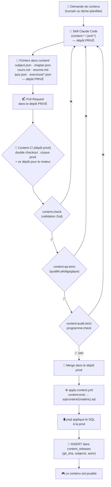
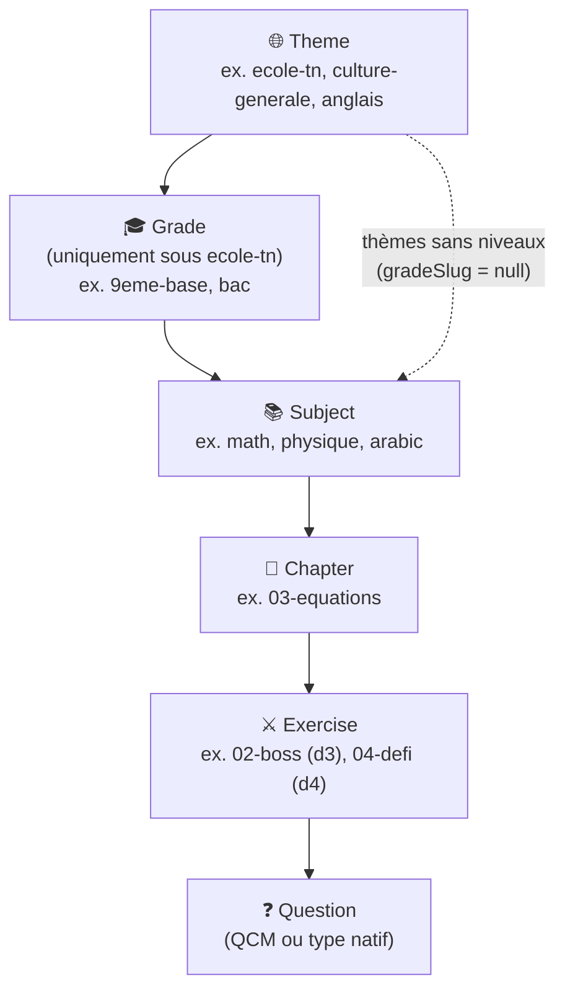
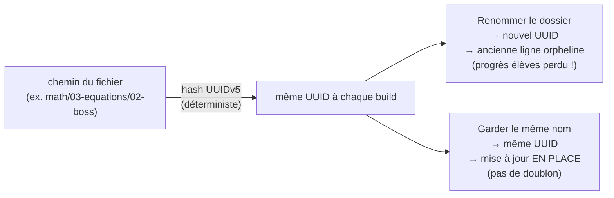
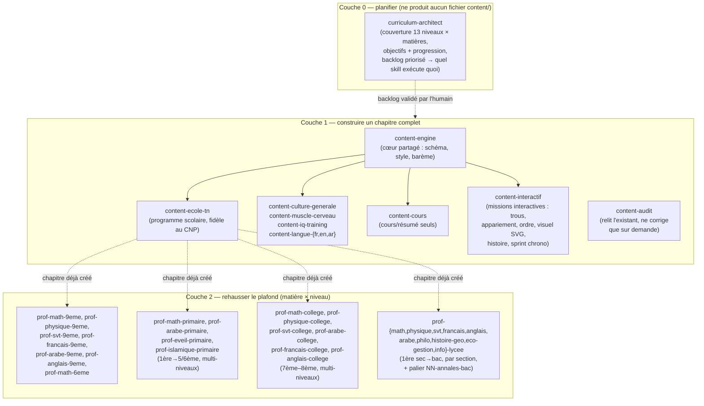
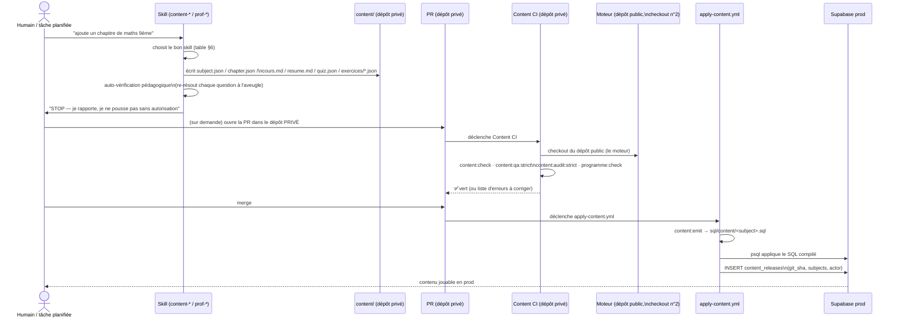
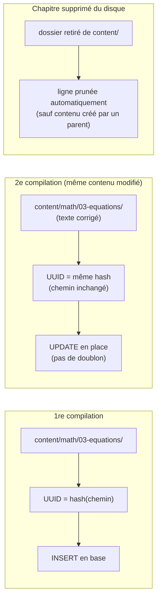
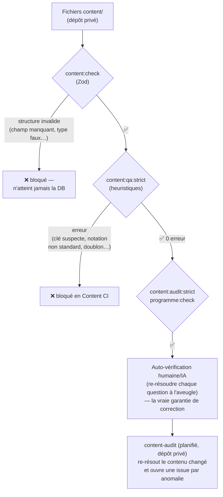
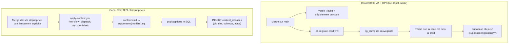
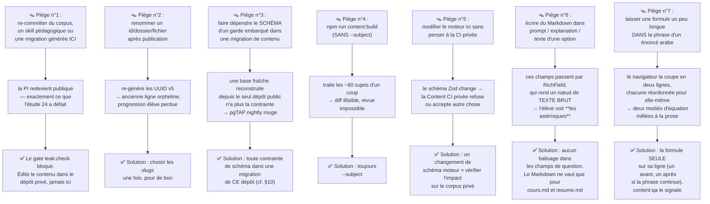

# Pipeline de génération de contenu — guide complet

> **Pour qui ?** Ce document explique, en langage simple et avec des schémas, comment le contenu
> pédagogique (matières, chapitres, cours, quiz, exercices) est **créé, validé, compilé en SQL,
> puis appliqué en prod** — et **où** chaque morceau de la chaîne vit depuis que le corpus a
> quitté ce dépôt. Il est écrit pour être compris aussi bien par un humain (auteur de contenu,
> développeur, relecteur) que par une IA (Claude) qui reprend le travail.
>
> ⚠️ **Depuis l'étude 24 (2026-07-20), le corpus et l'usine de génération ne vivent plus dans
> ce dépôt public.** Ils ont été transférés dans le dépôt **privé** `MBeji/yahia-quest-content`
> (sur invitation). Ce dépôt-ci ne garde que le **moteur** — générique et sans corpus. Si tu
> cherches `content/` ici, c'est normal : il n'existe plus. Lis le §2 avant tout le reste.
>
> Ce fichier est un **résumé narratif avec schémas** — la source de vérité normative reste
> [`AGENTS.md`](../AGENTS.md) (§ "Content pipeline"), et, côté dépôt privé, le README du corpus
> et `.claude/skills/content-engine/references/generation-pipeline.md`. En cas de désaccord,
> ceux-là gagnent — corrige ce fichier.

---

## 1. L'idée en une phrase

> Le contenu pédagogique n'est **jamais écrit directement en base de données** : on écrit des
> **fichiers texte versionnés** dans le **dépôt privé**, un **moteur** hébergé dans ce dépôt
> public les **valide** puis les **compile** en SQL idempotent, et c'est **le merge dans le dépôt
> privé** qui l'applique en prod.

Fichiers → validation → SQL → revue humaine (PR) → merge → prod. Jamais l'inverse, jamais de
raccourci.

Ce qui a changé avec l'étude 24 : le contenu **n'est plus livré sous forme de migrations
Supabase**. Il est compilé en fichiers `sql/content/<subject>.sql` stables et appliqué par un
workflow dédié — parce qu'une base ne peut porter **qu'un seul** historique de migrations, et
que deux dépôts qui poussent dedans se bloquent mutuellement (voir §11).

---

## 2. Où vit quoi — la répartition public / privé

C'est la question n°1 depuis la scission. La ligne de partage est simple :

> **Le moteur est public et générique. Le corpus et l'usine qui le fabriquent sont privés.**


```mermaid
flowchart LR
    subgraph PUB["🌍 yahia-quest-arena (public)"]
        E1["scripts/content/**\n(build, qa, audit, suivi, svg)"]
        E2["src/shared/content/**\n(loader, schema, sql-builder,\nqa-checks, program-manifest)"]
        E3["scripts npm content:* / programme:*"]
        E4["supabase/migrations/**\n(schéma + ops)"]
        E5["gate anti-fuite\nleak:check"]
    end

    subgraph PRIV["🔒 MBeji/yahia-quest-content (privé, sur invitation)"]
        C1["content/**\n(566 chapitres, ~18 700 questions,\ncorrigés)"]
        C2["registres : misconceptions.json,\ncompetences/, videos.json"]
        C3["41 skills pédagogiques\n(content-*, prof-*,\ncurriculum-architect)"]
        C4["FableEtudes/ +\nMÉTHODE-GENERATION-CONTENU.md"]
        C5["workflows content-audit.yml,\nvideo-health.yml, apply-content.yml"]
    end

    PRIV -->|"la CI privée fait un double checkout :\nson corpus + ce dépôt pour le moteur"| PUB
```

| Ce que tu cherches                                                                                      | Où c'est                                                       |
| ------------------------------------------------------------------------------------------------------- | -------------------------------------------------------------- |
| Le corpus (`content/`, cours, quiz, exercices, corrigés)                                                | **dépôt privé**                                                |
| Les registres `misconceptions.json`, `competences/`, `videos.json`                                      | **dépôt privé**                                                |
| Les 41 skills pédagogiques (`content-*`, `prof-*`, `curriculum-architect`)                              | **dépôt privé**                                                |
| Les études (`FableEtudes/`) et `METHODE-GENERATION-CONTENU.md`                                          | **dépôt privé**                                                |
| Les workflows `content-audit.yml` et `video-health.yml`                                                 | **dépôt privé**                                                |
| Le **moteur** : `scripts/content/**` et `src/shared/content/**`                                         | **ici** (public) — générique, aucun corpus dedans              |
| Les commandes `npm run content:*` / `programme:*`                                                       | **ici** (public) — la CI privée les invoque depuis ce checkout |
| Les 5 skills techniques (`verify`, `code-review`, `regression-guard`, `upgrade-guard`, `report-triage`) | **ici** (public)                                               |
| Les migrations de **schéma** et d'**ops**                                                               | **ici** (public), `supabase/migrations/`                       |
| Les **17 migrations de contenu écrites à la main**                                                      | **ici** (public) — elles restent, voir §10                     |
| L'état du projet, les décisions                                                                         | **ici** (public), [`STATUS.md`](../STATUS.md)                  |

> 🧠 **Le moteur est public exprès.** Il ne contient aucune question, aucun corrigé : c'est un
> validateur Zod + un compilateur SQL. C'est pour ça que la CI du dépôt privé fait un **double
> checkout** — elle récupère son corpus **et** ce dépôt-ci pour disposer du moteur. Modifier le
> schéma du moteur ici change donc ce que la CI privée accepte : les deux dépôts avancent
> ensemble.

**Ce qui a été retiré d'ici** au moment de la scission : le corpus entier, les 41 skills
pédagogiques, les études, les deux workflows ci-dessus, et **228 migrations de contenu générées**
(`*_generated_*_content.sql` et `*_generated_competences_registry.sql`).

---

## 3. Vue d'ensemble du pipeline (après la scission)


```mermaid
flowchart TD
    A["👤 Demande de contenu\n(humain ou tâche planifiée)"] --> B["🧠 Skill Claude Code\n(content-* / prof-*)\n— dépôt PRIVÉ"]
    B --> C["📁 Fichiers dans content/\nsubject.json · chapter.json\ncours.md · resume.md\nquiz.json · exercices/*.json\n— dépôt PRIVÉ"]
    C --> PR["📬 Pull Request\ndans le dépôt PRIVÉ"]
    PR --> CI{"🔎 Content CI (dépôt privé)\ndouble checkout : corpus privé\n+ ce dépôt pour le moteur"}
    CI --> G1{"content:check\n(validation Zod)"}
    G1 -- "❌" --> B
    G1 -- "✅" --> G2{"content:qa:strict\n(qualité pédagogique)"}
    G2 -- "❌" --> B
    G2 -- "✅" --> G3{"content:audit:strict\nprogramme:check"}
    G3 -- "❌" --> B
    G3 -- "✅ vert" --> H["🔀 Merge dans le dépôt privé"]
    H --> I["⚙️ apply-content.yml\ncontent:emit → sql/content/(matière).sql"]
    I --> J["🛢️ psql applique le SQL\nà la prod"]
    J --> K["📓 INSERT dans content_releases\n(git_sha, subjects, actor)"]
    K --> L["🎮 Le contenu est jouable"]
```

**Ce qu'il faut retenir de ce schéma :**

- Une IA (skill) ou un humain n'écrit **que des fichiers** — jamais de SQL à la main.
- Les portes de qualité tournent désormais **dans la CI du dépôt privé** (c'est là que vit le
  corpus à valider), mais elles exécutent **le moteur de ce dépôt-ci**.
- Le SQL compilé est appliqué à la prod par **un lancement explicite** d'`apply-content.yml`
  (`workflow_dispatch`, `dry_run=true` par défaut) — le merge seul ne publie rien.
- Le contenu **ne passe plus par `supabase/migrations/`** : il a son propre canal et son propre
  journal (`content_releases`).

---

## 4. La hiérarchie du catalogue (le modèle mental)

Inchangée par la scission — c'est le modèle de données, il vit dans le schéma public.


```mermaid
flowchart TD
    T["🌐 Theme\nex. ecole-tn, culture-generale, anglais"]
    G["🎓 Grade\n(uniquement sous ecole-tn)\nex. 9eme-base, bac"]
    S["📚 Subject\nex. math, physique, arabic"]
    C["📖 Chapter\nex. 03-equations"]
    E["⚔️ Exercise\nex. 02-boss (d3), 04-defi (d4)"]
    Q["❓ Question\n(QCM ou type natif)"]

    T --> G --> S --> C --> E --> Q
    T -. "thèmes sans niveaux\n(gradeSlug = null)" .-> S
```

- Un **theme** est une grande piste (le programme scolaire tunisien, la culture générale, une
  langue…). Seul `ecole-tn` a des **grades** (la classe : 1ère année de base → Bac).
- Une **subject** (matière) appartient à un theme, et si le thème a des grades, à un grade précis
  (`gradeSlug`).
- Un **chapter** (chapitre) appartient à une matière ; il porte le cours (`cours.md`), le résumé
  (`resume.md`) et le quiz obligatoire (`quiz.json`).
- Un **exercise** (mission) appartient à un chapitre ; sa difficulté (1 à 4) détermine sa
  récompense.
- Une **question** appartient à un exercice ou au quiz — QCM par défaut, ou l'un des types natifs
  (voir [`docs/guide-types-questions-natifs.md`](./guide-types-questions-natifs.md)).

> 💡 **9ème année n'est qu'un `grade` parmi 13.** C'est le plus riche en contenu aujourd'hui,
> mais l'architecture est générique : n'importe quel thème/niveau suit le même pipeline.

---

## 5. L'arborescence de fichiers (ce qu'on écrit vraiment)

Cette arborescence vit **dans le dépôt privé**. Le moteur de ce dépôt-ci sait la lire et la
valider, mais elle n'existe pas ici.

```
content/                        ← dépôt PRIVÉ yahia-quest-content
└── math/                       ← un dossier = une SUBJECT (contient subject.json)
    ├── subject.json            ← méta : id, nom natif, thème, niveau, langue…
    └── 03-equations/           ← un dossier = un CHAPTER (contient chapter.json)
        ├── chapter.json        ← titre, description, ordre, domaine, sources[]
        ├── cours.md            ← le cours complet (markdown, style RPG)
        ├── resume.md           ← résumé du cours (bullet points)
        ├── quiz.json           ← quiz de compréhension OBLIGATOIRE (verrou)
        └── exercices/
            ├── 01-pratique.json ← practice, difficulté 1, 50 XP / 10 coins
            ├── 02-boss.json     ← boss, difficulté 3, 120 XP / 30 coins
            └── 04-defi.json     ← challenge, difficulté 4, 300 XP / 60 coins
```

**Règle d'or : le nom du dossier/fichier EST l'identité.** Chaque ID en base est un
**UUID v5 déterministe**, calculé à partir du chemin (`subjectId/chapterSlug/exerciseSlug/qN`).


```mermaid
flowchart LR
    P["chemin du fichier\n(ex. math/03-equations/02-boss)"] -->|"hash UUIDv5\n(déterministe)"| U["même UUID à chaque build"]
    U --> R1["Renommer le dossier\n→ nouvel UUID\n→ ancienne ligne orpheline\n(progrès élèves perdu !)"]
    U --> R2["Garder le même nom\n→ même UUID\n→ mise à jour EN PLACE\n(pas de doublon)"]
```

C'est pourquoi la règle absolue est : **on ne renomme jamais** un `id` de matière, un dossier de
chapitre ou un fichier d'exercice une fois publié. On ajoute toujours du contenu **nouveau** à côté
(le prochain `NN` libre), on ne renumérote/réordonne jamais l'existant.

---

### Les domaines d'une matière (« sections »)

Un programme officiel n'est pas une liste plate de chapitres : les maths alternent **algèbre** et
**géométrie**, l'arabe et les langues séparent **grammaire**, **conjugaison** et **compréhension**.
Le champ **facultatif** `domain` de `chapter.json` porte ce découpage :

```json
{ "title": "Théorème de Thalès", "description": "…", "displayOrder": 4, "domain": "Géométrie" }
```

Cinq règles, et rien d'autre :

1. **Seul le programme scolaire a des sections.** Une matière sans niveau (`gradeSlug` nul :
   parcours libre, entraînement, culture générale) n'a pas de programme officiel dont tirer des
   domaines — ce qu'on y écrirait serait un découpage inventé. `content:qa` en fait une **erreur**
   (arbitrage du 2026-08-18).
2. **C'est un libellé, pas une clé.** Il s'écrit dans la langue de la matière
   (`contentLanguage`), comme le titre — « Géométrie » sous une matière française,
   « قواعد اللغة » sous une matière arabe. Il n'y a pas de table de domaines à tenir.
3. **Le texte EST l'identité.** Deux graphies d'un même domaine dans une matière
   (« Géométrie » / « geometrie », avec ou sans tashkil) sont une **erreur** de `content:qa` :
   le hub les regrouperait en n'en gardant qu'une, sans que personne ne le voie.
4. **L'ordre des domaines ne s'écrit pas** — il se lit dans les `displayOrder` des chapitres,
   à la première apparition. Un programme qui entrelace ses domaines garde sa progression.
5. **Tout ou rien par matière, à terme.** Rattacher la moitié des chapitres est un **warn** :
   les autres tombent sous « Autres chapitres » dans le hub. Et un domaine unique pour toute
   la matière ne groupe rien — le hub n'affiche des en-têtes qu'à partir de deux.

Une matière dont le programme n'a pas de domaines n'écrit simplement rien : son hub garde la
liste plate. La colonne compilée est `chapters.domain`
([`20260818120000_chapter_domain.sql`](../supabase/migrations/20260818120000_chapter_domain.sql)).

### Le manuel officiel, en lien plutôt qu'en copie

Le manuel élève est **le livre de la MATIÈRE** : une œuvre couvre l'année entière. Il se nomme
donc une fois, sur la page matière, et pas sous chacun de ses vingt chapitres (arbitrage du
2026-08-19). Deux surfaces le portent, et elles ne coûtent pas la même chose :

| Surface                                      | Déclarée par                 | Le fichier vient de…        | Compte requis |
| -------------------------------------------- | ---------------------------- | --------------------------- | ------------- |
| **Carte « Manuel officiel » (page matière)** | `subject.json` → `manuels[]` | **le CNP, chez lui**        | **non**       |
| Galerie « Pages du manuel » (sous le cours)  | `chapter.json` → `manuel`    | bucket privé `manuel-pages` | oui           |

La carte n'héberge **rien**. Elle reconstruit l'adresse du document à partir du `code` que le
contenu déclare déjà — `src/shared/content/manuel-cnp.ts` — donc **aucun champ nouveau à écrire,
aucun PDF à téléverser, aucun stockage à tenir à jour**. Un volume par entrée de `manuels[]`,
ouvert à sa couverture.

Elle servait auparavant un PDF que nous hébergions nous-mêmes (bucket privé `manuel-eleve`,
server fn à URL signée, connexion requise). Tout cela est retiré : demander un compte pour un
document public à la source ne se justifiait pas. Le bucket et sa migration restent en base, à
démonter dans un second temps (DoD §7) ; plus aucun code ne les lit.

La galerie de pages, elle, garde son sens et son verrou : ce sont des images que **nous**
hébergeons, chapitre par chapitre.

Trois propriétés à ne pas perdre en y touchant :

1. **Aucune URL libre ne traverse le pipeline** — c'est la doctrine de l'étude 23 (D-10) pour les
   vidéos, appliquée telle quelle. Le contenu déclare un `code`, jamais une adresse ; le lien se
   rebâtit par gabarit. Une coquille ne peut donc produire qu'un document manquant, jamais une
   destination arbitraire dans le navigateur d'un élève.
2. **Le nom de fichier se déduit du code.** Le registre CNP nomme ses documents
   `<code><tome>.pdf` : un code qui épelle déjà son tome (`102105P01`) est pris tel quel, un code
   nu (`102905`) reçoit `P00` — le seul tome que le corpus lui connaisse.
3. **`content:qa` vérifie que le document existe.** Chaque code — de matière comme de chapitre —
   est confronté à `suivi/corpus-cnp.json` (`auditManuelRefs`) : absent du corpus ⇒ **erreur**.
   Sans ce contrôle, une coquille ne se voyait qu'à une carte restée vide ; elle se verrait
   maintenant à un lien qui tombe en 404 devant l'élève. Le contrôle se met en veille — en
   l'annonçant — quand le corpus n'est pas branché, comme la garde anti-verbatim.

⚠️ **La seule valeur à re-pointer si le CNP déplace son dépôt** est `CNP_MANUEL_BASE_URL`
(`src/shared/content/manuel-cnp.ts`). Tout le reste se dérive des codes déjà présents dans
`content/`.

**Et si l'éditeur bouge quand même ?** `content:qa` prouve qu'un code EXISTE au registre, pas que
le document répond encore aujourd'hui. C'est le rôle de `npm run content:manuel:check`
([`scripts/content/check-manuel-links.ts`](../scripts/content/check-manuel-links.ts)), sonde
hebdomadaire branchée en non-régression par le workflow privé `manuel-health.yml` :

- **elle ne télécharge aucun manuel** — un `HEAD` par code DISTINCT (14 aujourd'hui), quelques
  secondes. Le statut dit si le document est là ; `Content-Length` dit sa taille, que le registre
  connaît déjà (`octets`). Même taille ⇒ même document. Repli sur un GET d'UN octet
  (`Range: bytes=0-0`) quand le serveur refuse `HEAD` ou tait sa taille ;
- **`broken` UNIQUEMENT sur 404/410**, les deux seuls statuts où le serveur affirme que la
  ressource n'est plus là. 401/403 (proxy, WAF, blocage géographique), 5xx, corps non-PDF et
  pannes réseau tombent en `unknown`. Ce n'est pas de la timidité : lancée depuis un réseau dont
  la passerelle refuse le domaine, une première version déclarait morts les 14 manuels d'un coup ;
- **`blind: true`** quand RIEN n'a pu être vérifié — sans ce drapeau, un tel passage se lirait
  « 0 broken », donc « tout va bien », alors qu'il n'a rien prouvé ;
- **jamais dans `verify` ni dans les checks requis** : la disponibilité d'un site tiers ne doit
  pas bloquer la file de merge (leçon `audit:deps`). Elle ouvre une issue de suivi, refermée
  d'elle-même au premier passage propre, et n'écrit jamais dans `content/`.

---

## 6. Qui écrit quoi ? La couche de planification + les deux couches de skills

Le contenu n'est **jamais écrit "à la main" par un développeur** — il est produit par des
**skills Claude Code** spécialisés. **Ces 41 skills vivent dans le dépôt privé** : une couche de
**planification** en amont, puis deux couches d'**écriture** qui ne se chevauchent pas.


```mermaid
flowchart TD
    subgraph L0["Couche 0 — planifier (ne produit aucun fichier content/)"]
        CA["curriculum-architect\n(couverture 13 niveaux × matières,\nobjectifs + progression,\nbacklog priorisé → quel skill exécute quoi)"]
    end

    subgraph L1["Couche 1 — construire un chapitre complet"]
        CE["content-engine\n(cœur partagé : schéma, style, barème)"]
        W1["content-ecole-tn\n(programme scolaire, fidèle au CNP)"]
        W2["content-culture-generale\ncontent-muscle-cerveau\ncontent-iq-training\ncontent-langue-{fr,en,ar}"]
        W3["content-cours\n(cours/résumé seuls)"]
        W5["content-interactif\n(missions interactives : trous,\nappariement, ordre, visuel SVG,\nhistoire, sprint chrono)"]
        W4["content-audit\n(relit l'existant, ne corrige\nque sur demande)"]
        CE --> W1
        CE --> W2
        CE --> W3
        CE --> W5
    end

    subgraph L2["Couche 2 — rehausser le plafond (matière × niveau)"]
        P1["prof-math-9eme, prof-physique-9eme,\nprof-svt-9eme, prof-francais-9eme,\nprof-arabe-9eme, prof-anglais-9eme,\nprof-math-6eme"]
        P2["prof-math-primaire, prof-arabe-primaire,\nprof-eveil-primaire,\nprof-islamique-primaire\n(1ère→5/6ème, multi-niveaux)"]
        P3["prof-math-college, prof-physique-college,\nprof-svt-college, prof-arabe-college,\nprof-francais-college, prof-anglais-college\n(7ème–8ème, multi-niveaux)"]
        P4["prof-{math,physique,svt,francais,anglais,\narabe,philo,histoire-geo,eco-gestion,info}-lycee\n(1ère sec→bac, par section,\n+ palier NN-annales-bac)"]
    end

    CA -.->|"backlog validé par l'humain"| L1
    W1 -.->|"chapitre déjà créé"| P1
    W1 -.->|"chapitre déjà créé"| P2
    W1 -.->|"chapitre déjà créé"| P3
    W1 -.->|"chapitre déjà créé"| P4
```

> 🏛️ **Lycée** : l'architecture du secondaire (sections = nœuds de grade, bascule linguistique
> ar→fr des matières scientifiques en 1ère sec — générées **nativement en français** dans le
> jargon des manuels officiels, jamais en traduction (décision 2026-07-13) —, ladder complet
> incl. `NN-annales-bac`, migration de seed et rollout phasé) est spécifiée dans
> [`docs/lycee-architecture.md`](./lycee-architecture.md).

> 🎭 **Les rôles classiques d'une équipe éditoriale sont tous couverts** — Curriculum Designer →
> `curriculum-architect` ; Content Writer → `content-cours` + wrappers ; Exercise Designer →
> wrappers + `content-interactif` ; Professeur par matière → `prof-*` ; Question Reviewer →
> `content-audit` + `content:qa:strict` ; Translator → **aucun par conception** (trois sujets
> frères natifs par langue, jamais de traduction ; le scolaire est monolingue) ; Difficulty
> Calibrator → règles encodées (`rewards-and-modes.md`, `expert-exercises.md`) ; SQL/JSON Exporter
> → script déterministe `scripts/content/build.ts` (**ce dépôt-ci**), jamais un LLM. La matrice
> détaillée est dans `generation-pipeline.md`, côté dépôt privé.

| Couche                                     | Ce qu'elle produit                                                                                                          | Ne touche jamais                              |
| ------------------------------------------ | --------------------------------------------------------------------------------------------------------------------------- | --------------------------------------------- |
| **Planification** (`curriculum-architect`) | un backlog priorisé + objectifs/progression par niveau×matière                                                              | aucun fichier `content/` — plan seulement     |
| **Base** (`content-*`)                     | cours + résumé + quiz + ladder (difficulté 1–2, + boss/défi d3-4 standard) ; missions interactives via `content-interactif` | —                                             |
| **Professeur** (`prof-*`)                  | exercices **difficiles/élites** (d3–4) **en plus**, sur un chapitre qui existe déjà                                         | le cours ou le quiz                           |
| **Audit** (`content-audit`)                | un rapport de qualité (re-résout chaque question)                                                                           | ne corrige que si on le demande explicitement |

### Table de sélection rapide (« je veux… → j'utilise… »)

> Tous ces skills s'invoquent depuis une session ouverte sur le **dépôt privé**.

| Je veux…                                                                                    | Skill à utiliser                                                |
| ------------------------------------------------------------------------------------------- | --------------------------------------------------------------- |
| **Planifier la couverture / la roadmap / la progression** d'un niveau                       | `curriculum-architect`                                          |
| Créer un **nouveau chapitre** complet (programme scolaire)                                  | `content-ecole-tn`                                              |
| Créer un nouveau chapitre pour un thème non scolaire                                        | le wrapper `content-*` correspondant (culture/iq/langue/muscle) |
| Réécrire **seulement le cours ou le résumé**                                                | `content-cours`                                                 |
| Réécrire **seulement le quiz** ou ajouter du **d1–2**                                       | le wrapper du programme (ou `content-engine` de base)           |
| Ajouter des **missions interactives** (trous, appariement, ordre, visuel, histoire, sprint) | `content-interactif`                                            |
| Ajouter des exercices **difficiles/élites (d3–4)** pour une matière × niveau scolaire       | le `prof-*` correspondant                                       |
| **Auditer / vérifier** du contenu existant                                                  | `content-audit`                                                 |
| Comprendre le schéma / le barème qualité / les récompenses / la notation                    | `content-engine/references/*` (dépôt privé)                     |

> ℹ️ Les formats interactifs "natifs" (saisie numérique, glisser-déposer, appariement,
> multi-sélection) sont **livrés** — voir [`docs/guide-types-questions-natifs.md`](./guide-types-questions-natifs.md)
> pour l'usage et [`docs/interactive-question-types.md`](./interactive-question-types.md) pour la
> spec normative. Le catalogue des formats encodables en QCM (`interactive-formats.md`) vit dans
> le dépôt privé.

---

## 7. Le cycle de vie détaillé d'une demande de contenu


```mermaid
sequenceDiagram
    actor U as Humain / tâche planifiée
    participant S as Skill (content-* / prof-*)
    participant F as content/ (dépôt privé)
    participant PR as PR (dépôt privé)
    participant CI as Content CI (dépôt privé)
    participant EN as Moteur (dépôt public,\ncheckout n°2)
    participant AP as apply-content.yml
    participant DB as Supabase prod

    U->>S: "ajoute un chapitre de maths 9ème"
    S->>S: choisit le bon skill (table §6)
    S->>F: écrit subject.json / chapter.json /\ncours.md / resume.md / quiz.json / exercices/*.json
    S->>S: auto-vérification pédagogique\n(re-résout chaque question à l'aveugle)
    S->>U: "STOP — je rapporte, je ne pousse pas sans autorisation"
    U->>PR: (sur demande) ouvre la PR dans le dépôt PRIVÉ
    PR->>CI: déclenche Content CI
    CI->>EN: checkout du dépôt public (le moteur)
    CI->>CI: content:check · content:qa:strict\ncontent:audit:strict · programme:check
    CI-->>PR: ✅ vert (ou liste d'erreurs à corriger)
    U->>PR: merge
    PR->>AP: déclenche apply-content.yml
    AP->>AP: content:emit → sql/content/<subject>.sql
    AP->>DB: psql applique le SQL compilé
    AP->>DB: INSERT content_releases\n(git_sha, subjects, actor)
    DB-->>U: contenu jouable en prod
```

Points clés de ce cycle :

1. **Tout se passe dans le dépôt privé** — la PR, la revue, le merge. Ce dépôt-ci n'intervient
   que comme fournisseur du moteur.
2. **Le skill s'arrête après avoir écrit les fichiers** — il ne pousse rien sans qu'on le lui
   demande explicitement (« stop and report »).
3. **La compilation est faite par la CI**, pas à la main : `content:emit` produit un fichier SQL
   **stable par matière** (`sql/content/<subject>.sql`), pas une migration horodatée.
4. **Le déploiement N'EST PAS automatique** : `apply-content.yml` n'a pas de déclencheur `push`, il
   est `workflow_dispatch` seul et son `dry_run` vaut **`true`** par défaut. Après le merge, le
   contenu est dans le dépôt mais **pas encore en base** — il faut lancer le workflow, d'abord à
   blanc puis avec `dry_run=false` :

   ```bash
   gh workflow run apply-content.yml -R MBeji/yahia-quest-content -f subjects=<sujet> -f dry_run=false
   ```

   _(Corrigé le 2026-07-28 : ce point affirmait l'inverse — « déploiement automatique, pas d'étape
   manuelle en prod ». Une campagne s'était crue publiée alors que rien n'était appliqué.)_

   ⚠️ **`subjects` VIDE N'EST PAS UN DÉFAUT ANODIN — c'est une opération de maintenance.**
   Laisser le champ vide applique **tout le corpus** : ~45 min d'écriture CONTINUE sur la base de
   production, contre ~2 min pour un sujet ciblé. Deux propriétés à ne pas confondre :

   - **Intégrité** — sûre dans les deux cas. Chaque fichier passe en `psql --single-transaction` :
     un sujet est appliqué en entier ou pas du tout, même si le job est interrompu.
   - **Charge** — PAS la même. Une application intégrale tient la base sous écriture assez
     longtemps pour dégrader les lectures de l'app. Vécu le 2026-08-18 : un corpus complet lancé
     à 18:39 UTC, en pleine utilisation, a fait tomber le tableau de bord des élèves sur
     « Failed to load dashboard » ; l'annulation du run a suffi à tout rétablir, sans perte.

   Donc : **cibler `subjects`** dès qu'on sait quoi publier — c'est le geste courant, celui d'une
   fin de campagne. Le corpus complet se réserve à une réconciliation, **hors des heures
   d'usage**, et en sachant qu'on ouvre une fenêtre de dégradation. L'annulation reste toujours
   possible et propre : les sujets déjà passés sont committés, celui en cours est annulé, la
   trace `content_releases` (écrite en fin de job) est simplement perdue — une reprise
   ultérieure la rétablit.

5. **Chaque application laisse une trace** dans la table `content_releases` (§11).

---

## 8. Pourquoi c'est idempotent (le modèle UUID v5)


```mermaid
flowchart LR
    subgraph "1re compilation"
        A1["content/math/03-equations/"] --> B1["UUID = hash(chemin)"] --> C1["INSERT en base"]
    end
    subgraph "2e compilation (même contenu modifié)"
        A2["content/math/03-equations/\n(texte corrigé)"] --> B2["UUID = même hash\n(chemin inchangé)"] --> C2["UPDATE en place\n(pas de doublon)"]
    end
    subgraph "Chapitre supprimé du disque"
        A3["dossier retiré de content/"] --> C3["ligne prunée automatiquement\n(sauf contenu créé par un parent)"]
    end
```

Conséquence pratique : on peut **réappliquer le SQL d'une matière autant de fois qu'on veut** sans
créer de doublons — c'est ce qui permet d'enrichir le catalogue en continu, chapitre par chapitre,
sans jamais tout regénérer. C'est aussi ce qui rend possible le passage du contenu **hors** du
cadre des migrations : un fichier `sql/content/<subject>.sql` **stable** (toujours le même nom)
peut être rejoué à chaque release sans historique à tenir.

---

## 9. Les portes de qualité (gates) — et où elles tournent maintenant


```mermaid
flowchart TD
    F["Fichiers content/\n(dépôt privé)"] --> G1{"content:check\n(Zod)"}
    G1 -- "structure invalide\n(champ manquant, type faux…)" --> X1["❌ bloqué —\nn'atteint jamais la DB"]
    G1 -- "✅" --> G2{"content:qa:strict\n(heuristiques)"}
    G2 -- "erreur\n(clé suspecte, notation\nnon standard, doublon…)" --> X2["❌ bloqué en Content CI"]
    G2 -- "✅ 0 erreur" --> G3{"content:audit:strict\nprogramme:check"}
    G3 -- "✅" --> G4["Auto-vérification humaine/IA\n(re-résoudre chaque question à l'aveugle)\n— la vraie garantie de correction"]
    G4 --> G5["content-audit (planifié, dépôt privé)\nre-résout le contenu changé\net ouvre une issue par anomalie"]
```

Les niveaux de filtrage, chacun attrapant un type d'erreur différent :

| Porte                      | Attrape                                                                                                           | Ne détecte PAS                                         |
| -------------------------- | ----------------------------------------------------------------------------------------------------------------- | ------------------------------------------------------ |
| `content:check` (Zod)      | champs manquants, mauvais types, contraintes de forme                                                             | une bonne réponse fausse                               |
| `content:qa:strict`        | déséquilibre des clés, notation non standard, structure suspecte, **reprise verbatim d'une source non autorisée** | une bonne réponse fausse                               |
| `content:audit:strict`     | conformité au programme officiel, couverture                                                                      | une bonne réponse fausse                               |
| `programme:check`          | cohérence du registre de transcription des programmes officiels                                                   | la qualité du contenu lui-même                         |
| Auto-vérification (skill)  | ce que le skill doit faire lui-même avant de rapporter                                                            | erreurs qu'il n'a pas vues                             |
| `content-audit` (planifié) | **ré-résout vraiment** chaque question, vérifie fidélité au programme                                             | rien n'est garanti à 100 %, c'est un filet de sécurité |

> ⚠️ Un mauvais corrigé (bonne réponse fausse) **passe** `content:check` et `content:qa:strict` —
> ces outils vérifient la **structure**, pas la **vérité**. C'est pour ça que `content-audit`
> existe : un balayage planifié qui re-résout chaque question.

#### Une explication ne désigne jamais une option par sa lettre ni son rang

`shuffleOptions` (`src/shared/lib/question-utils.ts`) mélange l'ordre des options au rendu, dans
les trois surfaces qui affichent un QCM (`exercise-player`, `duel-arena`, donjon). Une explication
qui dit « la réponse **b** se trompe de signe » ou « la **dernière** réponse intervertit la somme
et le produit » désigne donc une position que l'élève ne voit jamais : au mieux elle est inutile,
au pire elle accuse une option au hasard. Le bon patron cite la **valeur** ou l'**expression** —
« la réponse −25 vient d'une erreur de signe », « 3 et 10 respecte le produit mais pas la somme ».

`content:qa` le signale (`auditOptionReference`, dans `scripts/content/qa-checks.ts`), en
**[warn]** tant que la campagne de réécriture du corpus n'est pas finie : au 2026-07-30 l'état des
lieux comptait ~6 100 occurrences sur 715 fichiers et 48 matières. La bascule en **[error]** se
fait via `OPTION_REFERENCE_LEVEL` quand la QA ne remonte plus rien.

#### Aucun énoncé ne reprend l'expression d'une source non autorisée

Quand une campagne se **calibre** sur une source tierce — un devoir d'enseignant, un site de
séries corrigées — la frontière légale est fine et nette : **une notion se reprend librement, une
expression non.** « Calculer la résultante de deux forces concourantes » appartient à tout le
monde ; la phrase de l'auteur, ses valeurs, son contexte et la formulation de son corrigé lui
appartiennent. Cette frontière ne tient pas par bonne volonté d'un agent : `content:qa` la
vérifie.

Le contrôle (`auditVerbatim`, dans `scripts/content/verbatim-checks.ts`) indexe les séquences de
8 mots de chaque fiche de source externe **dont les droits n'autorisent pas la reprise**, puis les
cherche dans les cours, les résumés, les énoncés, le texte des options et les explications. Un
recouvrement est une **[error]** — jamais un warning : un avertissement se traverse, une
contrefaçon ne se traverse pas.

Trois propriétés à connaître avant de lire un verdict :

- **La notation sort du calcul.** Figures SVG, maths, LaTeX, code sont retirés, et les nombres
  disparaissent avec (seules les suites de lettres font des jetons). « une masse de 250 g » et
  « une masse de 45 g » se comparent donc sur le même squelette — sans quoi toute équation
  partagée serait un faux positif. C'est bien la **prose** qu'on compare.
- **Le défaut est sûr.** Une fiche sans en-tête de provenance, ou dont l'autorisation n'est pas
  explicitement `accordée`, est **surveillée**. Se tromper dans ce sens coûte une reformulation.
- **Le compte est toujours imprimé, même à zéro.** Dans le dépôt public il n'y a aucune fiche :
  le gate annonce « 0 source sous surveillance » et passe. Un gate muet ne se distingue pas d'un
  gate absent, et c'est ainsi qu'on le désarme sans le savoir.

Les fiches vivent aux deux emplacements du profil `source-web` :
`sources-externes/<slug>/fiche.md` (école) et `content/_sources/<theme>/<slug>/fiche.md` (hors
école). Doctrine complète, tiers d'usage et questions ouvertes : **étude 27** (dépôt privé).

### Qui exécute quoi, depuis la scission

| Gate                                                                                             | S'exécute dans                                     |
| ------------------------------------------------------------------------------------------------ | -------------------------------------------------- |
| `content:check`, `content:qa:strict`, `content:audit:strict`, `programme:check`                  | la **Content CI du dépôt privé** (double checkout) |
| `lint`, `typecheck`, `test:coverage`, `build:check`, `audit:deps`, `harness:check`, `leak:check` | la CI de **ce dépôt** (`ci:verify`)                |

**La CI de ce dépôt ne valide plus de contenu** — elle n'en a plus. `npm run ci:verify` ici,
c'est : `lint` + `typecheck` + `test:coverage` + `build:check` + `audit:deps` + `harness:check` +
`leak:check`. Le gate local `npm run verify` inclut lui aussi `leak:check`.

> 🔧 Les commandes `content:*` et `programme:*` **existent toujours ici** et ne sont pas
> dépréciées : c'est précisément ce que la CI privée invoque depuis ce checkout. Simplement,
> lancées ici **sans corpus**, elles n'ont rien à traiter.

### `programme:etat` — l'état des lieux (un rapport, pas une porte)

```bash
npm run programme:etat -- --grade 1ere-sec     # un niveau ; --json pour un autre outil
```

Les portes ci-dessus disent **oui ou non**. Avant d'ouvrir une campagne, la question est autre :
_où en est-on ?_ — et la réponse était jusqu'ici reconstituée à la main, en croisant `_INDEX.md`,
`CATALOGUE.md` et l'audit de programme. `programme:etat` la **calcule et la vérifie** : pour
chaque couple niveau × matière, l'état de la **fiche** (statut, profondeur, couverture calculée,
plages non lues, verdict R-7, génération autorisée ou non) et l'état du **contenu** (sujet
présent, chapitres couverts/attendus, incomplets), plus le corpus principal encore non rattaché.

**Et un troisième volet, l'ouverture en prod** — parce que du contenu appliqué en base reste
**invisible aux élèves** tant que le parcours du niveau est `coming_soon` : la bascule est une
migration `UPDATE public.parcours SET status = 'available'` (seuil R-8, étude 16), un geste séparé
du contenu que ni les gates de contenu ni la Content CI ne réclament. Le rapport le mesure en
**rejouant statiquement** `supabase/migrations` (`src/shared/content/parcours-ouverture.ts`) : seeds
puis bascules, dans l'ordre des versions, dernier statut gagnant — même principe que
`db:check-chain`, et pour la même raison qu'il n'y a pas d'accès prod local. Un niveau qui a au moins
un chapitre **complet** derrière un parcours non `available` ressort en constat, et le total
`parcours à ouvrir` le compte.

Trois propriétés voulues :

- **Le lien fiche → contenu est déclaré, jamais deviné** (`sujets` d'une entrée de suivi). Les
  noms ne concordent pas — `mathematiques` alimente `math-1ere-sec`, `chimie` n'alimente aucun
  sujet propre — donc une jointure heuristique se tromperait une fois sur deux. Non déclaré, le
  rapport le dit ; déclaré, `programme:check` vérifie que l'id existe au manifeste du niveau.
- **Aucune priorité n'est calculée.** Décider quoi lancer reste humain (méthode, Phase 0.4) ;
  l'outil fournit les faits, pas le classement. C'est une contrainte de conception, pas un
  manque : un tri par priorité contredirait la décision du 2026-07-26.
- **L'inconnu se dit inconnu.** Migrations non fournies ⇒ le volet ouverture vaut `null` (question
  non posée), pas « pas ouvert » ; un statut illisible ou un parcours basculé qu'aucun seed ne crée
  se rapportent tels quels. Un faux « pas ouvert » ferait écrire une migration inutile, un faux
  « ouvert » laisserait la classe invisible.

Ce n'est pas un gate : il ne sort en erreur que si l'état n'a pas pu être établi (registre
absent, manifeste invalide) — jamais parce qu'un constat déplaît.

---

## 10. Le gate anti-fuite (`leak:check`)

C'est le garde-fou de la scission. Il répond au risque évident : **une session future qui
re-commit du corpus ici par habitude**.

```bash
npm run leak:check     # inclus dans verify ET ci:verify ; étape CI « Anti-leak gate »
```

Implémentation : [`scripts/ci/check-content-leak.mjs`](../scripts/ci/check-content-leak.mjs). Il
parcourt tous les fichiers suivis par git au tip et **fait échouer le build** si l'un d'eux est :

| Ce qui déclenche l'échec                                                                                   | Pourquoi                                                |
| ---------------------------------------------------------------------------------------------------------- | ------------------------------------------------------- |
| `content/**`                                                                                               | le corpus — il vit dans le dépôt privé                  |
| `sql/content/**`                                                                                           | le SQL compilé (sortie de `content:emit`) — dépôt privé |
| `.claude/skills/{content-*,prof-*,curriculum-architect}/` (idem `.agents/skills/`)                         | l'usine de génération — dépôt privé                     |
| une migration de contenu **générée** (`*_generated_*_content.sql`, `*_generated_competences_registry.sql`) | le canal, c'est `content:emit` vers le dépôt privé      |

⚠️ Attention au faux positif de lecture : `scripts/content/` **n'est PAS une fuite** — c'est le
moteur générique, il doit rester ici. Seul `content/` à la racine est du corpus.

### L'exception assumée : les 17 migrations de contenu écrites à la main

Le gate les **exclut nommément** (liste fermée `MANUAL_CONTENT_MIGRATIONS` dans le script). Elles
restent publiques **exprès**, pour deux raisons :

1. `content:emit` **ne sait pas les reproduire** : les retirer perdrait leur effet.
2. Trois d'entre elles **seedent aussi des données non-contenu** (badges et `shop_items` ;
   `themes`/`grades` ; `parcours`/`parcours_entitlements`/`profiles`) — les retirer supprimerait
   silencieusement du schéma des choses qui n'ont rien à voir avec la pédagogie.

La liste est **fermée** : aucune nouvelle migration de contenu écrite à la main n'a de raison
d'exister. Le canal sanctionné, c'est `content:emit` vers le dépôt privé.

### Le corollaire : ce dépôt doit rester auto-suffisant pour le schéma

La contrainte `exercises_mode_check` n'était portée par **aucune** migration de schéma : chaque
migration de contenu générée embarquait un garde idempotent qui la reposait. En retirant ces
migrations, le garde partait avec elles — et une base **fraîche** reconstruite depuis le seul
dépôt public (ce que rejoue le pgTAP nightly) ne l'aurait plus portée. D'où
[`supabase/migrations/20260720190000_exercises_mode_check.sql`](../supabase/migrations/20260720190000_exercises_mode_check.sql),
qui la repose au niveau du schéma (no-op en prod, qui la porte déjà).

> 🧭 **Règle générale à retenir** : tout ce dont le **schéma** a besoin doit vivre dans une
> migration de **ce** dépôt. Le canal contenu ne doit jamais être un passager clandestin du
> schéma.

---

## 11. L'application en prod (par workflow, jamais à la main)

Il y a maintenant **deux canaux distincts**, à ne pas confondre :


```mermaid
flowchart TD
    subgraph S1["Canal SCHÉMA + OPS (ce dépôt public)"]
        A1["Merge sur main"] --> B1["Vercel : build + déploiement du code"]
        A1 --> C1["db-migrate-prod.yml"]
        C1 --> D1["pg_dump de sauvegarde"]
        D1 --> E1["vérifie que la cible est bien la prod"]
        E1 --> F1["supabase db push\n(supabase/migrations/**)"]
    end

    subgraph S2["Canal CONTENU (dépôt privé)"]
        A2["Merge dans le dépôt privé,\npuis lancement explicite"] --> C2["apply-content.yml\n(workflow_dispatch, dry_run=false)"]
        C2 --> D2["content:emit →\nsql/content/(matière).sql"]
        D2 --> E2["psql applique le SQL"]
        E2 --> F2["INSERT content_releases\n(git_sha, subjects, actor)"]
    end
```

**Pourquoi deux canaux ?** Une base ne peut porter **qu'un seul** historique de migrations
(`supabase_migrations.schema_migrations`). Deux dépôts qui poussent tous les deux des migrations
dedans se bloquent mutuellement (« Remote migration versions not found in local migrations
directory »). Le contenu sort donc du cadre des migrations et devient des fichiers SQL **stables
par matière**, appliqués par un workflow `psql` dédié.

**Le prix de ce choix, et sa compensation** : en quittant les migrations, le contenu perd sa
comptabilité automatique — `schema_migrations` ne dit plus ce qui a atteint la prod ni quand. La
table [`content_releases`](../supabase/migrations/20260719210000_content_releases.sql) est le
journal de remplacement : elle répond à « quelles matières ont été appliquées, depuis quel commit,
par qui ». Elle vit **ici**, dans le dépôt public, parce que c'est du **schéma**, pas du contenu —
créée par l'auto-apply sanctionné et prouvée par le pgTAP nightly sur base fraîche. Le dépôt privé
ne fait qu'y **insérer** des lignes. Elle est ops-privée : RLS activée **sans aucune policy**, donc
même une clé anon/authenticated fuitée n'y voit rien ; seul `service_role` (le workflow) y touche.

**On n'applique jamais rien à la main** (pas de SQL editor, pas de `db push` local contre la prod)
— ni du schéma, ni du contenu.

---

## 12. Les pièges connus (à ne jamais reproduire)


```mermaid
flowchart TD
    T1["🪤 Piège n°1 :\nre-committer du corpus,\nun skill pédagogique ou\nune migration générée ICI"] --> C1["la PI redevient publique\n— exactement ce que\nl'étude 24 a défait"]
    C1 --> S1["✅ Le gate leak:check bloque.\nÉdite le contenu dans le\ndépôt privé, jamais ici"]

    T2["🪤 Piège n°2 :\nrenommer un id/dossier/fichier\naprès publication"] --> C2["re-génère les UUID v5\n→ ancienne ligne orpheline,\nprogression élève perdue"]
    C2 --> S2["✅ Solution : choisir les slugs\nune fois, pour de bon"]

    T3["🪤 Piège n°3 :\nfaire dépendre le SCHÉMA\nd'un garde embarqué dans\nune migration de contenu"] --> C3["une base fraîche reconstruite\ndepuis le seul dépôt public\nn'a plus la contrainte\n→ pgTAP nightly rouge"]
    C3 --> S3["✅ Solution : toute contrainte\nde schéma dans une migration\nde CE dépôt (cf. §10)"]

    T4["🪤 Piège n°4 :\nnpm run content:build\n(SANS --subject)"] --> C4["traite les ~60 sujets d'un coup\n→ diff illisible, revue impossible"]
    C4 --> S4["✅ Solution : toujours\n--subject <id>"]

    T5["🪤 Piège n°5 :\nmodifier le moteur ici sans\npenser à la CI privée"] --> C5["le schéma Zod change →\nla Content CI privée refuse\nou accepte autre chose"]
    C5 --> S5["✅ Solution : un changement de\nschéma moteur = vérifier l'impact\nsur le corpus privé"]

    T6["🪤 Piège n°6 :\nécrire du Markdown dans\nprompt / explanation /\ntexte d'une option"] --> C6["ces champs passent par RichField,\nqui rend un nœud de TEXTE BRUT\n→ l'élève voit **les astérisques**"]
    C6 --> S6["✅ Solution : aucun balisage dans\nles champs de question.\nLe Markdown ne vaut que pour\ncours.md et resume.md"]

    T7["🪤 Piège n°7 :\nlaisser une formule un peu longue\nDANS la phrase d'un énoncé arabe"] --> C7["le navigateur la coupe en deux lignes,\nchacune réordonnée pour elle-même\n→ deux moitiés d'équation\nmêlées à la prose"]
    C7 --> S7["✅ Solution : la formule SEULE\nsur sa ligne (un \n avant, un après\nsi la phrase continue).\ncontent:qa le signale"]
```

> **Piège n°6, en clair.** `cours.md` et `resume.md` sont du Markdown ; **les champs d'une
> question ne le sont pas**. `prompt`, `explanation` et le `text` d'une option sont rendus par
> [`RichField`](../src/components/ui/svg-figure.tsx), qui n'extrait qu'une figure `<svg>` et
> passe **tout le reste en nœud de texte**. Un `**mot**` s'affiche donc littéralement,
> astérisques comprises, dans le player. Relevé le 2026-08-14 sur la matière `fiqh` :
> 22 champs concernés, sur 6 chapitres écrits par 6 auteurs différents — personne ne l'avait
> deviné, parce que rien ne le disait.
>
> **Depuis, `content:qa` l'attrape** (`auditQuestionMarkup`, `scripts/content/qa-checks.ts`) :
> `**gras**`, `__gras__` et un titre `#` en début de ligne sont des `[error]` sur `prompt`,
> `explanation` et le `text` d'une option — les leçons, elles, gardent leur Markdown. Le trou à
> compléter des matières de langue (`___`) n'est **pas** du balisage et n'est pas flagué.
> ⚠️ **Dette de corpus, mesurée le 2026-08-15 sur le corpus commité : 361 champs déjà porteurs
> du défaut, sur 31 matières** (197 énoncés, 160 explications, 4 options ; en tête
> `education-islamique-5eme` 59, `sciences-vie-terre` 58, `math-7eme` 27 — `fiqh` est à 0,
> corrigée). Le corpus n'ayant par ailleurs **aucune** autre erreur `content:qa:strict`, ces 361
> champs sont à eux seuls ce qui sépare la Content CI privée du vert : la campagne de réécriture
> doit passer avec — ou juste après — la bascule. Le levier est
> `QUESTION_MARKUP_LEVEL` (une ligne, `"error"` → `"warn"`), sur le modèle de
> `OPTION_REFERENCE_LEVEL`.

> **Piège n°7, en clair — une formule, une ligne.** Signalé en capture le 2026-08-24 sur
> `math/04-equations-inequations` : l'énoncé
> `بتطبيق مبدأ الجداء المعدوم، ما حلول المعادلة (x − 4)(x + 2) = 0 ؟` s'affichait avec son
> équation **coupée entre deux lignes** — `(x − 4)` finissant l'une, `(x + 2) = 0` ouvrant
> l'autre. L'algorithme bidi réordonnant **chaque ligne pour elle-même**, l'élève lisait deux
> moitiés de formule mêlées à la prose arabe. Les isolats Unicode de
> [`bidi.ts`](../src/shared/lib/bidi.ts) n'y pouvaient rien : `LRI … PDI` corrige l'ORDRE des
> glyphes, jamais le retour à la ligne.
>
> **Le rendu ne coupe plus une formule** : `RichField` pose chaque run mathématique dans un
> élément `.math-run` insécable et isolé LTR, et une ligne qui n'est **que** de la notation
> devient un bloc centré `.math-equation`. C'est valable partout, tout de suite, sans toucher
> au corpus.
>
> **Reste la règle d'écriture** : dans un énoncé arabe, une formule d'un certain poids (une
> relation + un délimiteur ou un radical, 10 signes ou plus) se pose **seule sur sa ligne**,
> pas dans la phrase — `…ما حلول المعادلة التالية؟\n(x − 4)(x + 2) = 0`. `content:qa` la
> signale (`auditInlineEquation`), en `[warn]` le temps que la campagne passe :
> **145 énoncés** concernés au 2026-08-24 (85 `math`, 27 `math-8eme`, 25 `math-7eme`,
> 7 `svt`, 1 `iq-training-ar`). Levier de bascule : `INLINE_EQUATION_LEVEL`.
>
> La règle se déclenche sur le **cadre de phrase**, pas sur la forme de la formule : elle
> exige que l'énoncé NOMME l'objet qu'il donne à traiter (`المعادلة`, `المتراجحة`, `العبارة`,
> `الجملة`, `الدالة`, `المجموعة`, `قانون`, `علاقة`, `الحصر`). C'est le seul discriminant
> fiable — aucune regex ne distingue `m = 1500 g` (une masse, à sa place dans le récit du
> problème) de `x = 5`, mais le mot qui les introduit, si. Restent donc hors visée, à dessein :
> les données de physique-chimie (`ρ = 0.7 g/cm³`, `M(S) = 32 g/mol`), les longueurs d'une
> figure (`BC = 10 cm`) et l'arithmétique de primaire (`في العمليّة 40 + 25 = 65، ما هما الحدّان؟`).

### Piège n° 8 — un REGISTRE sans canal vers la prod, et le run reste VERT

Le moteur sait émettre deux registres à part des sujets : `_competences_registry.sql`
(`build.ts --competences`) et `_misconceptions_registry.sql` (`build.ts --misconceptions`).
Chacun exige **deux** choses dans `apply-content.yml` (dépôt privé) : une **étape d'émission**,
et une **entrée dans le plan d'application**. Il en faut une **troisième** dans l'étape de
vérification — son propre critère —, sans quoi le registre est compté comme un SUJET, ne trouve
ni chapitre ni question, et fait échouer le run en « appliqué sans effet ».

**Ce piège s'est déclenché deux fois, à quatorze mois d'écart de conception et vingt-cinq jours
d'écart de découverte** :

| date       | registre       | ce qui manquait                            | ce que ça coûtait                                                                                     |
| ---------- | -------------- | ------------------------------------------ | ----------------------------------------------------------------------------------------------------- |
| 2026-07-31 | compétences    | l'étape d'émission                         | le registre restait figé à 57 entrées ; toute compétence ajoutée depuis n'existait nulle part en prod |
| 2026-08-25 | misconceptions | l'étape d'émission **et** l'entrée au plan | 6 entrées absentes, portant **73 des 1 244** placements de tags de `math` — dont 54 sur un seul tag   |

**Pourquoi les deux ont duré : un canal muet s'affiche VERT.** Le SQL du sujet passe, le sujet se
vérifie, la release est journalisée — seuls les libellés manquent. Côté élève, le bloc de
correction de é04 A1.2b s'affiche **sans nommer l'erreur** : dégradé, jamais cassé, donc jamais
signalé. Aucune migration ne sème `misconceptions` (la table est **vide** sur une base
reconstruite à neuf) : son seul canal historique était une migration **générée**, sortie d'ici
par l'étude 24 et interdite d'y revenir par `leak:check`.

> **La règle**, valable pour tout registre futur : un artefact que le moteur sait émettre mais
> que le workflow n'applique pas ne produit **aucun signal**. Émission + plan + **critère de
> vérification propre** — les trois, ou le canal est muet.

### Piège n° 9 — la ligne de résumé de l'émetteur ne compte PAS les quiz

`content:emit` affiche, par sujet, une ligne du genre `✓ math: 20 chapters, 119 exercises,
715 questions`. Ces compteurs portent sur `exercices/**` **seulement** : les `quiz.json` en sont
absents. Pour `math` 9ᵉ, le corpus réel vaut **818 = 715 + 103**, et c'est bien 818 insertions
que le SQL émis contient (son prune conserve **139** ids d'exercices = 119 + 20 quiz).

Conséquence pratique, vécue le 2026-08-25 **juste avant une écriture en prod** : comparer cette
ligne de log à un chiffre de journal (« 818 questions en base ») donne un écart de 103 qui
ressemble à une suppression massive. Il n'en est rien — mais on ne le sait qu'en **rejouant le
SQL émis sur une base vierge et en comptant**, jamais en réconciliant deux logs. C'est la
recette de [`agents/pgtap-en-local.md`](./agents/pgtap-en-local.md), et c'est exactement le
genre de vérification qu'un écart avant écriture en production justifie.

---

## 13. Les surveillances automatiques (planifiées)

En plus du pipeline "à la demande", plusieurs garde-fous tournent tout seuls dans le temps.
Attention : **ils ne vivent plus tous dans le même dépôt**.

| Automatisation      | Dépôt     | Rôle                                                                                                                                           |
| ------------------- | --------- | ---------------------------------------------------------------------------------------------------------------------------------------------- |
| `nightly.yml`       | public    | E2E + pgTAP complets sur base fraîche, issue de suivi                                                                                          |
| `regression-guard`  | public    | réconcilie les tests avec les changements du jour, distingue test obsolète vs vrai bug                                                         |
| `upgrade-guard`     | public    | met à jour la stack (npm, TS, Node, Supabase CLI, Actions), une PR par majeure                                                                 |
| `db-backup.yml`     | public    | sauvegardes prod                                                                                                                               |
| `content-audit.yml` | **privé** | **re-résout** chaque question changée, ouvre une issue par anomalie **BLOCKER/MAJOR** — le filet que `content:qa:strict` ne peut pas être (§9) |
| `video-health.yml`  | **privé** | santé des vidéos référencées par le registre `videos.json`                                                                                     |
| `apply-content.yml` | **privé** | compile et applique le contenu en prod au merge (§11)                                                                                          |

Aucune de ces automatisations ne pousse directement sur `main` (sauf `automerge` qui merge une PR
déjà entièrement verte). `content-audit` en particulier est **review-only** : il ne corrige jamais
le contenu tout seul, il signale.

---

## 14. Checklist de bout en bout (à copier-coller)

**Côté contenu (dépôt privé) :**

- [ ] Je travaille bien dans `yahia-quest-content`, pas dans le dépôt public.
- [ ] Bon skill choisi (base vs professeur — tableau §6).
- [ ] Ladder existante auditée ; le nouveau contenu remplit vers le haut, sans renommer/renuméroter,
      sans dupliquer de question.
- [ ] Barème qualité + auto-vérification (re-résoudre à l'aveugle, distracteurs réalistes, notation
      standard, piège nommé sur d3-4).
- [ ] PR ouverte dans le dépôt privé ; Content CI verte (`content:check`, `content:qa:strict`,
      `content:audit:strict`, `programme:check`).
- [ ] Après merge : `apply-content.yml` vert, ligne présente dans `content_releases`.

**Côté moteur (ce dépôt public) :**

- [ ] Aucun fichier de corpus, skill pédagogique ou migration de contenu générée ajouté.
- [ ] `npm run verify` vert (il inclut `leak:check`).
- [ ] Si le schéma Zod / le sql-builder change : impact vérifié sur le corpus privé avant merge.

---

## 15. Glossaire express

| Terme                  | Définition simple                                                                                      |
| ---------------------- | ------------------------------------------------------------------------------------------------------ |
| **Theme**              | Grande piste (ex. programme scolaire, culture générale)                                                |
| **Grade**              | Niveau scolaire (uniquement sous `ecole-tn`), ex. 9ème année                                           |
| **Parcours**           | Le "produit" auquel l'élève est inscrit (thème+grade)                                                  |
| **Subject**            | Une matière (maths, arabe, anglais…)                                                                   |
| **Chapter**            | Un chapitre d'une matière : cours + résumé + quiz + exercices                                          |
| **Exercise**           | Une mission notée (practice/boss/challenge), difficulté 1 à 4                                          |
| **Quiz**               | Le QCM de compréhension du cours, obligatoire, verrouille les exercices (programme scolaire seulement) |
| **UUID v5**            | Identifiant déterministe calculé à partir du chemin/slug — stable tant que le nom ne change pas        |
| **Idempotent**         | Rejouer la même compilation ne crée pas de doublon : ça met juste à jour                               |
| **Skill**              | Un mode d'assistance Claude Code spécialisé (ex. `content-ecole-tn`, `prof-math-9eme`)                 |
| **Moteur**             | `scripts/content/**` + `src/shared/content/**` — le validateur/compilateur, générique et **public**    |
| **Corpus**             | Les fichiers pédagogiques eux-mêmes — **privés** depuis l'étude 24                                     |
| **`content:emit`**     | La compilation du corpus en `sql/content/<subject>.sql` (fichiers stables, pas des migrations)         |
| **`content_releases`** | La table-journal qui trace chaque application de contenu en prod (commit, matières, acteur)            |
| **Gate anti-fuite**    | `npm run leak:check` — échoue si du corpus ou de l'usine réapparaît dans le dépôt public               |

---

## 16. Pour aller plus loin

**Dans ce dépôt (public) :**

- [`AGENTS.md`](../AGENTS.md) — vue d'ensemble du projet, section "Content pipeline" et "Definition
  of Done" §7 (coordination DB ↔ code).
- [`STATUS.md`](../STATUS.md) — la phase courante, les décisions datées, l'état réel des features.
- [`scripts/ci/check-content-leak.mjs`](../scripts/ci/check-content-leak.mjs) — le gate anti-fuite
  et la liste fermée des 17 migrations écrites à la main.
- [`docs/guide-types-questions-natifs.md`](./guide-types-questions-natifs.md) — guide auteur des
  types de questions natifs (numérique, ordering, matching, multi).
- [`docs/interactive-question-types.md`](./interactive-question-types.md) — la spec normative du
  moteur de types de questions.
- [`docs/lycee-architecture.md`](./lycee-architecture.md) — sections, politique linguistique et
  pipeline du secondaire.
- [`scripts/content/svg/README.md`](../scripts/content/svg/README.md) — outillage des figures SVG.

**Dans le dépôt privé `MBeji/yahia-quest-content`** (liens impossibles depuis ici — accès sur
invitation) :

- `.claude/skills/content-engine/references/generation-pipeline.md` — la carte canonique des
  skills, les règles cumulatives et la procédure de compilation (source de vérité de ce document).
- `.claude/skills/content-engine/references/content-schema.md` — le schéma exact (champs,
  contraintes Zod) de chaque fichier.
- `.claude/skills/content-engine/references/rewards-and-modes.md` — modes, difficultés, barème de
  récompenses, seuils de score.
- `.claude/skills/content-engine/references/themes-and-trilingual.md` — thèmes/grades seedés,
  modèle trilingue.
- `.claude/skills/content-engine/references/quality-bar.md` — protocole d'auto-vérification
  pédagogique.
- `.claude/skills/content-engine/references/interactive-formats.md` — catalogue des formats
  interactifs encodables en QCM (Tier A) + contrat du moteur de rendu.
- `.claude/skills/content-engine/references/math-and-notation.md` — notation standard, chiffres.
- `.claude/skills/curriculum-architect/references/programme-map.md` — matrice officielle
  niveaux × matières (les 13 grades tunisiens) pour la planification.
- `METHODE-GENERATION-CONTENU.md` — la méthode de génération de bout en bout.
- `FableEtudes/` — les études d'architecture des epics, dont
  `24-protection-ip-contenu` qui spécifie la scission décrite ici.
